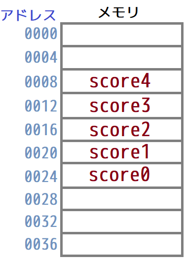
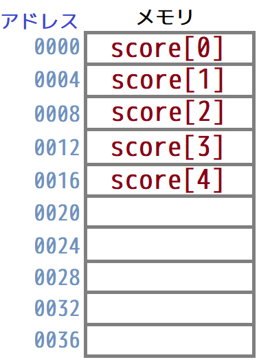
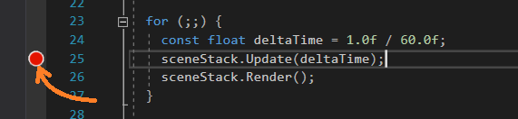

[OpenGL 3D 2019 第02回]

# 転生したらスタックだった件

<br>

## 1 データ構造

### 1.1 いろいろなデータ構造

コンピューターはさまざまなデータを扱います。
それらを効率よく扱うために、これまたさまざまなデータの格納方法が考えられてきました。
この「データの格納方法」のことを「データ構造」と呼びます。
実際に、みなさんは普段からさまざまなデータ構造と接しています。
- 連絡先を検索する<br>
スマホなどで連絡先を検索するとき、入力に従って該当する連絡先を絞り込んでくれます。
人によっては数百に及ぶ連絡先が登録されている可能性があること、また特にスマホでは、できる限り電力を使いたくないことを考えると、これは容易ではありません。
- 文字を入力する<br>
例えば日本語には10万以上の漢字が存在すると言われており、それぞれに音読み、訓読み、さらに例外的な読み方があります。
ひらがなから瞬時に読みの一致する漢字や熟語の一覧を表示するのは、容易ではありません。
- ファイルを開く<br>
ファイル管理用のデータ構造を使って、ファイルをHDDやSSD等に保存し、検索し、開くことができます。
各々のファイルは、数百ギガバイトから数テラバイトに及ぶ容量のどこに保存されていてもおかしくありません。
数テラバイトの領域からほんの数メガバイトのファイルを探し出すのは容易ではありません。
- ウェブページを検索する<br>
インターネットには80億を越えるウェブページがあり、それぞれのページには検索対象になりうる語句が数百から数千個も含まれています。
この中から、短時間で該当する語句を含むページを探し出すことは、容易ではありません。

単純な配列では、上記の問題を解決することは不可能…とまでは言いませんが、大きな困難が予想されます。
そのため、データ構造が重要になるのです。
とはいえ、上記の問題を解決するようなデータ構造は非常に精巧かつ複雑です。
まずは簡単なデータ構造から学習していきましょう。

### 1.2 実装(じっそう)とインターフェイス

データ構造には実装とインターフェイスという2つの要素があります。
インターフェイスはデータ構造がどのような操作に対応しているかを定義します。
対して実装は、それらの操作をどのようにして実現するかを定義します。
インターフェイスには、スタック、キュー、リンクリスト、連想配列などがあります。
多くのデータ構造は、配列かポインタ、あるいはその両方を使って実装されます。

### 1.3 配列

C++言語において、配列とは「同じ大きさの領域を、有限個数、メモリ上で連続するように割り当てたデータ構造」です。
配列は、「添字(そえじ)」を使ってアクセスできる点で、単独の変数とは異なります。
テストの得点の合計を求めるプログラムを書くとします。単独の変数を使うと以下のように書けるでしょう:
```c++
int score0 = 10;
int score1 = 3;
int score2 = 9;
int score3 = 35;
int score4 = 100;
int sum = score0 + score1 + score2 + score3 + score4;
```
この方法では、合計する得点の数が増減すると、合計を求める式も書き換えなければなりません。
これに対して、配列を使うと以下のように書けます:
```c++
int score[] = { 10, 3, 9, 35, 100 };
int sum = 0;
for (int i = 0; i < sizeof(score)/sizeof(score[0]); ++i) {
  sum += score[i];
}
```
配列バージョンでは、得点の数に増減があっても、合計を求めるプログラムを変更する必要はありません。
また、配列ではデータが順序付けされているため、「N番目の得点」といったものも簡単に調べられます。
```c++
int score[] = { 10, 3, 9, 35, 100 };
int N = 3;
int scoreN = score[N];
```
同じことを単独変数バージョンで実現するには、以下のように書くことになるでしょう:
```c++
int score0 = 10;
int score1 = 3;
int score2 = 9;
int score3 = 35;
int score4 = 100;
int N = 3;
int scoreN;
switch (N) {
  case 0: scoreN = score0; break;
  case 1: scoreN = score1; break;
  case 2: scoreN = score2; break;
  case 3: scoreN = score3; break;
  case 4: scoreN = score4; break;
}
```
ここで、「単独変数バージョンでも、ポインタ演算を使えば、配列と同じことができるかも」と考えるかもしれません。
```c++
int N = 3;
int scoreN = *(&score0 + N);
```
しかし、これは間違いです。
なぜなら、C/C++言語の規格では、変数をメモリ上に配置する順番を決めていないからです。
そのため、あるコンパイラはscore0から順番に並べてくれるかもしれませんが、別のコンパイラはscore4から順番に並べるかもしれません。
あるいは、特に順序はなくバラバラに配置するかもしれません。また、グローバル変数とローカル変数では、順番が異なることも考えられます。
言い換えると、上のプログラムが**たまたま**うまく動いたとしても、それは偶然でしかなく保証はされない、ということです。

|単独の変数を使った場合のメモリ配置の例|配列を使った場合のメモリ配置の例|
|:-:|:-:|
|||

このように、配列というデータ構造の特徴は、「データがメモリ上に連続して配置される。それがが規格で保証されている」ことです。
この特徴が、添字によるアクセスを可能にしているわけです。

### 1.4 スタック

配列は有用なデータ構造ですが、さらに工夫を加えることで、もっと便利な使い方ができるようになります。
そのひとつが「スタック(stack)」というインターフェイスです。スタックには「積み重ね(たモノ)」という意味があり、英語で「a stack of books」といえば「積み上がった本の山」を意味します。

配列をスタックとして転生させる(スタックの実装として配列を使う)には、「いくつのデータが積まれているか」という情報を追加します。これを「データ数」と呼ぶことにしましょう。
本の山を作るには、本を上に積み重ねていきますよね。同様に、スタックでは配列の0番目の要素から順番にデータを入れていきます。そして、データを追加するたびに、データ数を1増やします。この操作を「スタックにデータをプッシュする」と言います。ご存知のとおり、プッシュ(push)は「押す」という意味です。データを配列に押し込むさまをイメージすると分かりやすいかもしれません。

また、本の山を崩すときは、上から順番に本を取っていきますね。同じように、スタックからデータを取り出すときは、「データ数－１」番目(これが一番上のデータです)をコピーし、データ数を１減らします。この操作を「スタックからデータをポップする」と言います。ポップ(pop)には「物を置く、飛び出す」という意味があります。データを取り出して別の場所に置くイメージです。

本の山を積んだり崩したりするように、配列などにプッシュとポップの機能を持たせたものが「スタック」なのです。

<div style="border:solid 1px; background:#f8f0dc; margin: 1rem; padding: 1rem; border-radius: 10px">
<strong>［課題01］</strong><br>
新しいプロジェクトを作成し、main関数を以下のようにプログラムしてください。そして、このプログラムが適切に動作するようなスタックを実装してください。<br>
プッシュ操作とポップ操作は、push及びpopという名前の関数として実装してください。
<pre>
#include &lt;iostream&gt;
int main()
{
  push(10);
  push(30);
  std::cout << pop() << "\n";
  push(20);
  push(100);
  pop();
  std::cout << pop() << "\n";
  std::cout << pop() << "\n";
}
</pre>
正しく実装できたなら、出力は
<pre>
30
20
10
</pre>
になるはずです。
</div>

## 2 シーンスタック

### 2.1 シーンの切り替わりかた

シーンの切り替えには2つのパターンがあります。
ひとつは、

シーンA -> シーンB -> シーンC -> シーンD -> シーンE

というように、順次切り替えていくパターン。このパターンでは、たとえいつかシーンAに戻ることがあっても、シーンAは新しく開始されます。シーンBに切り替わる直前の状態から再開したりはしません。
そのため、前のシーンを消してしまっても問題はありません。

もうひとつは、

シーンA -> シーンB -> シーンC -> シーンB -> シーンA

というように、元のシーンに戻ってくるパターンです。このパターンでは、戻り先のシーンの状態が維持されていることが多いです。
戻り先の状態を記録しておく必要があるので、前のシーンを消すことはできません。
実はこのパターン、なんとスタックで実現することができるんです。
上記のパターンをスタック操作で表したものが次です:
```c++
push(シーンA);
push(シーンB);
push(シーンC);
pop();
pop();
```
シーンをスタックにプッシュすることで、前のシーンを残したまま次のシーンへ切り替えることが可能になります。
前のシーンに戻るには、ただポップするだけです。

### 2.2 シーンスタッククラスを定義する

それでは、シーンスタックを実装してみましょう。
まずはOpenGLのプロジェクトを開きます。そして、ソリューションエクスプローラーからScene.hを開いてください。
スタックはvectorクラスで代用できるので、まずはvectorヘッダをインクルードします。
Scene.hに次のプログラムを追加してください。
```diff
 #ifndef SCENE_H_INCLUDED
 #define SCENE_H_INCLUDED
 #include <memory>
 #include <string>
+#include <vector>

 class SceneStack;
```

ヘッダをインクルードしたら、シーンスタッククラスを定義しましょう。
ScenePtrのusing宣言の下に、次のプログラムを追加してください。
```diff
 using ScenePtr = std::shared_ptr<Scene>;

+/**
+* シーン管理クラス.
+*/
+class SceneStack
+{
+public:
+  static SceneStack& Instance();
+
+  void Push(ScenePtr);
+  void Pop();
+  void Replace(ScenePtr);
+  Scene& Current();
+  const Scene& Current() const;
+  size_t Size() const;
+  bool Empty() const;
+
+  void Update(float);
+  void Render();
+
+private:
+  SceneStack();
+  SceneStack(const SceneStack&) = delete;
+  SceneStack& operator=(const SceneStack&) = delete;
+  ~SceneStack() = default;
+
+  std::vector<ScenePtr> stack;
+};
+
 #endif // SCENE_H_INCLUDED
```

このクラスには、プッシュとポップだけでなく、スタックの状態にアクセスするためのメンバ関数も宣言しています。
今回の実装では、Pop関数の戻り値をvoidにしてみました。シーンの制御に関する限り、ポップしたシーンを利用することは滅多にないと思われるからです。
そのかわりに、Current(かれんと)という関数を用意して、一番上にあるシーンを参照できるようにしています。
また、見慣れないReplace(りぷれーす)関数は、ポップとプッシュを合わせたもので、前のシーンを新しいシーンに置き換えます。
これらに加えて、シーンを更新するためのUpdate(あっぷでーと)関数と、描画するためのRender(れんだー)関数も定義しました。

### 2.3 シーンスタックを取得する関数を定義する

ここからはメンバ関数の定義をしていきます。
シーンスタックを取得する関数から始めましょう。
Scene::IsVisible関数定義の下に、次のプログラムを追加してください。
```diff
 bool Scene::IsVisible() const
 {
   return isVisible;
 }
+
+/**
+* シーンスタックを取得する.
+*
+* @return シーンスタック.
+*/
+SceneStack& SceneStack::Instance()
+{
+  static SceneStack instance;
+  return instance;
+}
```

### 2.4 シーンスタッククラスのコンストラクタを定義する

続いて、コンストラクタを定義します。
Scene.cppを開き、ファイルの末尾に次のプログラムを追加してください。
```diff
 SceneStack& SceneStack::Instance()
 {
   static SceneStack instance;
   return instance;
 }
+
+/**
+* コンストラクタ.
+*/
+SceneStack::SceneStack()
+{
+  stack.reserve(16);
+}
```
コンストラクタでは、スタックの予約サイズを16個設定しています。
シーンを16個も積み上げることはあまりないと思うので、予約サイズとしては十分なはずです。

### 2.5 プッシュ関数を定義する

次にプッシュ関数を定義します。
コンストラクタの定義の下に、次のプログラムを追加してください。
```diff
 SceneStack::SceneStack()
 {
   stack.reserve(16);
 }
+
+/**
+* シーンをプッシュする.
+*
+* @param p 新しいシーン.
+*/
+void SceneStack::Push(ScenePtr p)
+{
+  stack.push_back(p);
+  std::cout << "[シーン プッシュ] " << p->Name() << "\n";
+}
```
スタックとして使うだけなら、シーンポインタをプッシュするだけで終わりです。
しかし、SceneStackの実態はシーン管理クラスです。ですから、シーンを制御するプログラムを追加しましょう。
```diff
 void SceneStack::Push(ScenePtr p)
 {
+  if (!stack.empty()) {
+    Current().Stop();
+  }
   stack.push_back(p);
   std::cout << "[シーン プッシュ] " << p->Name() << "\n";
+  Current().Initialize();
+  Current().Play();
 }
```
最初に、スタックにシーンが積まれているかを調べ、存在していたら、現在一番上にあるシーンを停止させます。
次に、新しいシーンを初期化したのち実行開始し、このシーンをスタックにプッシュします。
現在のシーンを停止して、新しいシーンを起動しているわけです。

### 2.6 ポップ関数を定義する

プッシュ関数の次は、ポップ関数を定義します。
Push関数の定義の下に、次のプログラムを追加してください。
```diff
   stack.push_back(p);
   std::cout << "[シーン プッシュ] " << p->Name() << "\n";
 }
+
+/**
+* シーンをポップする.
+*/
+void SceneStack::Pop()
+{
+  const std::string sceneName = Current().Name();
+  stack.pop_back();
+  std::cout << "[シーン ポップ] " << sceneName << "\n";
+}
```
ポップ操作にもシーン制御プログラムを追加しましょう。
Pop関数に次のプログラムを追加してください。
```diff
 void SceneStack::Pop()
 {
+  if (stack.empty()) {
+    std::cout << "[シーン ポップ] [警告] シーンスタックが空です.\n";
+    return;
+  }
+  Current().Stop();
+  Current().Finalize();
   const std::string sceneName = Current().Name();
   stack.pop_back();
   std::cout << "[シーン ポップ] " << sceneName << "\n";
+  if (!stack.empty()) {
+    Current().Play();
+  }
 }
```
最初にスタックの状態をチェックします。スタックにひとつもシーンが積まれていないのにこの関数が呼ばれた場合、高確率でなにか良くないことが起きています。
そこで、メッセージを出力して注意を促します。そして、ポップするシーンがないのですぐにreturnします。
シーンが積まれている場合、カレント(現在一番上にある)シーンを停止、終了させます。
そしてスタックをポップし、まだシーンが積まれているようなら、新たにカレントになったシーンの実行を開始します。

> [補足]<br>
> Current(カレント)は「現在の」という意味です。

### 2.7 リプレース関数を定義する

次に、シーンを置き換える関数を定義します。
Pop関数の定義の下に、次のプログラムを追加してください。
```diff
   std::cout << "[シーン ポップ] " << sceneName << "\n";
   if (!stack.empty()) {
     Current().Play();
   }
 }
+
+/**
+* シーンを置き換える.
+*
+* @param p 新しいシーン.
+*/
+void SceneStack::Replace(ScenePtr p)
+{
+  std::string sceneName = "(Empty)";
+  if (stack.empty()) {
+    std::cout << "[シーン リプレース] [警告]シーンスタックが空です.\n";
+  } else {
+    sceneName = Current().Name();
+    Current().Stop();
+    Current().Finalize();
+    stack.pop_back();
+  }
+  stack.push_back(p);
+  std::cout << "[シーン リプレース] " << sceneName << " -> " << p->Name() << "\n";
+  Current().Initialize();
+  Current().Play();
+}
```
Replace(りぷれーす)には「取り替える、交換する」という意味があります。
この関数はその言葉のとおり、一番上に積まれたシーンを取り除き、新しいシーンを積む、という処理を行います。

### 2.8 現在のシーンを取得する関数を定義する

現在のシーンを取得する関数には、const(こんすと)の付かないバージョンと付いているバージョンがあります。
constの付いているほうは「const(こんすと)メンバ関数」と言います。付いていないほうは単に「メンバ関数」と言いますが、特にconstメンバ関数と区別したい場合は「非const(こんすと)メンバ関数」と呼びます。<br>
それでは、Replace関数の定義の下に、次のプログラムを追加してください。
```diff
   Current().Play();
   std::cout << "[シーン リプレース] " << sceneName << " -> " << p->Name() << "\n";
 }
+
+/**
+* 現在のシーンを取得する.
+*
+* @return 現在のシーン.
+*/
+Scene& SceneStack::Current()
+{
+  return *stack.back();
+}
+
+/**
+* 現在のシーンを取得する.
+*
+* @return 現在のシーン.
+*/
+const Scene& SceneStack::Current() const
+{
+  return *stack.back();
+}
```
Current関数の内容はどちらも同じものになっていて、どちらも同じback関数を呼び出しているように見えます。しかし、実は違う関数を呼び出しているのです。
std::vectorにはconstなしとありの両方のback関数が定義されていて、constのないCurrent関数では同じくconstのないback関数が呼び出され、constの付いたCrrent関数ではconstの付いたback関数が呼び出されます。
ちょっとややこしいですが、constありとなしの呼び分けはコンパイラがやってくれますので、あまり気にする必要はありません。

### 2.9 constメンバ関数の意義と注意点

constを付けて変数を定義すると、その変数を書き換えられなくなります。
それと同様に、constを付けてメンバ関数を宣言すると、そのメンバ関数内ではメンバ変数を書き換えられなくなります。
また、C++にはconstを付けた変数から呼び出せるのはconstメンバ関数だけ、というルールがあります。
もし普通のメンバ関数を呼び出せてしまうと、その中でメンバ変数を書き換えることができてしまうからです。

なんだかややこしいですが、それほど難しく考えることはありません。
constメンバ関数は、Current関数のように「何らかのデータを取得する」関数であることがほとんどだからです。
「データを取得する」という操作は、const変数に対しても使えないと困りますからね。

なお、同じ名前でconstの有無だけが違う2つの関数を定義するとき、その2つは本質的に同じ操作を行うように書くべきです。
constの有無によって行われる操作が違ってしまうと、あとから変数にconstをつけたり消したりするだけでプログラムの動作が変わってしまうからです。

いろいろと説明しましたが、とりあえずは「データを取得するメンバ関数を書くときはconstバージョンも書く」と覚えておけば十分でしょう。

### 2.10 サイズ関数を定義する

Size(さいず)関数は、シーンスタックに積まれている数を調べます。
主な用途はデバッグです。
Current関数の定義の下に、次のプログラムを追加してください。
```diff
 const Scene& SceneStack::Current() const
 {
   return *stack.back();
 }
+
+/**
+* シーンの数を取得する.
+*
+* @return スタックに積まれているシーンの数.
+*/
+size_t SceneStack::Size() const
+{
+  return stack.size();
+}
```
### 2.11 エンプティ関数を定義する

Empty(えんぷてぃ)関数は、シーンスタックが空かどうかを調べます。
これも、主な用途はデバッグです。
Size関数の定義の下に、次のプログラムを追加してください。
```diff
 size_t SceneStack::Size() const
 {
   return stack.size();
 }
+
+/**
+* スタックが空かどうかを調べる.
+*
+* @retval true  スタックは空.
+* @retval false スタックに1つ以上のシーンが積まれている.
+*/
+bool SceneStack::Empty() const
+{
+  return stack.empty();
+}
```

### 2.12 アップデート関数を定義する

Update(あっぷでーと)関数は、シーンスタックに積まれている全シーンのProcessInput関数とUpdate関数を呼び出します。
Empty関数の定義の下に、次のプログラムを追加してください。

```diff
 bool SceneStack::Empty() const
 {
   return stack.empty();
 }
+
+/**
+* シーンを更新する.
+*
+* @param deltaTime 前回の更新からの経過時間(秒).
+*/
+void SceneStack::Update(float deltaTime)
+{
+  if (!Empty()) {
+    Current().ProcessInput();
+  }
+  for (ScenePtr& e : stack) {
+    if (e->IsActive()) {
+      e->Update(deltaTime);
+    }
+  }
+}
```

### 2.13 レンダー関数を定義する

Render(れんだー)関数は、シーンスタックに積まれているシーンのうち、表示状態になっている全てのシーンのRender関数を呼び出します。
Update関数の定義の下に、次のプログラムを追加してください。
```diff
   for (ScenePtr& e : stack) {
     e->Update(deltaTime);
   }
 }
+
+/**
+* シーンを描画する.
+*/
+void SceneStack::Render()
+{
+  for (ScenePtr& e : stack) {
+    if (e->IsVisible()) {
+      e->Render();
+    }
+  }
+}
```
これでSceneStackクラスの定義は完了です。

## 3 シーンスタックを使う

### 3.1 タイトル画面クラスを定義する

作成したシーンスタックを使うために、まずはSceneクラスの派生クラスを作りましょう。
下図のように、4つの派生クラスを作ります。


まずはTitleSceneクラスを定義しましょう。
SrcフォルダにTitleScene.hというファイルを作成してください。そして、作成したファイルを開き、以下のプログラムを追加して下さい。
```c++
/**
* @file TitleScene.h
*/
#ifndef TITLESCENE_H_INCLUDED
#define TITLESCENE_H_INCLUDED
#include "Scene.h"

/**
* タイトル画面.
*/
class TitleScene : public Scene
{
public:
  TitleScene() : Scene("TitleScene") {}
  virtual ~TitleScene() = default;

  virtual bool Initialize() override { return true; }
  virtual void ProcessInput() override;
  virtual void Update(float) override {}
  virtual void Render() override {}
  virtual void Finalize() override {}
};

#endif // TITLESCENE_H_INCLUDED
```

### 3.2 メインゲーム画面クラスを定義する

次にMainGameSceneクラスを定義しましょう。
SrcフォルダにMainGameScene.hというファイルを作成してください。そして、作成したファイルを開き、以下のプログラムを追加して下さい。
```c++
/**
* @file MainGameScene.h
*/
#ifndef MAINGAMESCENE_H_INCLUDED
#define MAINGAMESCENE_H_INCLUDED
#include "Scene.h"

/**
* メインゲーム画面.
*/
class MainGameScene : public Scene
{
public:
  MainGameScene() : Scene("MainGameScene") {}
  virtual ~MainGameScene() = default;

  virtual bool Initialize() override { return true; }
  virtual void ProcessInput() override;
  virtual void Update(float) override {}
  virtual void Render() override {}
  virtual void Finalize() override {}

private:
  bool flag = false;
};

#endif // MAINGAMESCENE_H_INCLUDED
```

### 3.3 ステータス画面クラスを定義する

続いてStatusSceneクラスを定義しましょう。
SrcフォルダにStatusScene.hというファイルを作成してください。そして、作成したファイルを開き、以下のプログラムを追加して下さい。
```c++
/**
* @file StatusScene.h
*/
#ifndef STATUSSCENE_H_INCLUDED
#define STATUSSCENE_H_INCLUDED
#include "Scene.h"

/**
* ステータス画面.
*/
class StatusScene : public Scene
{
public:
  StatusScene() : Scene("StatusScene") {}
  virtual ~StatusScene() = default;

  virtual bool Initialize() override { return true; }
  virtual void ProcessInput() override;
  virtual void Update(float) override {}
  virtual void Render() override {}
  virtual void Finalize() override {}
};

#endif // STATUSSCENE_H_INCLUDED
```

### 3.4 ゲームオーバー画面クラスを定義する

最後にGameOverSceneクラスを定義しましょう。
SrcフォルダにGameOverScene.hというファイルを作成してください。そして、作成したファイルを開き、以下のプログラムを追加して下さい。
```c++
/**
* @file GameOverScene.h
*/
#ifndef GAMEOVERSCENE_H_INCLUDED
#define GAMEOVERSCENE_H_INCLUDED
#include "Scene.h"

/**
* ゲームオーバー画面.
*/
class GameOverScene : public Scene
{
public:
  GameOverScene() : Scene("GameOverScene") {}
  virtual ~GameOverScene() = default;

  virtual bool Initialize() override { return true; }
  virtual void ProcessInput() override;
  virtual void Update(float) override {}
  virtual void Render() override {}
  virtual void Finalize() override {}
};

#endif // GAMEOVERSCENE_H_INCLUDED
```

### 3.5 タイトルシーンをシーンスタックにプッシュする

ゲームはタイトル画面から開始することにします(市販ゲームはメーカーロゴやデモ画面から始まるものですが、今回はそういうのがないので)。早速、シーンスタックへタイトル画面をプッシュしましょう。
main関数を定義しているcppファイルを次のように変更してください。
```diff
+#include "Src/TitleScene.h"
 #include <iostream>

 int main()
 {
-  std::cout << "Hello World!\n";
+  SceneStack& sceneStack = SceneStack::Instance();
+  sceneStack.Push(std::make_shared<TitleScene>());
+
+  for (;;) {
+    const float deltaTime = 1.0f / 60.0f;
+    sceneStack.Update(deltaTime);
+    sceneStack.Render();
+  }
 }
```
このプログラムで使っているstd::make_shared(えす・てぃー・でぃー・めいく・しぇあーど)関数は、「shared_ptr(しぇあーど・ぽいんた)」と呼ばれるクラス変数を作成する関数です。
シェアード・ポインタは、new演算子で作成した変数を指すためのクラスです。
通常のポインタと同じように「->(あろー)演算子」や「*(あすたりすく)演算子」を使って変数にアクセスできます。
大きな違いは、シェアード・ポインタは自分が削除されるときに、指している変数をdelete(でりーと)してくれる点です。newで作成した変数のdeleteを忘れる、というのはよくあるミスです。しかし、シェアード・ポインタならば自動的にdeleteしてくれるので、このミスをなくすことができるのです。

「shared_ptrクラスが便利なのはわかったけれど、std::make_shared関数はなんなの？」という質問はごもっとも。
これは、シェアード・ポインタを作るときのちょっと不便な点を解消してくれる関数です。
下のプログラムを見てください。
```c++
std::shared_ptr<TitleScene>(new TitleScene);
```
これは、普通にシェアード・ポインタを作る方法を示しています。この方法でも問題なくシェアード・ポインタは作れます。
ただ、TitleScdneというクラス名が2回出てきていますよね。もしクラス名を変えたくなったときには2個所とも変更しなければなりません。そもそも最初に2回書くこと自体が面倒です。そこでmake_shared関数の登場です。
この関数は「newを実行して変数を作成し、それをシェアード・ポインタに格納する」という操作を関数化したもので、クラス名を1回書くだけで済むようになっています。ようするに、ちょっとだけ楽に書けますよ、ということですね。

### 3.6 タイトル画面のProcessInput関数を定義する

タイトル画面以外のシーンも、シーンスタックに積んでいきます。
タイトル画面からはメインゲーム画面に切り替わることにしましょう。
SrcフォルダにTitleScene.cppというファイルを作成し、そこに以下のプログラムを追加してください。
```c++
/**
* @file TitleScene.cpp
*/
#include "TitleScene.h"
#include "MainGameScene.h"

/**
* プレイヤーの入力を処理する.
*/
void TitleScene::ProcessInput()
{
  SceneStack::Instance().Replace(std::make_shared<MainGameScene>());
}
```
これは、タイトル画面をメインゲーム画面にリプレースするプログラムです。
プッシュではなくリプレースを使っているのは、メインゲームを実行中にタイトル画面のデータが必要になることは考えにくいからです。より少ないメモリしか搭載していないPCでも問題なく動かせるように、使われないデータは速やかに取り除くべきです。

### 3.7 メインゲーム画面のProcessInput関数を定義する

次に、メインゲーム画面ではステータス画面をプッシュし、その後ゲームオーバー画面にリプレースします。
SrcフォルダにMainGameScene.cppというファイルを作成し、そこに以下のプログラムを追加してください。
```c++
/**
* @file MainGameScene.cpp
*/
#include "MainGameScene.h"
#include "StatusScene.h"
#include "GameOverScene.h"

/**
* プレイヤーの入力を処理する.
*/
void MainGameScene::ProcessInput()
{
  if (!flag) {
    flag = true;
    SceneStack::Instance().Push(std::make_shared<StatusScene>());
  } else {
    SceneStack::Instance().Replace(std::make_shared<GameOverScene>());
  }
}
```
ちょっと無理やりですが、flag(ふらぐ)という変数を使ってシーンの切り替え方を制御しています。メインゲーム画面クラスが作成されたとき、flag変数はfalseで初期化されています。結果、最初のif文が成立してステータス画面がプッシュされます。同時にflagをtrueに変更しておきます。
次にこの関数が実行されたとき、今度はflagがtrueになっているので、ゲームオーバー画面へとリプレースされるわけです。

本来であれば、このプッシュとリプレースは、キー入力があったときやプレイヤーのライフが0になったときに実行されるべきですが、まだそういった機能をプログラムしていないので、仮の実装としてflagを使ったプログラムを書いてみました。

### 3.7 ステータス画面のProcessInput関数を定義する

続いて、ステータス画面から前の画面へ戻るプログラムを追加します。
SrcフォルダにStatusScene.cppというファイルを追加し、以下のプログラムを追加してください。
```c++
/**
* @file StatusScene.cpp
*/
#include "StatusScene.h"

/**
* プレイヤーの入力を処理する.
*/
void StatusScene::ProcessInput()
{
  SceneStack::Instance().Pop();
}
```
プッシュと違って、ポップでは戻り先のシーンを知っている必要はありません。

### 3.8 ゲームオーバー画面のProcessInput関数を定義する

最後に、ゲームオーバー画面からタイトル画面に切り替えるプログラムを追加します。
SrcフォルダにGameOverScene.cppというファイルを追加し、以下のプログラムを追加してください。
```c++
/**
* @file GameOverScene.cpp
*/
#include "GameOverScene.h"
#include "TitleScene.h"

/**
* プレイヤーの入力を処理する.
*/
void GameOverScene::ProcessInput()
{
  SceneStack::Instance().Replace(std::make_shared<TitleScene>());
}
```
リプレース関数を使って、ゲームオーバー画面からタイトル画面へ切り替えています。

これでひととおりのプログラムは書き終えたので、ビルドして実行してください。
すると、コンソールウィンドウにシーン切り替えメッセージが流れ続ける状態になると思います。

### 3.9 ブレークポイントを使って動作を確認する

一応動いているようですが、メッセージの流れが早すぎて、本当に意図したとおりに動いているのか分かりませんね。
こういうときは、ブレークポイントを活用しましょう。
一旦プログラムを終了させ、main関数のfor文の中でUpdate関数を呼び出している行にブレークポイントを置いてください。



ブレークポイントを置いたら、改めて実行してみましょう。
最初にブレークポイントで停止したとき、コンソールウィンドウには、タイトル画面のコンストラクタが実行されたこと、タイトル画面をシーンスタックへプッシュしたこと、タイトル画面のPlay関数が実行されたことが出力されていると思います。<br>
実際にシーンをプッシュするときはこの順番で実行されます。つまり、順番どおりに出力されているなら、タイトル画面のプッシュは成功しているといえるでしょう。
ここまで確認できたら、「続行」ボタンをクリックしてプログラムを動かしてください。すぐにブレークポイントで停止してしまいますが、コンソールウィンドウには新たな情報が出力されているはずです。<br>
メインゲーム画面のコンストラクタが実行されたこと、タイトル画面が停止し、デストラクタが実行されたこと、そしてタイトル画面からメインゲーム画面へとリプレースされ、メインゲーム画面のPlay関数が実行されたことが出力されているでしょう。
もし出力順が違っていたり、足りないものがあった場合、プログラムを確認してください。

<div style="border:solid 1px; background:#f0e4cd; margin: 1rem; padding: 1rem; border-radius: 10px">
<strong>［課題02］</strong><br>
同様にして、ステータス画面がシーンスタックにプッシュされ、次にポップされてメインゲーム画面が再開されることを確認してください。さらにその後、メインゲーム画面がゲームオーバー画面にリプレースされ、さらにゲームオーバー画面がタイトル画面にリプレースされることも確認してください。<br>確認の結果、問題なく動作していると判断できたら、ブレークポイントを削除してください(赤丸をクリックすると消せます)。
</div>
