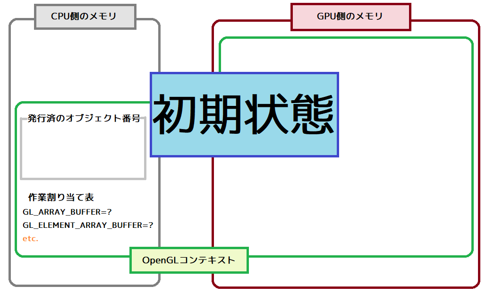
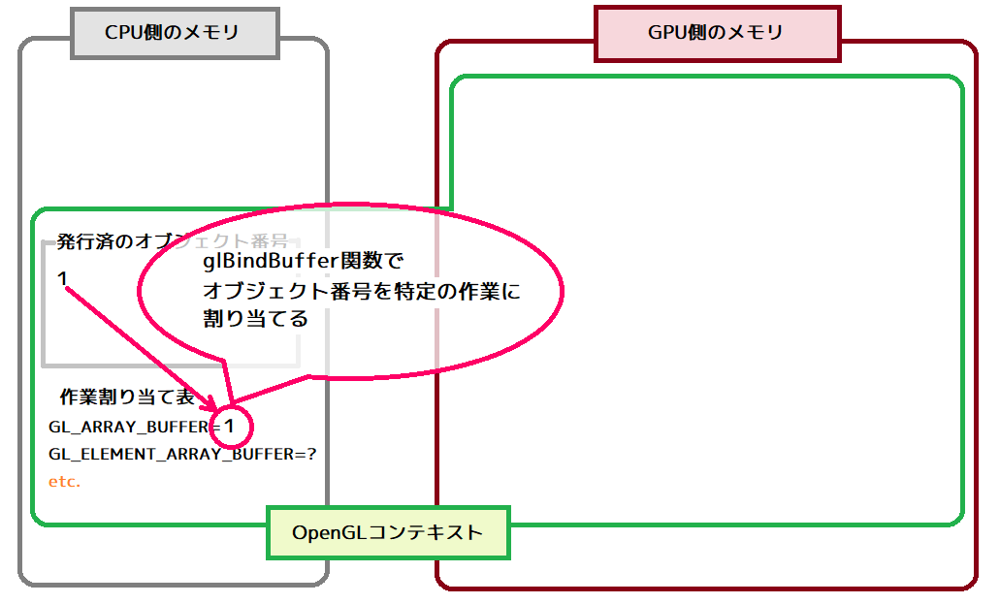
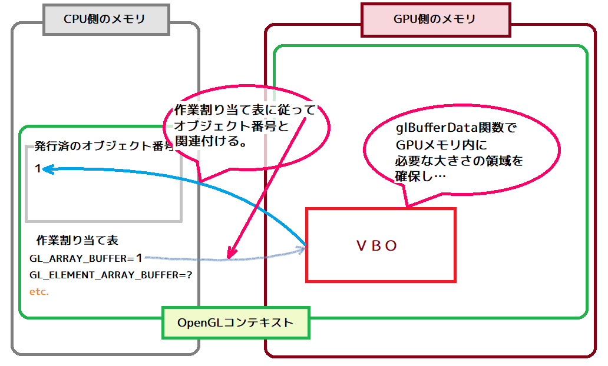
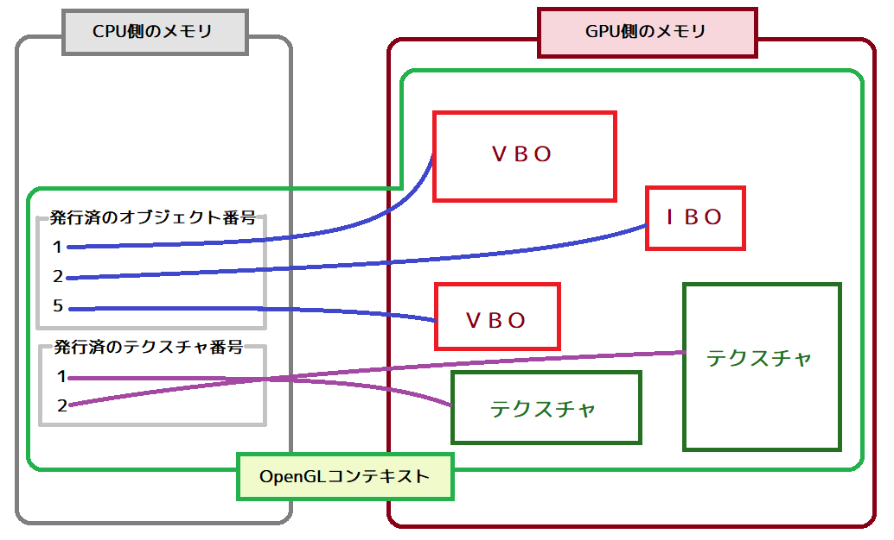

[OpenGL 3D 2019 第03回]

# バッファオブジェクトについてkwsk

## 1 キー入力を実装する

### 1.1 NupenGLのインストール

前回は、ブレークポイントを使ってシーンスタックの動作確認を行いました。とはいえ、ブレークポイントを設置し、停止するたびに「続行」をクリックするというのは実際のゲームではありえないことです。
そこで、ゲームらしく、キー入力を検知してシーンを切り替えるようにしていきます。キー入力の検知にはGLFWライブラリを使うのが簡単です。GLFWのインストールには、NupenGLパッケージを利用します。
上部メニューから「プロジェクト->NuGetパッケージの管理」を選択してパッケージ管理ウィンドウを開き、NupenGLパッケージをインストールしてください。

### 1.2 GLFWEW.hとGLFWEW.cppの追加

GLFWやGLEWの初期化には、以前作成したGLFWEW::Windowクラスが使えます。
エクスプローラーなどを使って、過去のプロジェクトからGLFWEW.hとGLFWEW.cppをコピーし、現在作成しているプロジェクトのSrcフォルダに貼り付けてください。
それができたらVisual Studioに戻り、ソリューションエクスプローラーの「ソースファイル」フィルタを右クリックして「追加->既存の項目」を選択します。
そして、さきほど追加したGLFWEW.hとGLFWEW.cppを選択して追加してください。

### 1.3	ゲームパッドの実装

ゲームにもよりますが、一般的にはゲームを遊ぶときは、キーボードよりゲームパッドのほうが遊びやすいものです。
そこで、ゲームパッドを使えるようにしましょう。幸い、GLFWにはゲームパッドからの入力を取得する機能が備わっていますので、この機能を使って作ることにします。
ひとつ問題なのは、GLFWのキー入力を扱う関数とジョイスティック入力を扱う関数は別だという点です。そのため、両方の入力に対応するには工夫が必要です。
今回は、キーボードの入力をゲームパッドの入力に変換することで、プログラムではゲームパッドのことだけを考えれば済むようにしようと思います。

まずはゲームパッドの入力を表すためにGamePadという構造体を作成します。SrcフォルダにGamePad.hというファイルを追加してください。そして、追加したファイルを開き、次のコードを追加してください。
```c++
/**
* @file GamePad.h
*/
#ifndef GAMEPAD_H_INCLUDED
#define GAMEPAD_H_INCLUDED
#include <stdint.h>

/**
* ゲームパッド情報.
*/
struct GamePad
{
  // キーとボタンに対応するビット定数.
  static const uint32_t DPAD_UP = 0x0001;
  static const uint32_t DPAD_DOWN = 0x0002;
  static const uint32_t DPAD_LEFT = 0x0004;
  static const uint32_t DPAD_RIGHT = 0x0008;
  static const uint32_t START = 0x0010;
  static const uint32_t A = 0x0020;
  static const uint32_t B = 0x0040;
  static const uint32_t X = 0x0080;
  static const uint32_t Y = 0x0100;
  static const uint32_t L = 0x0200;
  static const uint32_t R = 0x0400;

  uint32_t buttons = 0; ///< 押されているあいだフラグが立つ.
  uint32_t buttonDown = 0; ///< 押された瞬間だけフラグが立つ.
};

#endif // GAMEPAD_H_INCLUDED
```
DPAD_UP(でぃー・ぱっど・あっぷ)などの定数は、buttons及びbottonDown変数と論理積を計算することで、キーの状態を調べるために使います。
例えば、
```c++
if (gamepad.buttons & GamePad::A) {
  // Aボタンが押されている.
}
```
のようにして使います。

<br>

### 1.4	GLFWEW.hの変更

GLFWの機能を使うので、ゲームパッドの状態を取得したり更新したりする機能はGLFWEW::Windowクラスに追加するのがいいでしょう。
GLFWEW.hを開き、glew.hのインクルード文の下に、次のコードを追加してください。
```diff
 #define GLFWEW_H_INCLUDED
 #include <GL/glew.h>
+#include "GamePad.h"
 #include <GLFW/glfw3.h>
```
次に、Windowクラスがゲームパッドの状態を保持できるように変数を追加し、さらにゲームパッドの状態を更新するための関数を宣言します。
まずはメンバ関数の宣言を追加します。
```diff
  void ResetDeltaTime();
  double DeltaTime() const;
  bool KeyDown(int key) const;
+ const GamePad& GetGamePad() const;

 private:
   Window() = default;
   ~Window();
   Window(const Window&) = delete;
   Window& operator=(const Window&) = delete;
+  void UpdateGamePad();

   bool isGLFWInitialized = false;
   bool isInitialized = false;
```
さらに、ゲームパッド変数を追加します。
```diff
   bool isGLFWInitialized = false;
   bool isInitialized = false;
   GLFWwindow* window = nullptr;
   int width = 0;
   int height = 0;
   double prevTime = 0;
   double deltaTime = 0;
+  GamePad gamepad;
 };
```

<div style="page-break-after: always"></div>

### 1.5 GetGamePad関数を定義する

続いて、追加したメンバ関数の定義を書いていきます。まずはゲームパッドの状態を取得する関数から書いていきます。
GLFWEW.cppを開き、ファイルの一番下に次のプログラムを追加してください。
```diff
 void Window::SwapBuffers() const
 {
   glfwPollEvents();
   glfwSwapBuffers(window);
 }
+
+/**
+* ゲームパッドの状態を取得する.
+*
+* @return ゲームパッドの状態.
+*/
+const GamePad& Window::GetGamePad() const
+{
+  return gamepad;
+}

 } // namespace GLFWEW
```

### 1.6 ゲームパッドのデータ順を定義する

続いて、ゲームパッドの状態を更新する関数を定義していきますが、そのまえに2つの列挙型を定義します。
GLFWから返されるスティックやトリガーのデータは配列になっているのですが、何番目にどのアナログスティックやトリガーのデータが格納されているかは分かりません。
というのは、接続するゲームパッドによって順番が違う可能性があるからです。そのため、順番はプログラマーが定義しなければなりません。
今回は、PCでは最も一般的と思われるXboxゲームパッドの順番で定義することにしました。
それでは、GetGamePad関数の定義の下に、次のプログラムを追加してください。
```diff
 {
   return gamepad;
 }
+
+/**
+* ゲームパッドのアナログ入力装置ID.
++
+* @note 順序はXBOX360ゲームパッド基準.
+*/
+enum GAMEPAD_AXES
+{
+  GAMEPAD_AXES_LEFT_X,  ///< 左スティックのX軸.
+  GAMEPAD_AXES_LEFT_Y,  ///< 左スティックのY軸.
+  GAMEPAD_AXES_TRIGGER, ///< アナログトリガー.
+  GAMEPAD_AXES_RIGHT_Y, ///< 右スティックのY軸.
+  GAMEPAD_AXES_RIGHT_X, ///< 右スティックのX軸.
+};

 } // namespace GLFWEW
```
GAMEPAD_AXES(げーむぱっど・あくしす)列挙型は、この配列の何番目にどのアナログスティックやアナログトリガーのデータが格納されているかを表します。
注意点として、NupenGLに含まれるバージョンのGLFWでは、左右のアナログトリガーを区別できません。そのため、どちらのトリガーを押しても反応します。

> ［補足］最新のGLFWではゲームパッドまわりが大幅に改善されており、ゲームパッドの種類に関わらず、GLFWが定義した順番でデータが格納できるようになっています。

<div style="page-break-after: always"></div>

続いて、もうひとつの列挙型を定義します。こちらはボタン入力の格納順を表します。GAMEPAD_AXES列挙型の定義の下に、次のプログラムを追加してください。
```diff
   GAMEPAD_AXES_RIGHT_X, ///< 右スティックのX軸.
 };
+
+/**
+* ゲームパッドのデジタル入力装置ID.
+*
+* @note Xbox360ゲームパッド準拠.
+*/
+enum GAMEPAD_BUTTON {
+  GAMEPAD_BUTTON_A, ///< Aボタン.
+  GAMEPAD_BUTTON_B, ///< Bボタン.
+  GAMEPAD_BUTTON_X, ///< Xボタン.
+  GAMEPAD_BUTTON_Y, ///< Yボタン.
+  GAMEPAD_BUTTON_L, ///< Lボタン.
+  GAMEPAD_BUTTON_R, ///< Rボタン.
+  GAMEPAD_BUTTON_BACK, ///< Backボタン.
+  GAMEPAD_BUTTON_START, ///< Startボタン.
+  GAMEPAD_BUTTON_L_THUMB, ///< 左スティックボタン.
+  GAMEPAD_BUTTON_R_THUMB, ///< 右スティックボタン.
+  GAMEPAD_BUTTON_UP, ///< 上キー.
+  GAMEPAD_BUTTON_RIGHT, ///< 右キー.
+  GAMEPAD_BUTTON_DOWN, ///< 下キー.
+  GAMEPAD_BUTTON_LEFT, ///< 左キー.
+};

 } // namespace GLFWEW
```
GAMEPAD_AXES列挙型と同じく、GAMEPAD_BUTTON(げーむぱっど・ぼたん)列挙型も、GLFWから返される配列のインデックスを示します。

### 1.7 ゲームパッドのデータを取得する

データの順番が定義できたので、いよいよゲームパッドのデータを取得していきます。まずはデータ配列を取得します。
GAMEPAD_BUTTON列挙型の定義の下に、次のプログラムを追加してください。
```diff
   GAMEPAD_BUTTON_LEFT, ///< 左キー.
 };
+
+/**
+* ゲームパッドの状態を更新する.
+*/
+void Window::UpdateGamePad()
+{
+  const uint32_t prevButtons = gamepad.buttons; // buttonDownを生成するために、更新前の入力状態を保存しておく.
+
+  // アナログ入力とボタン入力を取得.
+  int axesCount, buttonCount;
+  const float* axes = glfwGetJoystickAxes(GLFW_JOYSTICK_1, &axesCount);
+  const uint8_t* buttons = glfwGetJoystickButtons(GLFW_JOYSTICK_1, &buttonCount);
+
+  // 両方の配列がnullptrでなく、最低限必要なデータ数を満たしていれば、有効なゲームパッドが接続されているとみなす.
+  if (axes && buttons && axesCount >= 2 && buttonCount >= 8) {
+    // 有効なゲームパッドが接続されている場合
+  }
+}

 } // namespace GLFWEW
```
ゲームパッドのアナログ入力のデータを取得するには、glfwGetJoystickAxes(じーえるえふだぶりゅー・げっと・じょいすてぃっく・あくしす)関数を使います。
同様に、ボタン入力のデータを取得するには、glfwGetJoystickButtons(じーえるえふだぶりゅー・げっと・じょいすてぃっく・ぼたんず)関数を使います。
>［補足］Joystick(じょいすてぃっく)は、操縦桿(そうじゅうかん)を模した入力装置の呼び名です。ゲームパッドが主流になる以前はPCの主要な入力装置でした。
最初の引数はゲームパッドの接続番号です。GLFWではGLFW_JOYSTICK_1からGLFW_JOYSTICK_16までの定数が用意されており、最大16個のゲームパッドを制御することができます。
今回はひとつのゲームパッドにだけ対応することにしたので、この引数にはGLFW_JOYSTICK_1という定数を直接渡しています。複数のゲームパッドに対応させるには、この値を引数として受け取るようにするとよいでしょう。
2番目の引数には、有効な入力データ数を受け取る変数へのポインタを渡します。

### 1.8 アナログスティックの値を方向キー入力に変換する

さて、これらの関数は、アナログ入力またはボタンの状態を格納した配列へのポインタを返します。両方ともnullptrの場合、ゲームパッドが接続されていないか、PCに認識されていません。どちらかがnullptrの場合、接続されているのは一般的なゲームパッドではないか、ゲームパッドが故障しています。
どちらもnullptr**ではない**場合、ゲームパッドが接続されている可能性が高いですが、まだ完璧ではありません。入力装置によってアナログ入力やボタンの数が違うので、これらが最低限必要な数を満たしていることを確認しなければなりません。

こうして、戻り値とデータ数の条件を満たすと分かったら、ようやくデータを処理する段階に進みます。UpdateGamePad関数に、次のプログラムを追加してください。
```diff
   if (axes && buttons && axesCount >= 2 && buttonCount >= 8) {
     // 有効なゲームパッドが接続されている場合
+
+    // 方向キーの入力状態を消去して、左スティックの入力で置き換える. 
+    gamepad.buttons &= ~(GamePad::DPAD_UP | GamePad::DPAD_DOWN | GamePad::DPAD_LEFT | GamePad::DPAD_RIGHT);
+    static const float digitalThreshold = 0.3f; // デジタル入力とみなすしきい値.
+    if (axes[GAMEPAD_AXES_LEFT_Y] >= digitalThreshold) {
+      gamepad.buttons |= GamePad::DPAD_UP;
+    } else if (axes[GAMEPAD_AXES_LEFT_Y] <= -digitalThreshold) {
+      gamepad.buttons |= GamePad::DPAD_DOWN;
+    }
+    if (axes[GAMEPAD_AXES_LEFT_X] >= digitalThreshold) {
+      gamepad.buttons |= GamePad::DPAD_LEFT;
+    } else if (axes[GAMEPAD_AXES_LEFT_X] <= -digitalThreshold) {
+      gamepad.buttons |= GamePad::DPAD_RIGHT;
+    }
   }
 }

 } // namespace GLFWEW
```
このプログラムでは、左アナログスティック入力を上下左右のキー入力に変換しています。
まず、button変数から方向キーの情報を消去します。これには「&=(あんど・いこーる)」による「ビット単位AND(あんど)」演算と、「|(ばーちかる・らいん)」による「ビット単位OR」演算、それに「~(ちるだ)」による「ビット単位NOT(のっと)」演算を利用しています。

「ビット単位AND」は、2つの値の同じ桁のビット同士を比較し、どちらも1であれば1、それ以外は0を結果とする演算です。これにより「特定のビット以外を0にする」という操作が実現できます。<br>
例: 0011 & 0101 -> 0001

「ビット単位OR」は、2つの値の同じ桁のビット同士を比較し、どちらかでも1であれば1、どちらも0なら0を結果とする演算です。これにより、「特定のビットを1にする」という操作が実現できます。<br>
例: 0011 | 0101 -> 0111

「ビット単位NOT」は、すべての桁のビットを反転させます。元が0のビットは1に、元が1のビットは0になるわけです。<br>
例: 0011 -> 1100

上記のプログラムでは、上下左右キーのビットをビット単位ORして、**方向キーのビットだけが1になった値(11110000000000)**を作り出しています。次に、この値にビット単位NOTを行います。
これによって、方向キー**以外の**ビットが1になった値(0000111111111)に変換しています。
そして最後にビット単位ANDを実行することで、全体として「方向キーのビットだけを0にする」という結果を生み出しているのです。

### 1.9 ボタンの状態を取得する

続いて、アナログスティックのデータを方向キーの状態へと変換します。アナログ入力のデータは、-1.0から+1.0までの範囲を取ります。0.0が「入力なし」ですから、データが一定の値以上(あるいは以下)なら、その方向に入力されたとみなせます。
「一定の値」というのは、プログラムではdigitalThreshold(でじたる・すれっしょるど)という変数で設定しています。今回はデータが0.3以上、あるいは0.3以下ならば入力ありと判定されるようにしてみました。
機械の構造上、アナログ入力には常に小さな変動があるため、このあまり小さくすると、触れていなくても入力ありと判定されてしまいます。逆に大きすぎると、スティックを目一杯倒さないと入力ありにならないため、操作しづらくなってしまいます。

>［補足］スレッショルドは「しきい値」という意味です。元々は「入り口」という意味の単語で、転じて「何かが起こり始める開始点・境界」という意味を持つようになったようです。

<div style="page-break-after: always"></div>

続いて、ボタン入力を処理していきます。方向キーを処理するプログラムの下に、次のプログラムを追加してください。
```diff
     } else if (axes[GAMEPAD_AXES_LEFT_X] <= -digitalThreshold) {
       gamepad.buttons |= GamePad::DPAD_RIGHT;
     }
+
+    // 配列インデックスとGamePadキーの対応表.
+    static const struct {
+      int dataIndex;
+      uint32_t gamepadBit;
+    } keyMap[] = {
+      { GAMEPAD_BUTTON_A, GamePad::A },
+      { GAMEPAD_BUTTON_B, GamePad::B },
+      { GAMEPAD_BUTTON_X, GamePad::X },
+      { GAMEPAD_BUTTON_Y, GamePad::Y },
+      { GAMEPAD_BUTTON_L, GamePad::L },
+      { GAMEPAD_BUTTON_R, GamePad::R },
+      { GAMEPAD_BUTTON_START, GamePad::START },
+      { GAMEPAD_BUTTON_UP, GamePad::DPAD_UP },
+      { GAMEPAD_BUTTON_DOWN, GamePad::DPAD_DOWN },
+      { GAMEPAD_BUTTON_LEFT, GamePad::DPAD_LEFT },
+      { GAMEPAD_BUTTON_RIGTH, GamePad::DPAD_RIGHT },
+    };
+
+    for (const auto& e : keyMap) {
+      if (buttons[e.dataIndex] == GLFW_PRESS) {
+        gamepad.buttons |= e.gamepadBit;
+      } else if (buttons[e.dataIndex] == GLFW_RELEASE) {
+        gamepad.buttons &= ~e.gamepadBit;
+      }
+    }
   }
 }

 } // namespace GLFWEW
```
このプログラムでは、2つの要素を持つ構造体の配列によって、データのインデックスとゲームパッドのキーを対応付けています。そして、その情報を元にデータを処理しています。
ボタン入力データには、ボタンが押されていれば「GLFW_PRESS(じーえるえふだぶりゅー・ぷれす)」、離されていれば「GLFW_RELEASE(じーえるえふだぶりゅー・りりーす)」が設定されます。
ですから、GLFW_PRESSなら対応するボタンのビットを1にして、GLFW_RELEASEならビットを0にする、という処理をしています。

<div style="page-break-after: always"></div>

### 1.10 buttonDown変数の値を更新する

これでbuttons変数の更新はできました。しかし、まだbuttonDown変数を更新していません。
UpdateGamePad関数の末尾に、次のプログラムを追加してください。
```diff
       } else if (buttons[e.dataIndex] == GLFW_RELEASE) {
         gamepad.buttons &= ~e.gamepadBit;
       }
     }
   }
+
+  // 前回の更新で押されてなくて、今回押されているキーの情報をbuttonDownに格納.
+  gamepad.buttonDown = gamepad.buttons & ~prevButtons;
 }

 } // namespace GLFWEW
```
このプログラムは、更新前のボタン状態(関数の最初で保存しています)と更新後のボタン状態のあいだでビット演算を行い、「更新前は押されておらず、更新後に押されているボタンのビットだけを1にする」処理を行っています。

### 1.11 キーボードにゲームパッドを真似させる

さて、ここまでのプログラムで、ゲームパッドの入力を扱えるようになりました。以下のように使うことができます。
ゲームパッドがつながっていない場合も考えると、次のようになるでしょうか。
```c++
GLFWEW::Window& window = GLFWEW::Window::Instance();
const GamePad gamepad = window.GetGamePad();
if ((gamepad.button & GamePad::A) || window.KeyDown(GLFW_KEY_A)) {
  // Aボタンが押されたときの処理.
}
```
このプログラムは問題なく動作しますが、入力を扱うたびにゲームパッドとキーボードの両方の処理を書く必要があります。
また、この書き方では、ゲームパッドのボタンとキーボードのキーの組み合わせを間違えてしまったり、どちらかを書き忘れる可能性があります。

そこで、ゲームパッドが接続されていないときは、かわりにキーボードにゲームパッドを真似させるプログラムを追加します。こうすることで、ゲーム本体のプログラムでは、ゲームパッドの判定だけを書けば済むようになります。
それでは、ゲームパッドの入力を処理するプログラムの下(buttonDown変数を更新するプログラムの上)に、次のプログラムを追加してください。
```diff
     for (const auto& e : keyMap) {
       if (buttons[e.dataIndex] == GLFW_PRESS) {
         gamepad.buttons |= e.gamepadBit;
       } else if (buttons[e.dataIndex] == GLFW_RELEASE) {
         gamepad.buttons &= ~e.gamepadBit;
       }
     }
+  } else {
+    // 有効なゲームパッドが接続されていないので、キーボード入力で代用.
+
+    // 配列インデックスとGamePadキーの対応表.
+    static const struct {
+      int keyCode;
+      uint32_t gamepadBit;
+    } keyMap[] = {
+      { GLFW_KEY_J, GamePad::A },
+      { GLFW_KEY_K, GamePad::B },
+      { GLFW_KEY_U, GamePad::X },
+      { GLFW_KEY_I, GamePad::Y },
+      { GLFW_KEY_O, GamePad::L },
+      { GLFW_KEY_L, GamePad::R },
+      { GLFW_KEY_ENTER, GamePad::START },
+      { GLFW_KEY_W, GamePad::DPAD_UP },
+      { GLFW_KEY_A, GamePad::DPAD_DOWN },
+      { GLFW_KEY_S, GamePad::DPAD_LEFT },
+      { GLFW_KEY_D, GamePad::DPAD_RIGHT },
+    };
+
+    for (const auto& e : keyMap) {
+      const int key = glfwGetKey(window, e.keyCode);
+      if (key == GLFW_PRESS) {
+        gamepad.buttons |= e.gamepadBit;
+      } else if (key == GLFW_RELEASE) {
+        gamepad.buttons &= ~e.gamepadBit;
+      }
+    }
   }

   // 前回の更新で押されてなくて、今回押されているキーの情報をbuttonDownに格納.
   gamepad.buttonDown = gamepad.buttons & ~prevButtons;
 }
```
基本的な設計はゲームパッドのボタン入力の処理と同じです。
違いは、アナログ入力やボタン入力ではなく、キーボードの入力を調べていることです。

キーボードでゲームパッドを真似られるようになったので、今後はゲームパッドの入力だけを気にすればよくなりました。
つまり、以下のように書けるわけですね。
```c++
GLFWEW::Window& window = GLFWEW::Window::Instance();
const GamePad gamepad = window.GetGamePad();
if (gamepad.button & GamePad::A) {
  // Aボタンが押されたときの処理.
}
```
もうゲームパッドとキーボードの組み合わせを間違える心配はありません。

### 1.12 ゲームパッド入力でシーンを切り替える

さっそくゲームパッド入力を使ってみましょう。
TitleScene.cppを開き、まずはヘッダファイルをインクルードします。
```diff
 #include "TitleScene.h"
 #include "MainGameScene.h"
+#include "GLFWEW.h"

 /**
 * プレイヤーの入力を処理する.
 */
```
そして、ProcessInput関数に次のプログラムを追加してください。
```diff
 void TitleScene::ProcessInput()
 {
+  GLFWEW::Window& window = GLFWEW::Window::Instance();
+  if (window.GetGamePad().buttonDown & GamePad::START) {
     SceneStack::Instance().Replace(std::make_shared<MainGameScene>());
+  }
 }
```
これで、スタートボタン(キーボードではEnterキー)によってメインゲーム画面に切り替わるようになったはずです。
実際に望んだ動作になっているかどうか、ビルドして実行してください。

<div style="border:solid 1px; background:#f0e4cd; margin: 1rem; padding: 1rem; border-radius: 10px">
<strong>［課題01］</strong><br>
タイトル画面以外のすべてのシーンについて、タイトル画面と同様に、ゲームパッド入力によってシーンを切り替えるようにしてください。
</div>


## 2 バッファクラスを作成する

### 2.1 OpenGLのバッファについて

VBOやIBOなどのバッファオブジェクトは、コンピューターのGPUメモリに作られます。しかしそれは、いつ、どんなふうに作られるのでしょう。
順序として、まずglGenBuffersが実行されてバッファオブジェクト番号が確保されます、次にglBindBufferでOpenGLコンテキストに番号を割り当て、そしてglBufferDataが呼ばれたときに、ようやくバッファオブジェクトが作られて番号と結び付けられます。
>［補足］テキストではバッファオブジェクト番号と説明していますが、OpenGLのドキュメントではBuffer object nameとなっていて、これは直訳すると「バッファオブジェクト名」となります。
>つまり、「実装としては数値(番号)になっているけれど、仕様としては名前として扱われる」ということです。ただ、実装と仕様の違いを理解するのは慣れるまで難しいので、このテキストでは「番号」で通すことにしました。

それでは、図を見ながらバッファオブジェクト作成の流れを見ていきましょう。

［1. 初期状態］OpenGLコンテキストを作った直後、まだ何も作られていません。
<div style="text-align: center;width: 100%;">

</div>
<div style="page-break-after: always"></div>

［2. glGenBuffers(1, &id)を実行］バッファオブジェクト番号が確保されました。図には書いていませんが、プログラムでは変数idに確保した番号を記録し、後の作業でバッファオブジェクト番号を使えるようにしています。
<div style="text-align: center;width: 100%;">

</div>

［3. glBindBuffer(GL_ARRAY_BUFFER, id)を実行］確保したバッファオブジェクト番号をGL_ARRAY_BUFFER作業対象に割り当てます。以後、割り当てが変更されるまで、GL_ARRAY_BUFFERに対する処理は全てこの番号のバッファオブジェクト(図の場合は1番)に対して実行されます。
<div style="text-align: center;width: 100%;">

</div>
<div style="page-break-after: always"></div>

［4. glBufferData(GL_ARRAY_BUFFER, size, data)を実行］GPUメモリにVAO用の領域を確保し、その領域をGL_ARRAY_BUFFER作業対象のバッファオブジェクトに関連付けます。
<div style="text-align: center;width: 100%;">

</div>

［5. さまざまなバッファオブジェクトやテクスチャを作成したあとの状態］バッファオブジェクトとテクスチャでは管理部署が異なるため、同じ番号でも違うオブジェクトを指しています。
<div style="text-align: center;width: 100%;">

</div>

このように、バッファオブジェクトの本体はGPU側のメモリに存在します。しかし、関連付けられた番号については、OpenGLコンテキストによってCPU側メモリで管理されています。
OpenGL及びOpenGLコンテキストの役割は、GPUとそれに付随するメモリを、効率よくCPU側から扱えるようにすることなのです。

<div style="page-break-after: always"></div>

### 2.1 バッファクラスを定義する

画像を表示するには、頂点バッファやインデックスバッファを作成して、プリミティブとして描画しなければなりません。
前の節の説明を踏まえて、バッファオブジェクトを制御するクラスを作成していきましょう。
SrcフォルダにBufferObject.hというファイルを追加してください。そして追加したファイルを開き、次のプログラムを追加してください。
```c++
/**
* @file BufferObject.h
*/
#ifndef BUFFEROBJECT_H_INCLUDED
#define BUFFEROBJECT_H_INCLUDED
#include <GL/glew.h>

#endif // BUFFEROBJECT_H_INCLUDED
```
OpenGLで定義されている型を使うので、glew.hをインクルードしています。

次に、汎用のバッファオブジェクトクラスを定義します。glew.hのインクルード文の下に、次のプログラムを追加してください。
```diff
 #ifndef BUFFEROBJECT_H_INCLUDED
 #define BUFFEROBJECT_H_INCLUDED
 #include <GL/glew.h>
+
+/**
+* 汎用バッファオブジェクト(VBO, IBOなど).
+*/
+class BufferObject
+{
+public:
+  BufferObject() = default;
+  ~BufferObject() { Destroy(); }
+  BufferObject(const BufferObject&) = delete;
+  BufferObject& operator=(const BufferObject&) = delete;
+
+  bool Create(GLenum target, GLsizeiptr size, const GLvoid* data = nullptr, GLenum usage = GL_STATIC_DRAW);
+  bool BufferSubData(GLintptr offset, GLsizeiptr size, const GLvoid* data);
+  void Destroy();
+  GLuint Id() const { return id; }
+  GLsizeiptr Size() const { return size; }
+private:
+  GLenum target = 0; ///< バッファの種類.
+  GLuint id = 0; ///< 管理ID.
+  GLsizeiptr size = 0; ///< バッファのバイトサイズ.
+};

 #endif // BUFFEROBJECT_H_INCLUDED
```
BufferObject(ばっふぁ・おぶじぇくと)クラスは、頂点バッファ(VBO)とインデックスバッファ(IBO)を制御するためのクラスです。これらは扱うデータの種類が違うだけで、機能としては同一なので、単一のクラスにまとめることができます。

さらにもうひとつのクラスを定義しましょう。今度はVAOを制御するためのクラスです。BufferObjectクラス定義の下に、次のプログラムを追加してください。
```diff
   GLenum target = 0; ///< バッファの種類.
   GLuint id = 0; ///< 管理ID.
   GLsizeiptr size = 0; ///< バッファのバイトサイズ.
 };
+
+/**
+* VAO用.
+*/
+class VertexArrayObject
+{
+public:
+  VertexArrayObject() = default;
+  ~VertexArrayObject() { Destroy(); }
+  VertexArrayObject(const VertexArrayObject&) = delete;
+  VertexArrayObject& operator=(const VertexArrayObject&) = delete;
+
+  bool Create(GLuint vbo, GLuint ibo);
+  void Destroy();
+  void ResetVertexAttribPointer() const;
+  void Bind() const;
+  void Unbind() const;
+  void VertexAttribPointer(GLuint index, GLint size, GLenum type, GLboolean normalized, GLsizei stride, size_t offset) const;
+  GLuint Id() const { return id; }
+  GLuint Vbo() const { return vboId; }
+  GLuint Ibo() const { return iboId; }
+
+private:
+  GLuint id = 0; ///< 管理ID
+  GLuint vboId = 0; ///< VBOの管理ID
+  GLuint iboId = 0; ///< IBOの管理ID
+};

 #endif // BUFFEROBJECT_H_INCLUDED
```
VertexArrayObject(ばーてっくす・あれい・おぶじぇくと)は名前のとおりVAOを制御するためのクラスです。VBO, IBOとは機能が違うので、専用のクラスを作る必要があるのです。

### 2.2 BufferObject::Create関数を定義する

続いて、メンバ関数を定義していきます。SrcフォルダにBufferObject.cppというファイルを追加し、開いてください。
まずはヘッダファイルをインクルードします。BufferObject.cppに次のプログラムを追加してください。
```c++
/**
* @file BufferObject.cpp
*/
#include "BufferObject.h"
#include <iostream>
```
BufferObject.hと、エラーメッセージ表示用にiostream(あい・おー・すとりーむ)をインクルードしました。

それでは、メンバ関数を定義していきます。まずはバッファオブジェクトを作成するBufferObject::Create関数を定義しましょう。
インクルード文の下に、次のプログラムを追加してください。
```diff
 #include "BufferObject.h"
 #include <iostream>
+
+/**
+* バッファオブジェクトを作成する.
+*
+* @param target バッファオブジェクトの種類.
+* @param size   頂点データのサイズ.
+* @param data   頂点データへのポインタ.
+* @param usage  バッファオブジェクトのアクセスタイプ.
+*
+* @retval true  作成成功.
+* @retval false 作成失敗.
+*/
+bool BufferObject::Create(GLenum target, GLsizeiptr size, const GLvoid* data, GLenum usage)
+{
+  Destroy();
+  glGenBuffers(1, &id);
+  glBindBuffer(target, id);
+  glBufferData(target, size, data, usage);
+  glBindBuffer(target, 0);
+  this->target = target;
+  this->size = size;
+  const GLenum error = glGetError();
+  if (error != GL_NO_ERROR) {
+    std::cerr << "[エラー] " << __func__ << ": バッファの作成に失敗.\n";
+  }
+  return error == GL_NO_ERROR;
+}
```
このメンバ関数は、以前のテキストにあったCreateVBO関数やCreateIBO関数とほぼ同じことをします。主な違いはバッファの種類を指定できるように、target引数が追加されている点です。
また、バッファの種類と大きさをメンバ変数に記録しておきます。別のメンバ関数で必要になるからです。

### 2.3 BufferObject::BufferSubData関数を定義する

次に、バッファにデータを転送するメンバ関数を作成しましょう。BufferObject::Create関数の定義の下に、次のプログラムを追加してください。
```diff
     std::cerr << __func__ << "(" << __LINE__ << "): バッファの作成に失敗.\n";
   }
   return error == GL_NO_ERROR;
 }
+
+/**
+* バッファにデータを転送する.
+*
+* @param offset 転送開始位置(バイト単位).
+* @param size   転送するバイト数.
+* @param data   転送するデータへのポインタ.
+*
+* @retval true  転送成功.
+* @retval false 転送失敗.
+*/
+bool BufferObject::BufferSubData(GLintptr offset, GLsizeiptr size, const GLvoid* data)
+{
+  if (offset + size >= this->size) {
+    std::cerr << "[警告] " << __func__ << ": 転送先領域がバッファサイズを越えています.\n";
+    std::cerr << "  buffer size:" << this->size << " offset:" << offset << " size:" << size << "\n";
+    if (offset >= this->size) {
+      return false;
+    }
+    // 可能な範囲だけ転送を行う.
+    size = this->size - offset;
+  }
+  glBindBuffer(target, id);
+  glBufferSubData(target, offset, size, data);
+  glBindBuffer(target, 0);
+  if (error != GL_NO_ERROR) {
+    std::cerr << "[エラー] " << __func__ << ": データの転送に失敗.\n";
+  }
+  return error == GL_NO_ERROR;
+}
```
このメンバ関数は多少複雑に見えますが、それはおかしな数値が指定された場合の対策をしているからです。
本来の目的である「データの転送」を行っているのはglBindBuffer関数とglBufferSubData関数による3行だけです。
ただ、このテキストもそうですし、インターネット上で見つかる参考資料などでも省略されることが多いですが、実際の製品で使われるプログラムでは、データに間違いがないことを確認するためのプログラムがたくさん含まれています。
また、そもそも間違ったデータを設定できないように、より高度で複雑な設計を行うことも多いです。こういった小さな保険の積み重ねが、確実に動作するプログラムにつながるのです。

### 2.4 BufferObject::Destroy関数を定義する

次に、バッファを破棄するメンバ関数を作成しましょう。BufferObject::BufferSubData関数の定義の下に、次のプログラムを追加してください。
```diff
     std::cerr << "[エラー] " << __func__ << ": データの転送に失敗.\n";
   }
   return error == GL_NO_ERROR;
 }
+
+/**
+* Buffer Objectを破棄する.
+*/
+void BufferObject::Destroy()
+{
+  if (id) {
+    glDeleteBuffers(1, &id);
+    id = 0;
+  }
+}
```
この関数で注意することは、glDeleteBuffers関数でバッファを破棄したあと、idメンバ変数を0に設定している点です。
この関数はデストラクタではないので、オブジェクトが継続して使われる可能性があります。そのため、idを初期化しておく必要があるのです(逆に言えば、これはデストラクタでは必要ありません。なぜなら、もうオブジェクトが使われることはないからです)。

これでBufferObjectクラスのメンバ関数を定義することができました。

### 2.5 VertexArrayObject::Create関数を定義する

ここからはVertexArrayObjectクラスのメンバ関数を定義していきます。
まずはVAOを作成する関数です。BufferObject::Destory関数の定義の下に、次のプログラムを追加してください。
```diff
     glDeleteBuffers(1, &id);
     id = 0;
   }
 }
+
+/**
+* VAOを作成する.
+*
+* @param vbo  頂点バッファオブジェクトのID.
+* @param ibo  インデックスバッファオブジェクトのID.
+*
+* @retval true  作成成功.
+* @retval false 作成失敗.
+*/
+bool VertexArrayObject::Create(GLuint vbo, GLuint ibo)
+{
+  Destroy();
+  glGenVertexArrays(1, &id);
+  glBindVertexArray(id);
+  glBindBuffer(GL_ARRAY_BUFFER, vbo);
+  glBindBuffer(GL_ELEMENT_ARRAY_BUFFER, ibo);
+  glBindVertexArray(0);
+  glBindBuffer(GL_ARRAY_BUFFER, 0);
+  glBindBuffer(GL_ELEMENT_ARRAY_BUFFER, 0);
+  vboId = vbo;
+  iboId = ibo;
+  if (error != GL_NO_ERROR) {
+    std::cerr << "[エラー] " << __func__ << ": VAOの作成に失敗.\n";
+  }
+  return error == GL_NO_ERROR;
+}
```
この関数は、以前のテキストにあったCreateVAO関数とほぼ同じことをします。大きな違いは、頂点アトリビュートを設定するプログラムがない点です。
なぜかというと、クラスとして再構成するにあたって、頂点アトリビュートの設定を別の関数に分離したからです。分離することで、クラスの外から頂点アトリビュートの内容を自由に指定できるようになります。
結果として、別のゲームを作るときにも使えるクラスになるわけです。

### 2.6 VertexArrayObject::Destroy関数を定義する

続いて、VAOを破棄するメンバ関数を作成しましょう。
VertexArrayObject::Create関数の定義の下に、次のプログラムを追加してください。
```diff
     std::cerr << "[エラー] " << __func__ << ": VAOの作成に失敗.\n";
   }
   return error == GL_NO_ERROR;
 }
+
+/**
+* VAOを破棄する.
+*/
+void VertexArrayObject::Destroy()
+{
+  if (id) {
+    glDeleteVertexArrays(1, &id);
+    id = 0;
+    vboId = 0;
+    iboId = 0;
+  }
+}
```
注意点は、BufferObject::Destroy関数と同じく、glDeleteVertexArrays関数のあとでメンバ変数を消去しておくことだけです。

### 2.7 VertexArrayObject::Bind関数を定義する

プリミティブを描画するときは、OpenGLコンテキストにVAOを割り当てる必要があります。この関数はそれを行います。
VertexArrayObject::Destroy関数の定義の下に、次のプログラムを追加してください。
```diff
     vboId = 0;
     iboId = 0;
   }
 }
+
+/**
+* VAOをOpenGLコンテキストにバインドする.
+*
+* 描画、VertexAttribPointer()、ResetVertexAttribPointer()を呼び出す前に、この関数を実行してVAOをバインドする必要がある.
+*
+* @sa Unbind(), VertexAttribPointer(), ResetVertexAttribPointer()
+*/
+void VertexArrayObject::Bind() const
+{
+	glBindVertexArray(id);
+	glBindBuffer(GL_ARRAY_BUFFER, vboId);
+}
```
VAOだけでなくVBOも割り当てていますが、これはあとで使用するglVertexAttribPointer関数で必要なためです。

### 2.8 VertexArrayObject::Unbind関数を定義する

複数のVAOを使う可能性を考えると、VAOの割り当てを解除できるべきでしょう。そのための関数を追加しましょう。
VertexArrayObject::Bind関数の定義の下に、次のプログラムを追加してください。
```diff
 	glBindVertexArray(id);
 	glBindBuffer(GL_ARRAY_BUFFER, vboId);
 }
+
+/**
+* OpenGLコンテキストへのバインドを解除する.
+*
+* 描画、VertexAttribPointer()、ResetVertexAttribPointer()が終わったら、この関数を実行してバインドを解除しなければならない.
+*
+* @sa Bind(), VertexAttribPointer(), ResetVertexAttribPointer()
+*/
+void VertexArrayObject::Unbind() const
+{
+  glBindVertexArray(0);
+  glBindBuffer(GL_ARRAY_BUFFER, 0);
+}
```
この関数はBind関数と対になるものなので、実行する関数もBind関数と同じです。

### 2.9 VertexArrayObject::VertexAttribPointer関数を定義する

次は、頂点アトリビュートを設定する関数を定義しましょう。
これまでのテキストでは、頂点アトリビュートはCreateVAOで設定していました。しかし、その方法だと頂点アトリビュートごとに異なるCreateVAO関数を作る必要があります。
そこで、VAOの作成はCreate関数に、頂点アトリビュートの設定はVertexAttribPointer関数に分離しました。
Create関数でも説明しましたが、分離することでクラスに変更を加えずとも頂点アトリビュートを変更できるわけです。
それでは、VertexArrayObject::Unbind関数の定義の下に、次のプログラムを追加してください。
```diff
   glBindVertexArray(0);
   glBindBuffer(GL_ARRAY_BUFFER, 0);
 }
+
+/**
+* 頂点アトリビュートを設定する.
+*
+* @param index      頂点アトリビュートのインデックス.
+* @param size       頂点アトリビュートの要素数.
+* @param type       頂点アトリビュートの型.
+* @param normalized GL_TRUE=要素を正規化する. GL_FALSE=正規化しない.
+* @param stride     次の頂点データまでのバイト数.
+* @param offset     頂点データ先頭からのバイトオフセット.
+*
+* Bind()してからUnbind()するまでの間で呼び出すこと.
+*
+* @sa Bind(), Unbind(), ResetVertexAttribPointer()
+*/
+void VertexArrayObject::VertexAttribPointer(
+  GLuint index, GLint size, GLenum type, GLboolean normalized, GLsizei stride, size_t offset) const
+{
+  glEnableVertexAttribArray(index);
+  glVertexAttribPointer(index, size, type, normalized, stride, reinterpret_cast<GLvoid*>(offset));
+}
```

### 2.10 VertexArrayObject::ResetVertexAttribPointer関数を定義する

頂点アトリビュートは複数設定することができます。頂点アトリビュートを再設定しようとしたとき、それが以前の頂点アトリビュートの設定数より少なかった場合は不要な設定が残ってしまいます。
そこで、頂点アトリビュートの設定を消去する関数を用意します。再設定する前にこの関数を実行しておけば、不要な設定が残ることはないというわけです。
それでは、VertexArrayObject::VertexAttribPointer関数の定義の下に、次のプログラムを追加してください。
```diff
   glEnableVertexAttribArray(index);
   glVertexAttribPointer(index, size, type, normalized, stride, reinterpret_cast<GLvoid*>(offset));
 }
+
+/**
+* 全ての頂点アトリビュートを無効化する.
+*
+* @sa Bind(), Unbind(), VertexAttribPointer()
+*/
+void VertexArrayObject::ResetVertexAttribPointer() const
+{
+  GLint maxAttr;
+  glGetIntegerv(GL_MAX_VERTEX_ATTRIBS, &maxAttr);
+  for (int i = 0; i < maxAttr; ++i) {
+    glDisableVertexAttribArray(i);
+  }
+}
```
頂点アトリビュートがいくつまで設定できるかは環境によって違うので、glGetIntegerv関数をつかって取得しなければなりません。
この関数の第一引数にGL_MAX_VERTEX_ATTRIBSを指定すると取得できます。

>［補足］OpenGLの仕様では、この数値の最小値は8とされています。つまり、環境が違っても少なくとも8個は設定できることになります。

さて、今回はここまでにしましょう。<br>
次回はBufferObjectクラスとVertexArrayObjectクラスを使って画像の表示などを実装していきます。