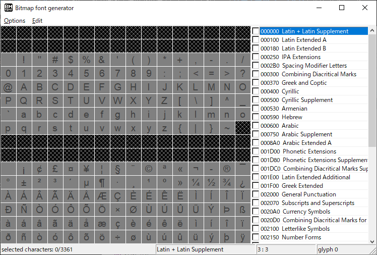
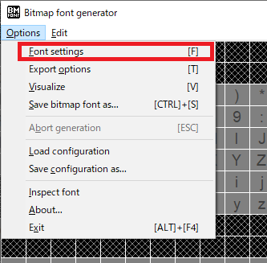
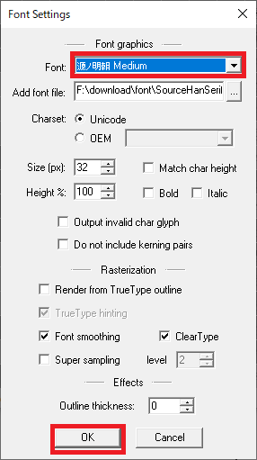
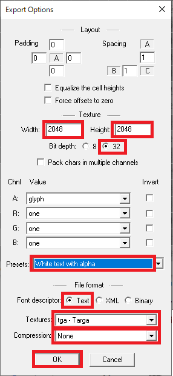
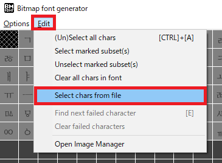
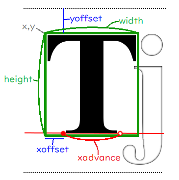

[OpenGL 3D 2019 第05回]

# 愛なんてフォントの選び間違い

Love ain't nothing but Font misselected

<br>

## 1 フォント画像を用意する

### 1.1 ビットマップフォント

3Dモデルは高い表現力がある反面、記号的な情報を伝えるには不向きです。そのような目的には2Dの文字やアイコンが適しています。そこで、文字を表示する機能を実装することにしましょう。

文字を表示する方法はいくつか存在します。<br>
ひとつはベクターフォントによる描画です。ベクターフォントはベジェ曲線というものをつかって輪郭を定義するフォントです。拡大率に関わらず鮮明な文字が書けますが、ベジェ曲線やシェーダに関する知識のほか、描画のための計算コストも必要とします。

もうひとつはビットマップフォントによる描画です。あらかじめ文字やアイコンをビットマップ画像として準備しておき、それを画面に描画するのです。文字の鮮明さはビットマップ画像の解像度に依存します。拡大に耐える画像を作ろうとするとデータサイズが大きくなってしまいます。しかし、テクスチャを貼り付けるだけなので実装は比較的カンタンで、計算コストもそれほど必要ありません。
今回は実装の簡便さからビットマップフォントを選択します。

>**［補足］** 「font」というのは「特定のデザインと大きさを持つ文字及び記号の組み合わせ」を指す英単語です。
>Wikipediaによると、フランス語で「溶かす」という意味の「fonte(ふぉんと)」が語源だそうです。活版印刷の文字パーツを「鋳造(ちゅうぞう)」していたことから来ているという話です。

### 1.2 BMFontのダウンロード

フォント描画プログラムを作るにあたっては、スプライトの描画プログラムを流用しようと思います。つまり、表示する文字はまとめて1枚の画像ファイルに詰め込むことになります。<br>
しかし、１枚の画像になっているということは、単純にその画像を表示した場合、すべての文字が表示されるわけです。画像の中のひとつの文字を表示するためには、その文字が画像のどの位置にあるのかという情報が必要になります。これを手作業で作るのは大変です。

そこで、既存のツールを利用することにします。今回はAngelCode.comで配布されている「Bitmap Font Generator(びっとまっぷ・ふぉんと・じぇねれーたー)」というツールを使用することにしました(ちょっと名前が長いので、実行ファイルの名前「BMFont.exe(びー・えむ・ふぉんと・えぐぜ)」から、以後は「BMFont」と呼ぶことにします)。

BMFontを選んだのは以下の理由によります：

1. **画像ファイル**のほかに、各文字が画像のどの位置に存在するかを示す**フォント情報ファイル**を作成できること。
1. フォント情報がテキストファイルとして記録されていること。
1. フォント情報ファイルの内容が比較的簡単なこと。

BMFontは以下のサイトからダウンロードできます。

`http://www.angelcode.com/products/bmfont/`

サイト内のDownloadsという見出しの下に、ダウンロードリンクがあります。どれをダウンロードしても問題はありませんが、おすすめは2番目の

`download installer for v1.14beta(551KB)`

です。

ダウンロードしたインストーラーを実行して、指示に従ってインストールしてください。

### 1.3 BMFontの使い方

インストールできたら、BMFontを起動しましょう。次のようなウィンドウが表示されると思います。

<div style="text-align: center;width: 100%;">

</div>

最初は「Arial(えりある)」というフォントが選択されているのですが、このフォントは英語用なので日本語の文字が使えません。そこで、日本語を含むフォントを選び直します。
以下のように、メニューバーから「Options→Font Settings」を選択してください。

<div style="text-align: center;width: 100%;">

</div>

すると、フォント設定ウィンドウが開きます。ウィンドウ上部の「Font:」というラベルのついたボックスをクリックすると、フォントが選べます。「ＭＳゴシック」や「遊明朝」など、日本語を含むフォントを選択して「OK」ボタンを押してください。

なお、どのフォントが日本語に対応しているかは、Windowsの「フォント設定」から調べることができます。フォント設定は、スタートメニューの検索ボックスに「フォント設定」と入力すれば見つけられるでしょう。

<div style="text-align: center;width: 100%;">

</div>

>**［重要］** Windowsに同梱されているフォントをビットマップフォントに変換して利用する場合、就職作品としてゲーム会社に提出することは許可されていますが、商業利用は禁止されていることに注意してください。<br>
>ただし、商業利用であっても、ロゴ作成程度のことは許可されています。フォント全体を変換して利用することはできないということです。
>作品をウェブサイトや即売会などで販売することを考えている場合は、商業利用が許可されているフリーフォントを使うか、有料フォントを購入する必要があります。

続いて、出力設定を行います。メニューバーから「Options→Export Options」を選択してください。
すると、次のような出力設定ウィンドウが開きます。

<div style="text-align: center;width: 100%;">

</div>

ウィンドウが開いたら、赤枠で囲ってある部分を変更します。まずは幅(Width)と高さ(Height)をどちらも「2048」にします。そして、ビット数(Bit depth)は「32」を選択してください。
次にビットの内訳を設定します。プリセット一覧(Presets)から「White text with alpha(透明度ありの白文字)」を選択してください。
その次は出力ファイル形式を選択します。フォント情報ファイル(Font descriptor)の種類は「Text」にしてください。テクスチャ形式(Textures)は「tga - Targe」、圧縮形式(Compression)は「None」を選択してください。
これらを設定し終えたら「OK」ボタンを押して設定を反映します。

次に、実際に出力する文字を選択します。BMFontのウィンドウ内の文字をクリックまたはドラッグすると、文字を選択したり解除したりできます。また、右側のリストのチェックボックスをクリックすることで、２５６文字単位で選択することも可能です。<br>
しかし、これらの方法ですべてのフォントを選択するのは面倒です。また、中国語や韓国語、アラビア語など、日本語を表示するだけなら不要な文字が含まれていると、テクスチャに無駄なデータが入ってしまうことになります。<br>
実はBMFontには「指定されたテキストファイルに出現する文字だけを選択する」という機能があります。この機能を使えば、必要な文字だけを選ぶことが可能です。

Shareフォルダの筆者の名前のフォルダに「char_set_cp932(utf8bom).txt」というファイルを用意しましたので、これをみなさんのPCの適当なフォルダにコピーしてください。
このファイルは「CP932」という文字集合に含まれる文字だけを抽出して、「BOMつきUTF-8」という形式で保存したものです。BMFontはこの形式しか正しく認識できませんので、もしこの文字ファイルを編集する場合は保存形式に注意してください。

コピーしたら、メニューバーから「Edit→Select chars from file」を選択してください。

<div style="text-align: center;width: 100%;">

</div>

「ファイルを開く」ウィンドウが表示されるので、さきほどコピーした「char_set_cp932(utf8bom).txt」を選択して「開く」をクリックします。
すると、ファイルに含まれる文字だけが明るく表示されます。

フォントファイルを出力するには「Ctrl」キーを押しながら「S」キーを押します。「名前をつけて保存」ウィンドウが開くので、保存先とファイル名を入力します。
今回、保存先はみなさんのプロジェクトの「Res」フォルダ、ファイル名は「font.fnt」とします。入力したら「保存」ボタンをクリックしてください。
すると保存が始まりますが、これには文字数に応じた時間がかかります。BMFontのウィンドウの下部に、出力した文字数がカウントされているので、終了するまでしばらく待ってあげてください。

カウントが停止したら保存完了です。正しく保存されているか確認しましょう。Resフォルダを開くと「font.fnt」と「font_0.tga」という2つのファイルが増えているはずです。
font.fntがフォント情報ファイルで、font_0.tgaが画像ファイル(テクスチャ)です。Visual Studioなどで両方のファイルを開き、どのように保存されているか確認してください。

>**［補足］** もしfont_1.tgaなど２つ以上の画像ファイルが保存されていた場合、出力設定の幅と高さを確認してください。<br>画像の大きさが小さいと１枚に収まりきらず、複数枚に分割されてしまいます。

<div style="page-break-after: always"></div>

### 1.4 フォント情報ファイル

Bitmap Font Generatorが出力するフォントファイルは次のような構造になっています。

```txt
info     ファイル作成情報～
common   文字共通情報～
page     テクスチャ情報～
chars    文字情報の数
char     文字情報～
...
kernings カーニング情報の数
kerning  カーニング情報～
...
```

各行の説明と、その行を読み込むときに行われる処理は次のとおりです:

**1行目:**<br>
文字列infoで始まり、フォント作成に使われたパラメータが並べられています。この行のsize要素には、BMFontの出力設定で指定したフォントサイズが格納されています。

**2行目:**<br>
文字列commonで始まり、フォントの共通データが並べられています。この行のscaleWとscaleHは画像ファイルの縦横のピクセル数を示します。各文字の情報は、このピクセル数を基準に定義されています。

**3行目:**<br>
文字列pageで始まり、テクスチャに関する情報が並びます。fileにはテクスチャファイル名が格納されています。

**4行目:**<br>
文字列charsで始まり、countというフォント情報の数を示すパラメータだけが存在します。この値はフォント情報取得の際のループ回数になります。

**5行目～:**<br>
文字列charで始まり、文字のフォント情報が並びます。この部分がフォント描画でもっとも重要な情報です。<br>
charは4行目のcountで指定された数だけ続きます。
なお、フォント情報ファイルのテクスチャ座標系は左上原点になっています。OpenGLは左下原点の座標系なので、読み込む際に変換しなければなりません。
また、テクスチャ座標及びサイズはピクセル数で記述されます。

**その他の行:**<br>
文字列kerningで始まる行には、特定の文字の組み合わせのときに、表示位置を調整するための情報が格納されています。kerningsは調整情報の数です。いずれも今回は使わないので無視します。

さて、charで始まる行の情報は以下のように表されます:

<div style="text-align: center;width: 100%;">

</div>

この図では、x,y、width、xoffsetといったパラメータが、Ｔの描画にどのような影響があるかを示しています。なお「Ｔ」がこれから描く文字で、「ｊ」は次に描かれるであろう文字の例です。
また、図には載せていませんが、1行目のpaddingは文字を画像化したときの上下左右の余白を表します。spacingは左側および上側の文字との間の空白を表します。

通常、paddingとspacingは初期値のままにしておきます。設定が必要なのは、ペイントツールを使ってフォントに独自の装飾を付け加えたり、シェーダーで特殊効果を加えたりする場合です。

今回のテキストでは、これらの情報を読み込んで文字を表示するプログラムを書いていきます。

<div style="page-break-after: always"></div>

## 2 フォント描画クラス

### 2.1 ヘッダファイルのインクルード

それでは、文字を表示するためのクラスを実装していきましょう。
Srcフォルダに「Font.h」というファイルを追加してください。そして、追加したFont.hを開き、次のプログラムを追加してください。

```c++
/**
* @file Font.h
*/
#ifndef FONT_H_INCLUDED
#define FONT_H_INCLUDED
#include <GL/glew.h>
#include "Sprite.h"
#include <glm/glm.h>
#include <vector>
#include <string>

#endif // FONT_H_INCLUDED
```

最初にインクルードするのはglew.hです(以前のテキストで「glew.hはgl.hと競合するので最初にインクルードしなければならない」と説明したことを覚えているでしょうか)。
描画にはスプライトレンダラークラスを使うので、Sprite.hをインクルードしています。フォントのサイズや位置などにvec2型を使いたいので、glm.hもインクルードしています。
vectorヘッダは文字のフォント情報を読み込むために使います。また、文字を扱うのですからstringヘッダが必要です。

### 2.2 フォント描画クラスを定義する

続いて、フォント描画クラスを定義しましょう。
フォントの描画クラスはFontRenderer(ふぉんと・れんだらー)という名前にしました。
まずは
stringヘッダのインクルード文の下に、次のプログラムを追加してください。
<div style="page-break-after: always"></div>

```diff
 #include <vector>
 #include <string>
+
+/**
+* ビットマップフォント描画クラス.
+*/
+class FontRenderer
+{
+public:
+  FontRenderer() = default;
+  ~FontRenderer() = default;
+  FontRenderer(const FontRenderer&) = delete;
+  FontRenderer& operator=(const FontRenderer&) = delete;
+
+private:
+};

 #endif // FONT_H_INCLUDED
```

まずは「コンストラクタ」と「デストラクタ」だけを定義しました。
「コピーコンストラクタ」と「コピー代入演算子」については「delete(でりーと)」を指定しておきます。こうすると、この型の変数のコピーが禁止されます。

メモリなどのコピーされると危険なデータを扱うクラスでは、プログラムのミスを未然に防ぐために、こうしてコピーを禁止しておくとよいでしょう。

### 2.3 メンバ関数を定義する

続いてメンバ関数を宣言します。
コピー代入演算子の宣言の下に、次のプログラムを追加してください。

```diff
   FontRenderer(const FontRenderer&) = delete;
   FontRenderer& operator=(const FontRenderer&) = delete;
+
+  bool Init(size_t maxChar);
+  bool LoadFromFile(const char* path);
+  void BeginUpdate();
+  bool AddString(const glm::vec2&, const wchar_t*);
+  void EndUpdate();
+  void Draw(const glm::vec2&) const;
+  float LineHeight() const;

 private:
 };
```

メンバ関数については、以下のような利用方法を想定して決めました：

1. Init関数でフォント描画クラスを初期化。
1. LoadFromFile関数でフォント情報ファイルとテクスチャを読み込む。
1. BeginUpdate関数で文字の追加を開始。
1. AddString関数を必要なだけ実行して文字を追加。
1. EndUpdate関数で追加を終了。
1. Draw関数でフォントを描画。

残りのLineHeight関数はフォントの高さを返す予定です。この数値は、次の行の位置を決めるときに役に立つでしょう。

### 2.4 メンバ変数を定義する

続いてメンバ変数を定義します。
privateアクセス指定子の下に、次のプログラムを追加してください。

```diff
   float LineHeight() const;

 private:
+  SpriteRenderer spriteRenderer;  ///< 描画に使用するスプライトレンダラー.
+  std::vector<Texture::Image2DPtr> textures; ///< フォントテクスチャリスト.
+  float lineHeight = 0;           ///< 行の高さ.
+  float base = 0;                 ///< 行の上部からベースラインまでの距離.
+
+  /// 文字情報.
+  struct CharacterInfo {
+    int id = -1;                     ///< 文字コード.
+    int page = 0;                    ///< 文字が含まれるフォントテクスチャの番号.
+    glm::vec2 uv = glm::vec2(0);     ///< 文字のテクスチャ座標.
+    glm::vec2 size = glm::vec2(0);   ///< 文字の表示サイズ.
+    glm::vec2 offset = glm::vec2(0); ///< 表示位置の補正値.
+    float xadvance = 0;              ///< 次の文字を表示する位置.
+  };
+  std::vector<CharcterInfo> characterInfoList; ///< 文字情報のリスト.
 };

 #endif // FONT_H_INCLUDED
```

これらは描画用のスプライトレンダラーと、フォント情報ファイルから取得した情報を保存する変数たちです。
CharacterInfo(きゃらくたー・いんふぉ)は、文字ごとの描画情報を保持する構造体です。

これでフォント描画クラスの定義は完了です。

### 2.5 FontRenderer::Init関数を定義する

ここからは、フォント描画クラスのメンバ関数を定義していきます。
Srcフォルダに「Font.cpp」というファイルを追加してください。そして追加したファイルを開き、以下のプログラムを追加してください。

```c++
/**
* @file Font.cpp
*/
#define  _CRT_SECURE_NO_WARNINGS
#include "Font.h"
#include <memory>
#include <iostream>
#include <stdio.h>
```

インクルード文の手前で「_CRT_SECURE_NO_WARNINGS(しー・あーる・てぃー・せきゅあ・のー・わーにんぐす)」というプリプロセッサ・マクロを定義しています。これが必要なのは、C言語が標準で提供しているいくつかの関数について、Microsoftは「我々は危険だ考えている」という理由で利用を制限しているからです。<br>
それらの関数が宣言されたヘッダファイルのインクルードより先にこのマクロを定義することで、関数の制限を無効にできます。今回は制限された関数を使いたいので、このマクロを定義しました。

memoryヘッダはstd::unique_ptr(えす・てぃー・でぃー・ゆにーく・ぽいんたー)というクラスを使うためにインクルードしています。このクラスの使い方については、フォント情報ファイルを読み込むときに説明します。
iostreamヘッダはエラーメッセージを出力するためのものです。stdio.h(えす・てぃー・でぃー・あい・おー・どっと・えいち)には、ファイル操作に関する関数が定義されています。

>**［補足］** Microsoftは制限された関数の**代わりになる関数**を用意してくれています。それらはfopen_sやfscanf_sのように末尾に「_s」が付けられた名前になっています。<br>
>「そんなものがあるなら、_s付きの関数を使えばいいのでは？」と思ってしまいますが、以下の理由から使わないほうが無難です。<br>
>まず「C11」という新しいC言語の規格が作られたときに、_s付きの関数は晴れて規格に取り入れられ「icrosoftが勝手に作ったもの」扱いからは抜け出しました。しかし、それらは言語に必須の関数にはなれませんでした。そのため、実際には多くの環境で_s付きの関数は定義されていません。<br>
>また、C11規格の関数はMicrosoft版より機能が拡張されているのですが、Microsoftはこの拡張に対応していないため、規格どおりに使うことができません。
>こういった問題があるので、_s付きの関数からは距離を置くことをオススメします。

ヘッダーファイルのインクルードが済んだら、最初のメンバ関数を定義します。
stdio.hのインクルード文の下に、次のプログラムを追加してください。

```diff
 #include <iostream>
 #include <stdio.h>
+
+/**
+* フォント描画オブジェクトを初期化する.
+*
+* @param maxCharacter  最大描画文字数.
+*
+* @retval true  初期化成功.
+* @retval false 初期化失敗.
+*/
+bool FontRenderer::Init(size_t maxCharacter)
+{
+  return spriteRenderer.Init(maxCharacter, "Res/Sprite.vert", "Res/Sprite.frag");
+}
```

この関数の内容は、スプライトレンダラーを初期化しているだけです。<br>
また、本当ならフォント用のシェーダーを作成するほうがいいのですが、とりあえすはスプライト用のシェーダーを指定しておきます。

### 2.6 FontRenderer::LoadFromFile関数を定義する(その１)

初期化の次は、フォント情報ファイルを読み込む関数を定義します。この関数は本テキストのハイライトです。長いプログラムになりますので、心の準備をしておいてください。

手始めに雛形を定義しましょう。FontRenderer::Init関数の定義の下に、次のプログラムを追加してください。

```diff
   return spriteRenderer.Init(maxCharacter, "Res/Sprite.vert", "Res/Sprite.frag");
 }
+
+/**
+* フォントファイルを読み込む.
+*
+* @param filename フォントファイル名.
+*
+* @retval true  読み込み成功.
+* @retval false 読み込み失敗.
+*/
+bool FontRenderer::LoadFromFile(const char* filename)
+{
+  return true;
+}
```

最初に追加するのは、ファイルを開くプログラムです。<br>
FontRenderer::LoadFromFile関数の先頭に、次のプログラムを追加してください。

```diff
 bool FontRenderer::LoadFromFile(const char* filename)
 {
+  // ファイルを開く.
+  std::unique_ptr<FILE, decltype(&fclose)> fp(fopen(filename, "r"), &fclose);
+  if (!fp) {
+    std::cerr << "[エラー] " << __func__ << ": " << filename << "を開けません.\n";
+    return false;
+  }
   return true;
 }
```

今回は、ファイル操作にC言語由来の関数を使っていきます。理由は、C++言語の関数より文字の取り扱いが簡単だからです。
ファイルを開くには「fopen(えふ・おーぷん)」という関数を使います(「f」は「file」の頭文字です)。この関数は、ファイル名と開き方(オープンモードといいます)を表す文字列を受け取り、ファイル操作用のポインタを返します。
受け取ったポインタは、ファイル操作が終わったら「fclose(えふ・くろーず)」という関数でＯＳに返却しなければなりません。
つまり、return文で関数を終了する前には常にfcloseを実行しなければならないわけです。C++言語のfstreamクラスはこの処理を勝手にやってくれますので、C言語はちょっと不便です。

しかしこの問題は、std::unique_ptr(えす・てぃー・でぃー・ゆにーく・ぽいんたー)と組み合わせることで解決できます。std::unique_ptrには「デストラクタで実行する関数」を指定する機能があります。
ここにfclose関数を指定すれば、fstreamクラスのように、自動的にポインタを返却させることができるのです(面倒なので以後はstd::は省略します)。<br>
unique_ptrは「テンプレート」という機能を使っているので、少し書き方が変わっていますが、一度覚えてしまえばそれほど難しくはありません。

### 2.7 C++のクラステンプレート

「テンプレート」は、クラス名のうしろの「<」と「>」で囲った部分に、クラスごとに決められたパラメータを指定することで、そのクラスをカスタマイズする機能です。<br>
unique_ptrの場合、２つのパラメータを指定できます。最初のパラメータは、unique_ptrが管理するポインタの型です。今回はfopen関数が返すポインタを管理させたいので、インターネットでC言語のfopen関数の戻り値を調べてみます。
すると「FILE*」型だと分かります。アスタリスクはポインタを示す記号なので除外すると、最初のパラメータは「FILE」にすればいいと分かります。<br>
２つめのパラメータは「デストラクタで実行する関数」の型です。関数の型もインターネット検索すればすぐに分かりますが、環境によって微妙に違うことがあるため、直接書くのは良い方法とはいえません。

そこで、C++11規格で追加された「decltype(でっくる・たいぷ、でっくえる・たいぷ、等)」という機能を使うことにします。decltypeは「カッコ内の式の型」を返す機能です。
また、unique_ptrに渡すのは、実際には「関数のポインタ」です。ですから、式として関数のポインタを指定します(アンパサンドを付けるだけです)。<br>
これを組み合わせると`std::unique_ptr<FILE, decltype(&fclose)>`という型になるわけです。…やっぱり少し難しいですかね。

### 2.8 FontRenderer::LoadFromFile関数を定義する(その２)

ともかく、これで型は決まりました。変数名は「fp(えふ・ぴー、ファイル・ポインタの略)」にしました。あとはコンストラクタの引数を指定するだけです。
１つめの引数にはfopen関数を書きます。今回は読み出ししか行わないため、オープンモードには読み出し用を示す「r」だけを指定しました。２つめの引数にはfclose関数のポインタを指定します。
これで、unique_ptrが削除されると自動的にfclose関数が実行されるように設定できました。

ファイルが開けたかどうかは変数fpを調べることで分かります。fpがtrueと判定されれば成功、falseと判定されれば失敗しています。失敗したときの処理を書きたい場合は「!」を使います。

ファイルを開けたなら、いよいよフォント情報ファイルを読み込んでいきます。ファイルが開けたかどうかを判定するプログラムの下に、次のプログラムを追加してください。

```diff
     std::cerr << "[エラー] " << __func__ << ": " << filename << "を開けません.\n";
     return false;
   }
+
+  // info行を読み込む.
+  int line = 1; // 読み込む行番号(エラー表示用).
+  int spacing[2]; // １行目の読み込みチエック用.
+  int ret = fscanf(fp.get(),
+    "info face=\"%*[^\"]\" size=%*d bold=%*d italic=%*d charset=%*s unicode=%*d"
+    " stretchH=%*d smooth=%*d aa=%*d padding=%*d,%*d,%*d,%*d spacing=%d,%d%*[^\n]",
+    &spacing[0], &spacing[1]);
+  if (ret < 2) {
+    std::cerr << "[エラー]" << __func__ << ": " << filename << "の読み込みに失敗(" <<
+      line << "行目).\n";
+    return false;
+}
+  ++line;
   return true;
 }
```

ファイルの読み込みには「fscanf(えふ・すきゃん・えふ)」関数を使います。この関数は、指定した書式に合わせてデータを読み取ってくれます。
１つめの引数はファイルのポインタを指定します。ファイルポインタはunique_ptrに格納されているので、get関数を使って取り出しています。
２つめの引数は読み込み書式です。読み込むテキストの書式を指定して、好きな部分を取り出すことができます。この書式は非常に柔軟な指定ができるので、フォント情報ファイルのような複雑なテキストを読み込む場合にはとても便利です。

>**［補足］** fscanfの書式については`https://ja.wikipedia.org/wiki/Scanf`などを参考にしてください。

３つめ以降は、取り出したデータを格納する場所(変数のポインタ)を指定します。なお、変数の型が書式で指定した読み取り形式と違っていたり、指定する数が足りなかったりするとプログラムが停止してしまうことがあります。注意してください。
今回はspacingというデータを取得していますが、これは読み込みが成功したかどうかを確認するためだけに使っていて、これ以降のプログラムでは使いません。
fscanf関数は、取得できたデータの数を返します。上記のプログラムでは2つのデータを取得しようとしているので、戻り値が2未満の場合は正しく読めなかったと判断してエラー終了させます。

>**［重要］** このプログラムの、fscanf関数の書式部分は特に間違えやすいです。１文字間違えるだけで読み込めなくなるので、入念にチェックしましょう。

それでは、次の行の読み込みプログラムにうつりましょう。
行数をインクリメントするプログラムの下に、次のプログラムを追加してください。

```diff
     return false;
 }
   ++line;
+
+  // common行を読み込む.
+  float scaleH;
+  ret = fscanf(fp.get(),
+    " common lineHeight=%f base=%f scaleW=%*d scaleH=%f pages=%*d packed=%*d%*[^\n]",
+    &lineHeight, &base, &scaleH);
+  if (ret < 3) {
+    std::cerr << "[エラー]" << __func__ << ": " << filename << "の読み込みに失敗(" <<
+      line << "行目).\n";
+    return false;
+  }
+  ++line;
   return true;
 }
```

common行では「行の高さ」と「ベースラインまでの距離」の２つのデータを読み込みます。
エラーチェックはinfo行の読み込みと同じです。

common行の次はpage行を読み込みます。
行数をインクリメントするプログラムの下に、次のプログラムを追加してください。
<div style="page-break-after: always"></div>

```diff
     return false;
   }
   ++line;
+
+  // page行を読み込む.
+  std::vector<std::string> texNameList;
+  texNameList.reserve(16);
+  for (;;) {
+    int id;
+    char tex[256];
+    ret = fscanf(fp.get(), " page id=%d file=\"%255[^\"]\"", &id, tex);
+    if (ret < 2) {
+      break;
+    }
+    tex[sizeof(tex) / sizeof(tex[0]) - 1] = '\0'; // 0終端を保証する.
+    if (texNameList.size() <= static_cast<size_t>(id)) {
+      texNameList.resize(id + 1);
+    }
+    texNameList[id] = std::string("Res/") + tex;
+    ++line;
+  }
+  if (texNameList.empty()) {
+    std::cerr << "[エラー]" << __func__ << ": " << filename << "の読み込みに失敗(" <<
+      line << "行目).\n";
+    return false;
+  }
   return true;
 }
```

page行は複数行存在する可能性があるので、for文でループ処理します。
そして、texNameListというvector型の変数にファイル名を追加していきます。テクスチャの順序はidというデータに入っていますが、この数値がpage行の順序と同じだという保証はありません。
そこで、texNameListのサイズをidデータの数値まで拡大する処理を加えています。

続いてはchars行です。
テクスチャ名のエラーチェックプログラムの下に、次のプログラムを追加してください。

```diff
   if (texNameList.empty()) {
     std::cerr << "[エラー]" << __func__ << ": " << filename << "の読み込みに失敗(" <<
       line << "行目).\n";
     return false;
   }
+
+  // chars行を読み込む.
+  int charCount; // char行の数.
+  ret = fscanf(fp.get(), " chars count=%d", &charCount);
+  if (ret < 1) {
+    std::cerr << "[エラー]" << __func__ << ": " << filename << "の読み込みに失敗(" <<
+      line << "行目).\n";
+    return false;
+  }
+  ++line;
   return true;
 }
```

chars行にはchar行の数が記録されているので、後のループに備えて読み込みます。

chars行続いてchar行を読み込みます。行数をインクリメントするプログラムの下に、次のプログラムを追加してください。

```diff
     return false;
   }
   ++line;
+
+  // char行を読み込む.
+  characterInfoList.clear();
+  characterInfoList.resize(65536); // 16bitで表せる範囲を確保.
+  for (int i = 0; i < charCount; ++i) {
+    CharacterInfo info;
+    ret = fscanf(fp.get(),
+      " char id=%d x=%f y=%f width=%f height=%f xoffset=%f yoffset=%f xadvance=%f"
+      " page=%d chnl=%*d",
+      &info.id, &info.uv.x, &info.uv.y, &info.size.x, &info.size.y,
+      &info.offset.x, &info.offset.y, &info.xadvance, &info.page);
+    if (ret < 9) {
+      std::cerr << "[エラー]" << __func__ << ": " << filename << "の読み込みに失敗(" <<
+        line << "行目).\n";
+      return false;
+    }
+
+    // フォントファイルは左上が原点なので、OpenGLの座標系(左下が原点)に変換.
+    info.uv.y = scaleH - info.uv.y - info.size.y;
+
+    if (info.id < characterInfoList.size()) {
+      characterInfoList[info.id] = info;
+    }
+    ++line;
+  }
   return true;
 }
```

たくさんのデータを読み込まなければならないので、fscanf関数に設定した書式と引数が煩雑になっています。間違えやすいので注意して書き写してください。

ようやく読み込み関数の最後の部分に到達しました。
char行を読み込むforループの下に、次のプログラムを追加してください。

```diff
       characterInfoList[info.id] = info;
     }
     ++line;
   }
+
+  // テクスチャを読み込む.
+  textures.clear();
+  textures.reserve(texNameList.size());
+  for (const std::string& e : texNameList) {
+    Texture::Image2DPtr tex = Texture::Image2D::Create(e.c_str());
+    if (!tex) {
+      return false;
+    }
+    textures.push_back(tex);
+  }
  return true;
}
```

このプログラムでは、先に読み込んだtexNameListをもとに、必要なテクスチャを読み込みます。
読み込めなかった場合はfalseを返して終了します。

これでフォント情報ファイルの読み込み処理は完成です。

### 2.9 FontRenderer::BeginUpdate関数を定義する

大物をやっつけたあとは、簡単なメンバ関数で一休みといきましょう。文字の追加を開始するメンバ関数を定義します。
FontRenderer::LoadFromFile関数の定義の下に、次のプログラムを追加してください。

```diff
     textures.push_back(tex);
   }
   return true;
 }
+
+/**
+* 文字列の追加を開始する.
+*/
+void FontRenderer::BeginUpdate()
+{
+  spriteRenderer.BeginUpdate();
+}
```

やっていることは、スプライトレンダラーのBeginUpdate関数を実行しているだけです。
<div style="page-break-after: always"></div>

### 2.10 FontRenderer::AddString関数を定義する

次はFontRendererで２番めに面倒な、文字列を追加する関数を定義します。面倒といってもLoadFromFile関数に比べれば、たいしたことはありません。<br>
FontRenderer::BeginUpdate関数の定義の下に、次のプログラムを追加してください。

```diff
   spriteRenderer.BeginUpdate();
 }
+
+/**
+* 文字列を追加する.
+*
+* @param position 表示開始座標(Y座標はフォントのベースライン).
+* @param str      追加するUTF-16文字列.
+*
+* @retval true  追加成功.
+* @retval false 追加失敗.
+*/
+bool FontRenderer::AddString(const glm::vec2& position, const wchar_t* str)
+{
+  glm::vec2 pos = position;
+  for (const wchar_t* itr = str; *itr; ++itr) {
+    const CharacterInfo& info = characterInfoList[*itr];
+    if (info.id >= 0 && info.size.x && info.size.y) {
+      // スプライトの座標は画像の中心を指定するが、フォントは左上を指定する.
+      // そこで、その差を打ち消すための補正値を計算する.
+      const float baseX = info.size.x * 0.5f + info.offset.x;
+      const float baseY = base - info.size.y * 0.5f - info.offset.y;
+      const glm::vec3 spritePos = glm::vec3(pos + glm::vec2(baseX, baseY), 0);
+
+      Sprite sprite(textures[info.page]);
+      sprite.Position(spritePos);
+      sprite.Rectangle({ info.uv, info.size });
+      if (!spriteRenderer.AddVertices(sprite)) {
+        return false;
+      }
+    }
+    pos.x += info.xadvance; // 次の表示位置へ移動.
+  }
+  return true;
+}
```

<div style="page-break-after: always"></div>

### 2.11 FontRenderer::EndUpdate関数を定義する

続いて、BeginUpdate関数と対になる、文字列の追加を終了するメンバ関数を書きましょう。

```diff
     pos.x += info.xadvance;
   }
   return true;
+
+/**
+* 文字列の追加を終了する.
+*/
+void FontRenderer::EndUpdate()
+{
+  spriteRenderer.EndUpdate();
+}
```

BeginUpdate関数と同じく、スプライトレンダラーのEndUpdate関数を実行するだけです。

### 2.12 FontRenderer::Draw関数を定義する

メンバ関数の定義も終盤です。追加した文字列を描画する関数を定義しましょう。
FontRenderer::EndUpdate関数の定義の下に、次のプログラムを追加してください。

```diff
   spriteRenderer.EndUpdate();
 }
+
+/**
+* フォントを描画する.
+*
+* @param screenSize 画面サイズ.
+*/
+void FontRenderer::Draw(const glm::vec2& screenSize) const
+{
+  spriteRenderer.Draw(screenSize);
+}
```

この関数も、スプライトレンダラーのDraw関数を実行しているだけです。

### 2.13 FontRenderer::LineHeight関数を定義する

いよいよ最後のメンバ関数です。
FontRenderer::Draw関数の定義の下に、次のプログラムを追加してください。

```diff
   spriteRenderer.Draw(screenSize);
 }
+
+/**
+* 行の高さを取得する.
+*
+* @return 行の高さ(ピクセル数).
+*/
+float FontRenderer::LineHeight() const
+{
+  return lineHeight;
+}
```

ようやくFontRendererクラスが完成しました！

<div style="page-break-after: always"></div>

## 3 フォント描画クラスを使う

### 3.1 タイトル画面クラスにフォント描画クラスを追加する

完成したフォント描画クラスを使って、文章を表示してみましょう。
TitleScene.hを開き、Font.hのインクルード文を追加します。

```diff
 #define TITLESCENE_H_INCLUDED
 #include "Scene.h"
 #include "Sprite.h"
+#include "Font.h"
 #include <vector>

```

続いて、メンバ変数を追加しましょう。
スプライトレンダラー変数の定義の下に、次のプログラムを追加してください。

```diff
 private:
   std::vector<Sprite> sprites;
   SpriteRenderer spriteRenderer;
+  FontRenderer fontRenderer;
 };

 #endif // TITLESCENE_H_INCLUDED
```

### 3.2 フォント描画クラスを初期化する

次に、TitleScene.cppを開き、TitleScene::Initialize関数に次のプログラムを追加してください。

```diff
   Sprite spr(Texture::Image2D::Create("Res/TitleBg.tga"));
   spr.Scale(glm::vec2(2));
   sprites.push_back(spr);

+  fontRenderer.Init(1000);
+  fontRenderer.LoadFromFile("Res/font.fnt");

   return true;
 }
```

### 3.3 文字列を追加する

それでは、文字列を追加しましょう。
TitleScene::Update関数に、次のプログラムを追加してください。

```diff
 void TitleScene::Update(float deltaTime)
 {
   spriteRenderer.BeginUpdate();
   for (const Sprite& e : sprites) {
     spriteRenderer.AddVertices(e);
   }
   spriteRenderer.EndUpdate();
+
+  const GLFWEW::Window& window = GLFWEW::Window::Instance();
+  const float w = window.Width();
+  const float h = window.Height();
+  const float lineHeight = fontRenderer.LineHeight();
+  fontRenderer.BeginUpdate();
+  fontRenderer.AddString(glm::vec2(-w * 0.5f + 32, h * 0.5f - lineHeight), L"タイトル画面");
+  fontRenderer.AddString(glm::vec2(-128, 0), L"アクションゲーム");
+  fontRenderer.EndUpdate();
 }
```

文字列を指定するとき、先頭に「L」を付けると「UTF-16(ゆー・てぃー・えふ・じゅうろく)」文字列としてビルドされます。
UTF-16文字列は、名前が示すように１文字に16ビットが割り当てられた文字列です。これによって、65536種類の文字を表現することができます。<br>
全世界の文字を表現するにはまだ不足していますが、ゲームに利用するぶんには十分でしょう。

### 3.4 文字列を描画する.

最後に、フォントを描画するプログラムを追加しましょう。
TitleScene::Render関数に、次のプログラムを追加してください。

```diff
 void TitleScene::Render()
 {
   const GLFWEW::Window& window = GLFWEW::Window::Instance();
   const glm::vec2 screenSize(window.Width(), window.Height());
   spriteRenderer.Draw(screenSize);
+  fontRenderer.Draw(screenSize);
 }
```

これでフォント描画プログラムの追加は完了です。**ビルドして実行してください。**<br>
タイトル画面に文字が表示されていれば成功です。

<div style="border:solid 1px; background:#f0e4cd; margin: 1rem; padding: 1rem; border-radius: 10px">
<strong>［課題01］</strong><br>
メインゲーム画面、ステータス画面、ゲームオーバー画面の左上に、シーン名を表示してください。
</div>

<div style="border:solid 1px; background:#f0e4cd; margin: 1rem; padding: 1rem; border-radius: 10px">
<strong>［課題02］</strong><br>
フォント描画クラスに、フォントの色を変更する機能を追加してください。
</div>
