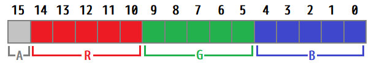
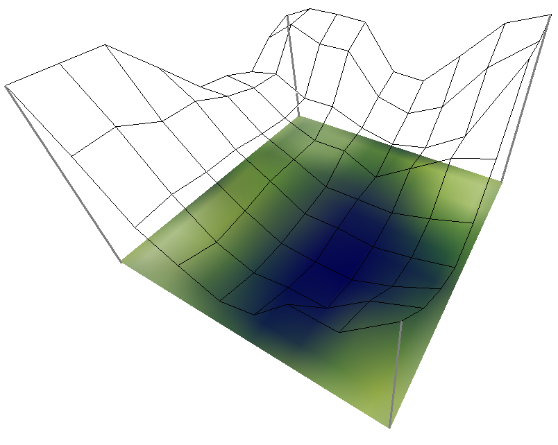
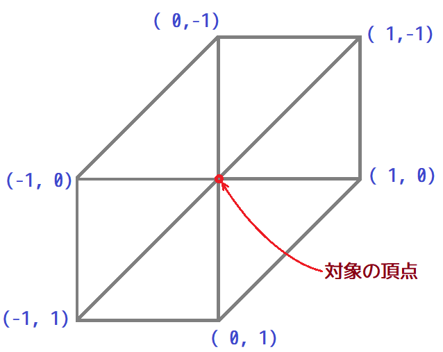
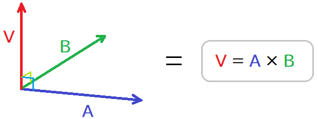

[OpenGL 3D 2019 第07回]

# <ruby>是<rt>こ</rt></ruby>の<ruby>多陀用幣流之國<rt>ただよへるくに</rt></ruby>を<br>　　　　　　<ruby>修理<rt>つくり</rt></ruby><ruby>固<rt>かた</rt></ruby>め<ruby>成<rt>な</rt>せ</ruby>

<br>

## 1. 画像データを調べられるようにする

### 1.1 画像データ型を定義する

これまでのところ、読み込んだ画像データはすぐにテクスチャへと変換され、元になった画像データはそのまま捨てられています。<br>
画像をテクスチャ以外の用途で使えるようにするには、「画像データの読み込み」と「画像データからテクスチャを作成」の２つの機能に分離する必要があるでしょう。
しかし、機能を分離するということは、それらのあいだでデータを受け渡す方法を作る必要があることを意味します。そこで、「画像データ」を表すクラスを作成して、これを使ってデータを受け渡すことにしましょう。

まずは、クラスで使用する型を含むヘッダファイルをインクルードしましょう。Texture.hを開き、次のプログラムを追加してください。

```diff
 #define TEXTURE_H_INCLUDED
 #include <GL/glew.h>
+#include <glm/glm.hpp>
+#include <vector>
 #include <memory>
```

続いて、クラスを定義します。Image2DPtr型の定義の下に、次のプログラムを追加してください。

```diff
 namespace Texture {

 class Image2D;
 using Image2DPtr = std::shared_ptr<Image2D>;
 
+/**
+* 画像データ.
+*/
+class ImageData {
+public:
+  glm::vec4 GetColor(int x, int y) const;
+
+public:
+  GLint width = 0; ///< 横のピクセル数.
+  GLint height = 0; ///< 縦のピクセル数.
+  GLenum format = GL_NONE; ///< 記録されている色の種類.
+  GLenum type = GL_NONE; ///< それぞれの色情報のビット配置.
+  std::vector<uint8_t> data; ///< バイトデータ.
+};

 GLuint CreateImage2D(GLsizei width, GLsizei height, const GLvoid* data,
   GLenum format,GLenum type);
 GLuint LoadImage2D(const char* path);
```

クラス名は「ImageData(いめーじ・でーた)」としました。このクラスには画像ファイルの情報がそのまま格納されます。
メンバ変数はコメントで説明しているとおりです。これらの変数は、glTexImage2D(じーえる・てっくす・いめーじ・つーでぃー)関数の引数として使えます。
「GL_NONE(じーえる・のん)」は、OpenGLで定義されている定数で「何も設定しない・されていない」ことを示す値です。ImageDataクラスの初期状態ではなんの画像データも設定されていないわけですから、それを示すためにこの定数を設定しておきます。

### 1.2 色データを取得する関数を定義する

また、ピクセルがどのようにデータ化されているかは、画像の形式によって異なるため、ピクセルを調べるときには画像形式を考慮しなければなりません。
これを毎回行うのは面倒なので、「GetColor(げっと・ぴくせる・からー)」というメンバ関数として定義します。

Texture.cppを開き、Texture名前空間の先頭に、次のプログラムを追加してください。

```diff
 /**
 * @file Texture.cpp 
 */
+#define NOMINMAX
 #include "Texture.h"
 #include <cstdint>
 #include <vector>
 #include <fstream>
 #include <iostream>
+#include <algorithm>
```

「NOMINMAX(のー・みん・まっくす)」マクロを定義しておくと、マイクロソフトが独自拡張したmin/maxではなく、標準ライブラリのmin/max関数が使えるようになります。
そして、min/max関数は「algorithm(あるごりずむ)」というヘッダファイルに定義されているので、これをインクルードしておきます。

これでGetColor関数を作る準備は完了です。

```diff
 /// テクスチャ関連の関数やクラスを格納する名前空間.
 namespace Texture {

+/**
+* 色データを取得する.
+*
+* @param x  X座標.
+* @param y  Y座標.
+*
+* @return 座標(x, y)の色を0.0～1.0で表した値.
+*         色要素がデータに存在しない場合、RGBは0.0、Aは1.0になる.
+*/
+glm::vec4 ImageData::GetColor(int x, int y) const
+{
+  return glm::vec4(0, 0, 0, 1);
+}

 /**
 * 2Dテクスチャを作成する.
 *
```

これはまだ雛形ですので、すこしずつプログラムを追加していきます。

画像データには、各色１バイトで表現されるものと、複数の色がまとまって２バイトで表現されるものが存在します。
まずはどちらのデータなのかを判別しなければなりません。GetColor関数に次のプログラムを追加してください。

```diff
 glm::vec4 ImageData::GetColor(int x, int y) const
 {
+  // 座標を画像の範囲に制限.
+  x = std::max(0, std::min(x, width - 1));
+  y = std::max(0, std::min(y, height - 1));
+
+  if (type == GL_UNSIGNED_BYTE) {
+    // 各色１バイトのデータ.
+    glm::vec4 color(0, 0, 0, 255);
+    return color / 255.0f;
+  } else if (type == GL_UNSIGNED_SHORT_1_5_5_5_REV) {
+    // 色が２バイトに詰め込まれたデータ.
+    glm::vec4 color(0, 0, 0, 1);
+    return color / glm::vec4(31.0f, 31.0f, 31.0f, 1.0f);
+  }
   return glm::vec4(0, 0, 0, 1);
 }
```

画像が１バイトデータなのか２バイトデータなのかは、typeメンバによって判別できます。typeがGL_UNSIGNED_BYTEなら１バイト、GL_UNSIGNED_SHORT_...なら２バイトのデータです。これらは取りうる値が違うため、基本の数値や最後の変換方法が異なる点に注意してください。
例えば１バイトデータは0～255の値になるので、それを0.0～1.0に変換するために255で割っているわけです。

次に、同じ１バイトデータでもデータの格納方法には複数の形式が存在するので、形式に応じてデータを取得しなければなりません。形式には膨大なバリエーションが存在するのですが、今回はTGA画像で使われる３つの形式に絞って対応することにしました。
GetColor関数に次のプログラムを追加してください。

```diff
   if (type == GL_UNSIGNED_BYTE) {
     // 各色１バイトのデータ.
     glm::vec4 color(0, 0, 0, 255);
+    if (format == GL_BGRA) {
+      // BGRAの順番で１バイトずつ、合計４バイト格納されている.
+      const uint8_t* p = &data[x * 4 + y * (width * 4)];
+      color.b = p[0];
+      color.g = p[1];
+      color.r = p[2];
+      color.a = p[3];
+    } else if (format == GL_BGR) {
+      // BGRの順番で１バイトずつ、合計３バイト格納されている.
+      const uint8_t* p = &data[x * 3 + y * (width * 3)];
+      color.b = p[0];
+      color.g = p[1];
+      color.r = p[2];
+    } else if (format == GL_RED) {
+      // 赤色だけ、合計１バイト格納されている.
+      color.r = data[x + y * width];
+    }
     return color / 255.0f;
   } else if (type == GL_UNSIGNED_SHORT_1_5_5_5_REV) {
```

画像データがどの形式なのかはformatメンバを調べることで分かります。TGA画像に対応するのはGL_BGRA、GL_BGR、GL_REDの３つです。これらは、名前に含まれる色データだけが名前で示される順序で格納されているので、それに従ってデータを取り出しています。
例えばGL_BGRなら「青、緑、赤」の順で１バイトずつ、合計３バイトのデータがあり、アルファはありません。そのため、１ピクセルのデータは３バイトになります。

２バイトデータも対応しましょう。TGA画像が対応している２バイト形式はGL_BGRAです。GetColor関数に次のプログラムを追加してください。

```diff
   } else if (type == GL_UNSIGNED_SHORT_1_5_5_5_REV) {
     // 色が２バイトに詰め込まれたデータ.
     glm::vec4 color(0, 0, 0, 1);
+    const uint8_t* p = &data[x * 2 + y * (width * 2)];
+    const uint16_t c = p[0] + p[1] * 0x100; // 2つのバイトを結合.
+    if (format == GL_BGRA) {
+      // 16ビットのデータから各色を取り出す.
+      color.b = static_cast<float>((c & 0b0000'0000'0001'1111));
+      color.g = static_cast<float>((c & 0b0000'0011'1110'0000) >> 5);
+      color.r = static_cast<float>((c & 0b0111'1100'0000'0000) >> 10);
+      color.a = static_cast<float>((c & 0b1000'0000'0000'0000) >> 15);
+    }
     return color / glm::vec4(31.0f, 31.0f, 31.0f, 1.0f);
   }
   return glm::vec4(0, 0, 0, 1);
 }
```

２バイトデータは少し特殊で、各バイトに色データが混在しています。２バイトデータから各色の数値を取り出すには、ビット演算によって必要な部分だけを取り出さなければなりません。以下の図は、どのビットにどの色のデータが格納されているかを示しています。

<div style="text-align: center;width: 100%;">

</div>

formatがGL_BGRAの場合は以下のようにデータが配置されているので、これに従ってデータを取り出しています。このとき「＆」演算だけではビット位置がずれたままなので、「＞＞」演算によって必要なだけ左に移動させます。
先頭が「0b」または「0B」で始まる数値は、C++11以降では２進数として扱われます。0b表記はビット演算を行う際に便利です。

これでImageDataクラスは完成です。

### 1.3 LoadImage2D関数の機能を２つの関数に分ける

それでは、LoadImage2D関数を分割していきましょう。
まずは「画像データの読み込み」を行う関数を宣言します。

Texture.hを開き、関数宣言の下に次のプログラムを追加してください。

```diff
 GLuint CreateImage2D(GLsizei width, GLsizei height, const GLvoid* data,
   GLenum format,GLenum type);
 GLuint LoadImage2D(const char* path);
+bool LoadImage2D(const char* path, ImageData* imageData);

 /**
 * 2Dテクスチャ
 */
```

新たに宣言した関数の名前は、既存のLoadImage2D関数と全く同じですが、戻り値の型と引数の種類は違います。このような宣言が可能なのは、C++言語には

「引数が違っていれば、同じ名前の関数を作ってもよい」

というルールがあるからです。また、このような、同名の関数を複数作成することを「オーバーロード」といいます。

>［補足］ここでいう「オーバーロード」は英語では「overload」と書き、「過負荷」や「過積載」を意味します。C言語では名前に対応する関数は１つだけだったので、名前に２つ以上の関数を割り当てられることからこのように呼ばれています。
>なお、英語で「君主」や「封建領主」を表す単語も「オーバーロード」ですが、こちらは「overlord」と書きます(ａとｒの違い)。

続いて、LoadImage2D関数を分割していきます。実際にLoadImage2D関数を調べてみると、関数の大半はファイルの読み込みプログラムになっていて、テクスチャの作成プログラムは、最後にCreateImage2D関数を実行している部分だけです。
それをふまえて分割方針を考えると、まず、これらのプログラムは新しく作成するほうのLoadImage2D関数で利用できそうです。そして既存の関数は「新しいLoadImage2D関数を実行し、その結果をCreateImage2D関数に渡すだけ」というものになるでしょう。

それでは、再びTexture.cppを開き、LoadImage2D関数を次のように変更してください。

```diff
 * @retval 0以外  作成したテクスチャ・オブジェクトのID.
 * @retval 0      テクスチャの作成に失敗.
 */
 GLuint LoadImage2D(const char* path)
 {
+  ImageData imageData;
+  if (!LoadImage2D(path, &imageData)) {
+    return 0;
+  }
+  return CreateImage2D(imageData.width, imageData.height, imageData.data.data(),
+    imageData.format, imageData.type);
+}
   // TGAヘッダを読み込む.
   uint8_t tgaHeader[18];
   ifs.read(tgaHeader, 18);
```

先の方針に従い、既存のLoadImage2D関数は、読み込んだ画像データを利用してCreateImage2D関数を実行するだけになります。
なお、上記のプログラムを書くとカッコの対応がずれますが、このあと修正しますのでそのままにしておいてください。

続いて、新しいLoadImage2D関数を定義します。上記で追加したプログラムの下に、次のプログラムを追加してください。

```diff
   if (!LoadImage2D(path, &imageData)) {
     return 0;
   }
   return CreateImage2D(imageData.width, imageData.height, imageData.data.data(), imageData.format, imageData.type);
 }
+
+/**
+* ファイルから画像データを読み込む.
+*
+* @param path      画像として読み込むファイルのパス.
+* @param imageData 画像データを格納する構造体.
+*
+* @retval true  読み込み成功.
+* @retval false 読み込み失敗.
+*/
+bool LoadImage2D(const char* path, ImageData* imageData)
+{
   // TGAヘッダを読み込む.
   uint8_t tgaHeader[18];
   ifs.read(tgaHeader, 18);
```

このように、既存のLoadImage2D関数のプログラムの大半は、新しいLoadImage2D関数のプログラムとして働いてもらうことになります。
しかし、まだ新しい関数になじんでいない部分があるので、あとすこし修正を加えましょう。
新しいLoadImage2D関数の末尾を次のように変更してください。

```diff
   {
     type = GL_UNSIGNED_SHORT_1_5_5_5_REV;
   }
-  return CreateImage2D(width, height, buf.data(), format, type);
+  imageData->width = width;
+  imageData->height = height;
+  imageData->format = format;
+  imageData->type = type;
+  imageData->data.swap(buf);
+  return true;
 }
```

CreateImage2D関数は、先ほどpath引数だけのLoadImage2D関数に引き継いだので不要です。そのかわりとして、imageData引数に値を設定するプログラムを追加しました。
これでLoadImage2D関数のオーバーロードは完了です。

<div style="page-break-after: always"></div>

## 2. 画像を高さデータに変換する

### 2.1 ハイトマップ

オープンワールドのような広大な世界を作るとき、愚直にモデリングしていてはいくら時間があっても足りません。そのうえ、データも巨大なものになってしまいます。
そこで、地形の標高を表すモノクロ画像から頂点データを作り出す手法が使われるようになりました。このような画像は、「ハイトマップ(height map)」と呼ばれます。

<div style="text-align: center;width: 100%;">

</div>

ハイトマップによって節約できるデータ量を考えてみましょう。頂点データはＸ、Ｙ、Ｚの３つのfloat型からなり、float型は４バイトなので合計１２バイト必要です。対して、画像データの場合、Ｘ、Ｚ座標は画素の位置から自動的に決まるために不要であり、残りのＹだけが色データとして記録されます。そして、モノクロ画像の色データはわずか１バイトです。
つまり、頂点データを使った場合に比べて、画像データを使った場合は１／１２のデータ量で済んでしまうわけです。高さが256通りでは不足だという場合は２バイトで表すことになりますが、それでも頂点データの１／６です。

ハイトマップは画像データなので、あらゆるペイントツールを使って作成や変更ができます。例えば、PhotoShopやGIMPなどでは、「雲模様」、「ソリッドノイズ」といったフィルタを使うことで、簡単に複雑な地形を作り出すことが可能です。
また、リアルな地形を自動的に作成してくれるツールも存在します。代表的なものは「Terragen」「World Creator」「L3DT」です(他にもあります)。

### 2.2 ハイトマップクラスを定義する

市販のゲームでは「テッセレーション」、「ジオメトリ・シェーダー」といった機能を使って、シェーダーの中でハイトマップから頂点データを生成します。
しかし、今回はC++のプログラムで頂点データを作成することにしました。これらの機能を使いこなすには、より高度なOpenGLとシェーダーの知識を説明する必要がありますが、その時間がないからです。

とはいえ、画像を頂点データに変換するための基本的な考えかたは、どの方法であっても共通ですし、画像データのほうが取り扱いが容易なことに違いはありません。

それでは、ハイトマップを扱うクラスを作成しましょう。まずは、Srcフォルダに「Terrain.h」(てれいん・どっと・えいち)というファイルを作成してください。

>［補足］Terrainは「てれいん」または「てれーん」と読み、「地域」や「地形」という意味を持っています。

そして作成したTerrain.hを開き、以下のプログラムを追加してください。

```c++
/**
* @file Terrain.h
*/
#ifndef TERRAIN_H_INCLUDED
#define TERRAIN_H_INCLUDED
#include "Mesh.h"
#include <glm/glm.hpp>
#include <string>
#include <vector>

namespace Terrain {

} // namespace Terrain

#endif // TERRAIN_H_INCLUDED
```

まず、いくつかのヘッダーファイルをインクルードしています。
Mesh.hをインクルードしているのは、地形データからメッシュを作成するためです。vectorは高さデータの保存用、またglm.hppは地形の広さを保存するためにvec2型を使ったり、頂点データを作成するときにvec3型を使うためです。

続いてクラスを定義します。クラス名は「HeightMap(はいと・まっぷ)」としましょう。それでは、Terrain名前空間の先頭に、次のプログラムを追加してください。

```diff
 #include <vector>

 namespace Terrain {
+
+/**
+* 高さマップ.
+*
+* 1. LoadFromFile()で画像ファイルから高さ情報を読み込む.
+* 2. CreateMesh()で読み込んだ高さ情報から地形メッシュを作成する.
+* 3. ある地点の高さを調べるにはHeight()を使う.
+*/
+class HeightMap {
+public:
+  HeightMap() = default;
+  ~HeightMap() = default;
+
+  bool LoadFromFile(const char* path, float scale, float baseLevel);
+  float Height(const glm::vec3& pos) const;
+  const glm::ivec2& Size() const;
+  bool CreateMesh(Mesh::Buffer& meshBuffer,
+    const char* meshName, const char* texName = nullptr) const;
+
+private:
+  std::string name;                ///< 元になった画像ファイル名.
+  glm::ivec2 size = glm::ivec2(0); ///< ハイトマップの大きさ.
+  std::vector<float> heights;      ///< 高さデータ.
+
+  glm::vec3 CalcNormal(int x, int z) const;
+};

 } // namespace Terrain

 #endif // TERRAIN_H_INCLUDED
```

HeightMapクラスの仕事は、ハイトマップ画像を読み込み、その情報を使って指定された地点の高さを計算することです。また、高さ情報からメッシュを作成するメンバ関数も、このクラスで作成します。

### 2.3 HeightMap::LoadFromFile関数を定義する

それでは、メンバ関数の定義を行っていきましょう。Srcフォルダに「Terrain.cpp」というファイルを追加してください。そして、追加したファイルを開いて以下のプログラムを追加してください。

```c++
/**
* @file Terrain.cpp
*/
#include "Terrain.h"
#include "Texture.h"
#include <iostream>
#include <algorithm>

/// 地形に関するクラス等を格納する名前空間.
namespace Terrain {

} // namespace Terrain
```

画像ファイルの読み込みにはTexture::LoadImage2D関数を使いますので、Texture.hをインクルードしています。

さて、最初に定義するメンバ関数はLoadFromFile(ろーど・ふろむ・ふぁいる)です。
Terrain名前空有間の下に、次のプログラムを追加してください。

```diff
 #include <algorithm>

 /// 地形に関するクラス等を格納する名前空間.
 namespace Terrain {
+
+/**
+* 画像ファイルから地形データを読み込む.
+*
+* @param path      画像ファイル名.
+* @param scale     高さに掛ける係数.
+* @param baseLevel 高さ0とみなす高さ値(色データ0.0～1.0のどこを高さ0とするか).
+*
+* @retval true  読み込み成功.
+* @retval false 読み込み失敗.
+*
+* 画像の赤要素を高さデータとみなして読み込む.
+*/
+bool HeightMap::LoadFromFile(const char* path, float scale, float baseLevel)
+{
+  // 画像ファイルを読み込む.
+  Texture::ImageData imageData;
+  if (!Texture::LoadImage2D(path, &imageData)) {
+    std::cerr << "[エラー]" << __func__ << ": ハイトマップを読み込めませんでした.\n";
+    return false;
+  }
+
+  name = path;
+
+  // 画像の大きさを保存.
+  size = glm::ivec2(imageData.width, imageData.height);
+
+  // 画像データは下から上に向かって格納されているので、上下反転しながら高さデータに変換.
+  heights.resize(imageData.data.size());
+  for (int y = 0; y < size.y; ++y) {
+    const int offsetY = (size.y - 1) - y; // 上下反転.
+    for (int x = 0; x < size.x; ++x) {
+      const glm::vec4 color = imageData.GetColor(x, y);
+      heights[offsetY * size.x + x] = (color.r - baseLevel) * scale;
+    }
+  }
+  return true;
+}

 } // namespace Terrain
```

### 2.4 HeightMap::Height関数を定義する

続いて、読み込んだ高さを取得する関数を定義します。関数名は「Height」(はいと、「高さ」という意味)です。

>［補足］「高さ」を表す英語には、他にも「elevation(えれべーしょん、標高)」や「altitude(あるちちゅーど、高度)」、「above sea level(あばーぶ・しー・れべる、海抜)」があります。
>現実の地面の高さには「elevation」か「above sea level」が使われるようですが、ハイトマップで与えられる高さデータは標高とも海抜ともつかない値なので、無難にHeightという語を使うことにしました。

それでは、LoadFromFile関数の定義の下に、次のプログラムを追加してください。

```diff
       heights[offsetY * size.x + x] = (color.r - baseLevel) * scale;
     }
   }
   return true;
 }
+
+/**
+* 高さを取得する.
+*
+* @param pos 高さを取得する座標.
+*
+* @return posの位置の高さ.
+*
+* ハイトマップはXZ平面に対応し、原点(0, 0)からプラス方向に定義される.
+*/
+float HeightMap::Height(const glm::vec3& pos) const
+{
+  // 座標が高さマップの範囲内に収まるように切り上げ、または切り捨てる.
+  const glm::vec2 fpos = glm::clamp(
+    glm::vec2(pos.x, pos.z), glm::vec2(0.0f), glm::vec2(size) - glm::vec2(1));
+
+  // 「高さ」はfposが含まれる正方形の左上頂点を基準として計算するので、左上の座標を求める.
+  // マップは右下がプラス方向で、正方形の大きさは1.0x1.0とする.
+  // そうすることで、左上の頂点座標を求める計算は、単にfposの小数部を切り捨てるだけにる.
+  // ただし、右端と下端の1列は、その先に正方形がないことから左上座標として使えないため、
+  // 左上頂点座標はsize-2に制限する. 座標fposは
+  //   (index.x, index.y), (index.x+1, index.y),
+  //   (index.x, index.y+1), (index.x+1, index.y+1)
+  // の4点からなる正方形の内側に存在することになる.
+  const glm::ivec2 index = glm::min(glm::ivec2(fpos), size - glm::ivec2(2));
+
+  // 左上頂点からの相対座標を計算.
+  const glm::vec2 offset = fpos - glm::vec2(index);
+
+  // 地形は4頂点からなる正方形であり、正方形は下記のように2つの三角形として定義される.
+  //     -Y
+  //    +--+
+  // -X |／| +X
+  //    +--+
+  //     +Y
+  // 奥が-Y方向、手前が+Y方向で、1x1の正方形であることから、
+  // 「offset.x + offset.y < 0」ならば、offsetは左上の三角形領域に存在する.
+  // そうでなければ右下の三角形領域に存在する.
+  if (offset.x + offset.y < 1) {
+    const float h0 = heights[index.y * size.x       + index.x];
+    const float h1 = heights[index.y * size.x       + (index.x + 1)];
+    const float h2 = heights[(index.y + 1) * size.x + index.x];
+    return h0 + (h1 - h0) * offset.x + (h2 - h0) * offset.y;
+  } else {
+    const float h0 = heights[(index.y + 1) * size.x + (index.x + 1)];
+    const float h1 = heights[(index.y + 1) * size.x + index.x];
+    const float h2 = heights[index.y * size.x       + (index.x + 1)];
+    return h0 + (h1 - h0) * (1.0f - offset.x) + (h2 - h0) * (1.0f - offset.y);
+  }
+}

 } // namespace Terrain
```

### 2.5 HeightMap::CreateMesh関数を定義する

次はメッシュを作成するメンバ関数を定義します。関数名は素直に「CreateMesh(くりえいと・めっしゅ)」としました。
Heightメンバ関数の定義の下に、次のプログラムを追加してください。

```diff
     return h0 + (h1 - h0) * (1.0f - offset.x) + (h2 - h0) * (1.0f - offset.y);
   }
 }
+
+/**
+* 高さマップからメッシュを作成する.
+*
+* @param meshBuffer メッシュ作成先となるメッシュバッファ.
+* @param meshName   作成するメッシュの名前.
+* @param texName    メッシュに貼り付けるテクスチャファイル名.
+*
+* @retval true  メッシュの作成に成功.
+* @retval false メッシュを作成できなかった.
+*
+* 三角形は以下の形になる.
+*   d--c
+*   |／|
+*   a--b
+*/
+bool HeightMap::CreateMesh(
+  Mesh::Buffer& meshBuffer, const char* meshName, const char* texName) const
+{
+  if (heights.empty()) {
+    std::cerr << "[エラー]" << __func__ << ": ハイトマップが読み込まれていません.\n";
+    return false;
+  }
+
+  return true;
+}

 } // namespace Terrain
```

とりあえず、高さデータを読み込んでいない場合はfalseを返して終了させます。続いて頂点データを作成します。
エラー判定プログラムの下に、次のプログラムを追加してください。

```diff
     std::cerr << "[エラー]" << __func__ << ": ハイトマップが読み込まれていません.\n";
     return false;
   }
+
+  // 頂点データを作成.
+  Mesh::Vertex v;
+  std::vector<Mesh::Vertex> vertices;
+  vertices.reserve(size.x * size.y);
+  for (int z = 0; z < size.y; ++z) {
+    for (int x = 0; x < size.x; ++x) {
+      // テクスチャ座標は上がプラスなので、向きを逆にする必要がある.
+      v.position = glm::vec3(x, heights[z * size.x + x], z);
+      v.texCoord = glm::vec2(x, (size.y - 1) - z) / (glm::vec2(size) - 1.0f);
+      v.normal = CalcNormal(x, z);
+      vertices.push_back(v);
+    }
+  }
+  const size_t vOffset =
+    meshBuffer.AddVertexData(vertices.data(), vertices.size() * sizeof(Mesh::Vertex));

   return true;
 }
```

高さデータをメッシュに変換するのはそれほど難しいことではありませんが、いくつかの注意点があります。
頂点データはXZ座標(0, 0)からプラス方向に作成します。二重のfor文を使い、1.0間隔で順番に並べていくだけなので、難しいところはないと思います。ただし、法線の計算は少々面倒なので、CalcNormal(かるく・のーまる)という関数にまとめました。

また、テクスチャ座標をどのように定義するかがひとつのポイントです。今回は地形の(0, 0)を左上としたので、(0, 0)の頂点が画像の左上に当たるようにテクスチャ座標を設定することにしました。
頂点座標とテクスチャ座標の原点の違い考慮すると、必要なテクスチャY座標は頂点座標のZ座標を反転させたものに相当します。上記のプログラムでは、「(画像の高さ - 1)」から高さデータのZ座標を引くことこれを行っています。
こういった座標系の違いは重要で、適切に対処しないと思ったとおりの表示にはなりません。注意しましょう。

全ての頂点データを作成したら、Mesh::BufferクラスのAddVertexDataメンバ関数を使って頂点バッファに登録します。vOffsetはデータが登録された位置を示し、あとでプリミティブを作成する際に使用します。

続いてインデックスデータを作成します。
頂点データを作成するプログラムの下に、次のプログラムを追加してください。

```diff
   const size_t vOffset =
     meshBuffer.AddVertexData(vertices.data(), vertices.size() * sizeof(Mesh::Vertex));
+
+  // インデックスデータを作成.
+  std::vector<GLuint> indices;
+  indices.reserve(size.x * size.y);
+  for (int z = 0; z < size.y - 1; ++z) {
+    for (int x = 0; x < size.x - 1; ++x) {
+      const GLuint a = (z + 1) * size.x + x;
+      const GLuint b = (z + 1) * size.x + (x + 1);
+      const GLuint c = z       * size.x + (x + 1);
+      const GLuint d = z       * size.x + x;
+      indices.push_back(a);
+      indices.push_back(b);
+      indices.push_back(c);
+
+      indices.push_back(c);
+      indices.push_back(d);
+      indices.push_back(a);
+    }
+  }
+  const size_t iOffset =
+    meshBuffer.AddIndexData(indices.data(), indices.size() * sizeof(GLuint));

   return true;
 }
```

インデックスデータの作成では、まず四角形を構成する四つの頂点のインデックスを計算します。そして、それらのインデックスを組み合わせて２つの三角形を定義します。

地形メッシュのインデックスデータはGLuint型にしました。GLushort型では65536個のインデックスしか扱えないので、画像の大きさが256x256までに制限されてしまうからです。
本テキストではんなに巨大なマップを扱うつもりはないのですが、より大きなマップを表示できるよう制限をゆるくしておくほうが、みなさんも改造しやすいと思います。
ただし、あまり大きな画像は読み込みと変換に時間がかかります。Releaseビルドにすればある程度速くなりますが、大きくとも600x600程度におさえたほうがいいでしょう。

全てのインデックスデータを作成したら、Mesh::BufferクラスのAddIndexDataメンバ関数を使ってインデックスバッファに登録します。iOffsetはデータが登録された位置を示し、頂点データのときと同様にあとでプリミティブを作成する際に使用します。

頂点データとインデックスデータを作成したら、それらをまとめてメッシュとして登録します。
インデックスデータを作成するプログラムの下に、次のプログラムを追加してください。

```diff
   const size_t iOffset =
     meshBuffer.AddIndexData(indices.data(), indices.size() * sizeof(GLuint));
+
+  // 頂点データとインデックスデータからメッシュを作成.
+  Mesh::Primitive p =
+    meshBuffer.CreatePrimitive(indices.size(), GL_UNSIGNED_INT, iOffset, vOffset);
+  Mesh::Material m = meshBuffer.CreateMaterial(glm::vec4(1), nullptr);
+  if (texName) {
+    m.texture = Texture::Image2D::Create(texName);
+  } else {
+    m.texture = Texture::Image2D::Create(name.c_str());
+  }
+  meshBuffer.AddMesh(meshName, p, m);

   return true;
 }
```

立方体の作成で見たように、メッシュの登録は、プリミティブとマテリアルを作成してAddMeshメンバ関数に引き渡すだけです。

### 2.6 HeightMap::CalcNormal関数を定義する

CreateMesh関数では、法線の計算をCalcNormal(かるく・のーまる)という関数に一任しています。次はこの関数を定義しましょう。
CreateMeshメンバ関数の定義の下に、次のプログラムを追加してください。

```diff
   meshBuffer.AddMesh(meshName, p, m);

   return true;
 }
+
+/**
+* 高さ情報から法線を計算する.
+*
+* @param centerX 計算対象のX座標.
+* @param centerr 計算対象のZ座標.
+*
+* @return (centerX, centerZ)の位置の法線.
+*/
+glm::vec3 HeightMap::CalcNormal(int centerX, int centerZ) const
+{
+  const glm::ivec2 offsetList[] = {
+    { 0,-1}, { 1,-1}, { 1, 0}, { 0, 1}, {-1, 1}, {-1, 0}, { 0,-1}
+  };
+  const glm::vec3 center(centerX, heights[centerZ * size.x + centerX], centerZ);
+  glm::vec3 sum(0);
+  for (size_t i = 0; i < 6; ++i) {
+    glm::vec3 p0(centerX + offsetList[i].x, 0, centerZ + offsetList[i].y);
+    if (p0.x < 0 || p0.x >= size.x || p0.z < 0 || p0.z >= size.y) {
+      continue;
+    }
+    p0.y = heights[static_cast<size_t>(p0.z * size.x + p0.x)];
+
+    glm::vec3 p1(centerX + offsetList[i + 1].x, 0, centerZ + offsetList[i + 1].y);
+    if (p1.x < 0 || p1.x >= size.x || p1.z < 0 || p1.z >= size.y) {
+      continue;
+    }
+    p1.y = heights[static_cast<size_t>(p1.z * size.x + p1.x)];
+
+    sum += normalize(cross(p1 - center, p0 - center));
+  }
+  return normalize(sum);
+}

 } // namespace Terrain
```

頂点の法線は、隣接する平面の法線を平均したものになります。隣接する平面と、計算対象の座標との関係を下図に示します。

<div style="text-align: center;width: 100%;">

</div>

メッシュの形状から、隣接する三角形(平面)は６つだと分かりますので、最大６回の計算が必要となります。

三角形の法線を求めるには「外積」を使うことができます。詳しい説明は省きますが、２つのベクトルの「外積」を計算すると、それらのベクトルに対して垂直なベクトルを得られるからです。
GLMライブラリでは、外積は「cross(くろす)」関数として定義されています。

<div style="text-align: center;width: 100%;">

</div>

上記のプログラムでは、まず隣接する２つの頂点座標p0とp1を計算し、それらがマップ外に存在するのでなければ、外積によって法線を計算し、sum(さむ、「合計」という意味)変数に加算しています。
なお、外積によって得られる垂直ベクトルの長さは、元になったベクトルの長さとそれらのなす角によって変化します。長さが不定だと正しい法線を計算できなくなってしまうので、normalize(のーまらいず)関数を用いて単位ベクトル(長さが１のベクトル)にしてから加算します。

>［注意！］外積では「交換法則」が成り立ちません。掛ける順序を間違えると計算結果が変わってしまうので、順番には気をつけてください。

全ての三角形の法線を加算し終えたら法線の平均を計算します。加算したのは単位ベクトルだけなので、normalize関数を使って単位ベクトルに変換すれば平均が求まります。

>［補足］あるベクトルを単位ベクトルに変換するには「ベクトルの各要素をベクトルの長さで割る」という計算をします。
>normalize関数はこの計算を関数化したものです。

これでHeightMapクラスの定義は完了です。

### 2.7 ハイトマップをメッシュとして表示する

早速、ハイトマップを作成して表示しましょう。まずはお好みのペイントツールを使って、ハイトマップ画像を作成します。
あまり大きい画像だと表示に時間がかかってしまうので、大きさは200x200にしてください。そして、適当にモノクロの絵を描いてください。画像の黒が最も低い部分、白が最も高い部分になります。
作成した画像は、プロジェクトのResフォルダに無圧縮のTGA形式で保存してください。名前はなんでもいいのですが、今回は「Terrain.tga」にしてください。もしツールがTGA出力に対応していない場合、いったんPNG形式などで保存し、それをVisual Studioで開いてTGAに変換するとよいでしょう。

次に、HeightMapクラスをMainGameSceneクラスに追加しましょう。まずはヘッダファイルをインクルードします。MainGameScene.hを開き、次のプログラムを追加してください。

```diff
 #include "Scene.h"
 #include "Sprite.h"
 #include "Font.h"
 #include "Mesh.h"
+#include "Terrain.h"
 #include <vector>
```

続いて、MainGameSceneクラスにHeightMap型の変数を追加します。MainGameSceneクラスの定義に、次のプログラムを追加してください。

```diff
 private:
   std::vector<Sprite> sprites;
   SpriteRenderer spriteRenderer;
   Font::Renderer fontRenderer;
   Mesh::Buffer meshBuffer;
+  Terrain::HeightMap heightMap;
 };
```

今度はMainGameScene.cppを開き、MainGameScene::Initialize関数に次のプログラムを追加してください。

```diff
   spr.Scale(glm::vec2(2));
   sprites.push_back(spr);
   meshBuffer.Init(1'000'000 * sizeof(Mesh::Vertex), 3'000'000 * sizeof(GLushort));
+
+  // ハイトマップを作成する.
+  if (!heightMap.LoadFromFile("Res/Terrain.tga", 20.0f, 0.5f)) {
+    return false;
+  }
+  if (!heightMap.CreateMesh(meshBuffer, "Terrain")) {
+    return false;
+  }

   return true;
 }
```

このプログラムはTerrain.tgaを高さデータとして読み込み、「Terrain(てれいん)」という名前のメッシュを作成します。

それでは、作成したメッシュを表示しましょう。MainGameScene::Renderer関数に次のプログラムを追加してください。

```diff
 void MainGameScene::Render()
 {
   const GLFWEW::Window& window = GLFWEW::Window::Instance();
   const glm::vec2 screenSize(window.Width(), window.Height());
   spriteRenderer.Draw(screenSize);
   fontRenderer.Draw(screenSize);

-  const glm::vec3 cameraPos(-5, 3, 5);
-  const glm::vec3 targetPos(0, 0, 0);
+  const glm::vec3 targetPos(100, 0, 100);
+  const glm::vec3 cameraPos = targetPos + glm::vec3(0, 50, 50);
   const glm::mat4 matView = glm::lookAt(cameraPos, targetPos, glm::vec3(0, 1, 0));
   const float aspectRatio =
     static_cast<float>(window.Width()) / static_cast<float>(window.Height());
   const glm::mat4 matProj =
     glm::perspective(glm::radians(30.0f), aspectRatio, 1.0f, 1000.0f);
   const glm::mat4 matModel(1);
   Mesh::Draw(meshBuffer.GetFile("Cube"), matProj * matView, matModel);
+  Mesh::Draw(meshBuffer.GetFile("Terrain"), matProj * matView, glm::mat4(1));
 }
```

地形メッシュは巨大なので(長さ1.0が1mだとして、200x200の画像から作成された地形は199x199mの広さになる)、ある程度広い範囲が見渡せるように視点を遠くに移動しました。

<div style="page-break-after: always"></div>

プログラムが書けたら、**ビルドして実行してください。**
メインゲーム画面で、描いたとおりの地形が表示されていたら成功です。

<div style="border:solid 1px; background:#f0e4cd; margin: 1rem; padding: 1rem; border-radius: 10px">
<strong>［課題01］</strong><br>
ハイトマップ画像に手を加えて、実際に地形が変化することを確認してください。
</div>

<div style="border:solid 1px; background:#f0e4cd; margin: 1rem; padding: 1rem; border-radius: 10px">
<strong>［課題02］</strong><br>
HeightMap::LoadFromFile関数の２つめの引数は、0.0～1.0の色データに掛けられます。地形の実際の高さはこの引数によって決まるわけです。そこで、この引数の値を1.0fにして、地形がどのように変化するかを確認してください。同様に100.0fにした場合も確認してください。
確認を終えたら20.0fに戻してください。
</div>

### 2.8 地形の上にメッシュを配置する

視点を移動したため、前回表示した立方体が見えなくなっています。見える位置に移動させたいですが、普通に移動させると地形に埋まって見えない可能性があります。
そこで、HeighMapクラスの機能を使って、立方体が常に地形の上に表示されるようにしてみましょう。MainGameScene::Render関数を次のように変更してください。

```diff
   const glm::mat4 matProj =
     glm::perspective(glm::radians(30.0f), aspectRatio, 1.0f, 1000.0f);
-  const glm::mat4 matModel(1);
+  glm::vec3 cubePos(100, 0, 100);
+  cubePos.y = heightMap.Height(cubePos);
+  const glm::mat4 matModel = glm::translate(glm::mat4(1), cubePos);
   Mesh::Draw(meshBuffer.GetFile("Cube"), matProj * matView, matModel);
   Mesh::Draw(meshBuffer.GetFile("Terrain"), matProj * matView, glm::mat4(1));
 }
```

変更したら**ビルドして実行してください。**<br>視界の中に小さな立方体が見えていたら成功です(地形によってはそれでも見えないかもしれませんが…)。

### 2.9 カメラを移動する

2.8節では、広い地形を表示するためにカメラを高い位置に移動しました。しかし、それでも全体を見渡すことはできません。そこで、キー操作でカメラを動かすことにしましょう。

MainGameSceneクラスの定義に、次のプログラムを追加してください。

```diff
 private:
   std::vector<Sprite> sprites;
   SpriteRenderer spriteRenderer;
   Font::Renderer fontRenderer;
   Mesh::Buffer meshBuffer;
   Terrain::HeightMap heightMap;
+
+  struct Camera {
+    glm::vec3 target = glm::vec3(100, 0, 100);
+    glm::vec3 position = glm::vec3(100, 50, 150);
+    glm::vec3 up = glm::vec3(0, 1, 0);
+    glm::vec3 velocity = glm::vec3(0);
+  };
+  Camera camera;
 };
```

続いて、MainGameScene::ProcessInput関数にカメラ操作プログラムを追加します。
MainGameScene::ProcessInput関数に、次のプログラムを追加してください。

```diff
 void MainGameScene::ProcessInput()
 {
   GLFWEW::Window& window = GLFWEW::Window::Instance();

+  // カメラ操作.
+  const GamePad gamepad = window.GetGamePad();
+  glm::vec3 velocity(0);
+  if (gamepad.buttons & GamePad::DPAD_LEFT) {
+    velocity.x = -1;
+  } else if (gamepad.buttons & GamePad::DPAD_RIGHT) {
+    velocity.x = 1;
+  }
+  if (gamepad.buttons & GamePad::DPAD_DOWN) {
+    velocity.z = 1;
+  } else if (gamepad.buttons & GamePad::DPAD_UP) {
+    velocity.z = -1;
+  }
+  if (velocity.x || velocity.z) {
+    velocity = normalize(velocity) * 20.0f;
+  }
+  camera.velocity = velocity;

   if (!flag) {
     if (window.GetGamePad().buttonDown & GamePad::X) {
       flag = true;
       SceneStack::Instance().Push(std::make_shared<StatusScene>());
```

次に、カメラの状態を更新するプログラムを追加します。
MainGameScene.cppを開き、Updateメンバ関数に次のプログラムを追加してください。

>［補足］第05回の課題01を終えていない場合、まだCPPファイルにUpdateメンバ関数を定義していないかもしれません。その場合は第05回の課題01を終えてから戻ってきてください。

```diff
 void MainGameScene::Update(float deltaTime)
 {
   GLFWEW::Window& window = GLFWEW::Window::Instance();
+
+  // カメラの状態を更新.
+  if (dot(camera.velocity, camera.velocity)) {
+    camera.target += camera.velocity * deltaTime;
+    camera.target.y = heightMap.Height(camera.target);
+    camera.position = camera.target + glm::vec3(0, 50, 50);
+  }

   fontRenderer.BeginUpdate();
```

カメラの座標を更新するとき、Y座標をハイトマップから取得しているのがポイントです。これによって、カメラは常に地形から一定の高さに位置することになります。

最後に、ビュー行列を新しいカメラデータから作成するように変更しましょう。Renderメンバ関数を次のように変更してください。

```diff
-  const glm::vec3 cameraPos(-5, 3, 5);
-  const glm::vec3 targetPos(0, 0, 0);
-  const glm::mat4 matView = glm::lookAt(cameraPos, targetPos, glm::vec3(0, 1, 0));
+  const glm::mat4 matView = glm::lookAt(camera.position, camera.target, camera.up);
   const float aspectRatio =
     static_cast<float>(window.Width()) / static_cast<float>(window.Height());
   const glm::mat4 matProj =
     glm::perspective(glm::radians(30.0f), aspectRatio, 1.0f, 1000.0f);
```

プログラムが書けたら**ビルドして実行してください。**
WASDキーで地形の高さに沿ってカメラが移動したら成功です。
