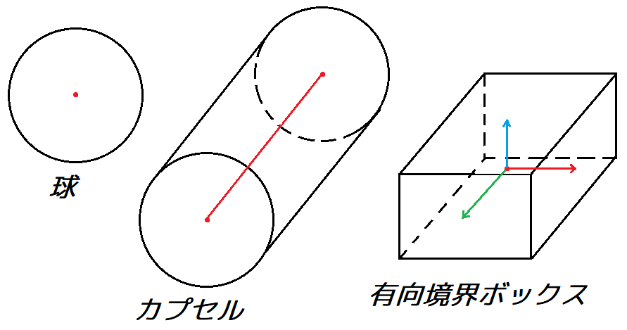
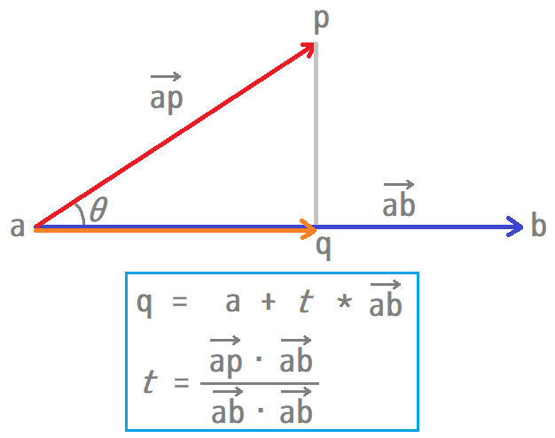

[OpenGL 3D 2019 第10回]

# あくたーのかたち

衝突情報はシェイプでウッドボール(決・ま；り)！

<br>

## 1. カプセルと<ruby>有向境界<rt>ゆうこうきょうかい</rt></ruby>ボックス

### 1.1 衝突判定で使われる形状

ある形状が衝突判定として望ましいかどうかは、以下の特徴をどれだけ満たしているかによって決まります。

1. 衝突判定にかかる時間
2. 元になるモデルへの密着度
3. 移動・回転・拡大縮小にかかる時間
4. メモリ消費量

「球」形状は上記の1、3、4について非常に優れていますが、2の「密着度」については、ボールなどほぼ球体のモデルを除いて、ほとんどのモデルで評価が低くなります。

モデルのポリゴンをそのまま衝突判定に使うことを考えてみましょう。当然ながら「密着度」は完璧です。しかし、モデルを構成するポリゴンの数だけ衝突判定や移動処理等を行わなければならないため「衝突判定にかかる時間」や「移動・回転・拡大縮小にかかる時間」は最悪です。また、衝突判定をCPU側で行う場合、ポリゴンデータをCPU側のメモリにも置くことになるため「メモリ消費量」も非常に大きくなるでしょう。

1/60秒で処理を完了しなければならないゲームにとって、衝突判定にかかる時間は最も重要なものです。また、コンピューターに搭載されているメモリは有限ですから、衝突判定形状に使うメモリが少ないほど、別のデータを読み込むことができます。これらの理由から「モデルのポリゴン」より「球」のほうがよりよい形状だと言えます。

実際、現代おいて「球」は最も効率的な衝突判定形状であることに間違いはありません。しかし、全て物体の衝突判定を定義するには球という形状は大雑把すぎます。ある方向に細長いモデルなどは、単一の球では明らかに密着度が不足します。そのようなときに使われる形状には「カプセル」と「有向境界ボックス(有向境界ボックス)」があります。

<div style="text-align: center;width: 100%;">

</div>

今回はカプセルと有向境界ボックスの2種類の形状を定義し、球との衝突判定をプログラムしていきます。

### 1.2 カプセル構造体を定義する

「カプセル」は円柱の両端を半球でおおった形状です。薬のカプセルを想像すると理解しやすいと思います。

カプセルの定義は、円柱の中心にある線分と、円柱と半球で共通の半径、の２つの成分で構成されます。まず「線分」を表す構造体を作り、その構造体と「半径」によって、カプセルを表す構造体を作ります。「線分」構造体名は「Segment(せぐめんと)」、カプセルの構造体名は「Capsule(かぷせる)」とします。

Collision.hを開き、Sphere構造体の定義の下に、次のプログラムを追加してください。

```diff
 struct Sphere {
   glm::vec3 center = glm::vec3(0);
   float r = 0;
 };
+
+/**
+* 線分.
+*/
+struct Segment {
+  glm::vec3 a = glm::vec3(0); ///< 線分の始点.
+  glm::vec3 b = glm::vec3(0); ///< 線分の終点.
+};
+
+/**
+* カプセル.
+*/
+struct Capsule {
+  Segment seg; ///< 円柱部の中心の線分.
+  float r = 0; ///< カプセルの半径.
+};

 bool TestSphereSphere(const Sphere&, const Sphere&);
```

構造体を眺めてみると、球の成分は「中心座標」と「半径」でしたが、カプセルでは中心となる成分が点(glm::vec3)から線分(Segment)に変化しているのが分かるでしょう。

### 1.3 球とカプセルの衝突判定

それでは、球とカプセルの衝突判定をプログラムしていきましょう。まずは関数宣言を追加します。TestSphereSphere関数の宣言の下に、次のプログラムを追加してください。

```diff
   float r = 0; ///< カプセルの半径.
 };

 bool TestSphereSphere(const Sphere&, const Sphere&);
+bool TestSphereCapsule(const Sphere& s, const Capsule& c, glm::vec3* p);

 #endif // COLLISION_H_INCLUDED
```

球と球の衝突判定にはない３つめの引数は、衝突したときの球に最も近い線分上の座標を返すために使います。球同士の場合は中心は点なので、どこが最近接点なのかは自明でした。しかしカプセルの場合、線分のどの位置が最近接点になるのかは衝突した位置によって異なりますから、その位置を知らせるための引数が必要なのです。

続いて関数を定義しましょう。球とカプセルが衝突しているかを調べるには、まず球の中心とカプセルの中心の線分の最短距離を求めます。その距離と球とカプセルの半径を合計した値を比較して、半径の合計以下ならば衝突していると分かるわけです。

そういうわけですから、まずは線分と点の最近接点を求める関数を書きましょう。関数名は「ClosestPointSegment(くろーぜすと・ぽいんと・せぐめんと)」とします。Collision.cppを開き、次のプログラムを追加してください。

```diff
   const float radiusSum = s0.r + s1.r;
   return glm::dot(m, m) <= radiusSum * radiusSum;
 }
+
+/**
+* 線分と点の最近接点を調べる.
+*
+* @param seg 線分.
+* @param p   点.
+*
+* @return segとpの最近接点.
+*/
+glm::vec3 ClosestPointSegment(const Segment& seg, const glm::vec3& p)
+{
+  const glm::vec3 ab = seg.b - seg.a;
+  const glm::vec3 ap = p - seg.a;
+  const float lenAQ = glm::dot(ab, ap);
+  const float lenAB = glm::dot(ab, ab);
+  if (lenAQ <= 0) {
+    return seg.a;
+  } else if (lenAQ >= lenAB) {
+    return seg.b;
+  }
+  return seg.a + ab * (lenAQ / lenAB);
+}

 } // namespace Collision
```

点pから線分abを通る直線に垂直な線を引き、その交点をqとすると、点qは直線上における点pの最近接点になります。下図に示すように、点qはベクトルabとベクトルapの内積によって計算することができます。

<div style="text-align: center;width: 100%;">

</div>

点qは直線の最近接点ではあっても、線分abの最近接点とは限らないことに注意してください。線分では最近接点はaとbのあいだに制限されるので、もし点qがaの外側にある場合はaが、bの外側にある場合はbが本当の最近接点になります。

最近接点を計算できるようになったので、球とカプセルの衝突判定を行いましょう。ClosestPointSegment関数の定義の下に、次のプログラムを追加してください。

```diff
   return seg.a + ab * (lenAQ / lenAB);
 }
+
+/**
+* 球とカプセルが衝突しているか調べる.
+*
+* @param s 球.
+* @param c カプセル.
+* @param p 最近接点の格納先.
+*
+* @retval true  衝突している.
+* @retval false 衝突していない.
+*/
+bool TestSphereCapsule(const Sphere& s, const Capsule& c, glm::vec3* p)
+{
+  *p = ClosestPointSegment(c.seg, s.center);
+  const glm::vec3 distance = *p - s.center;
+  const float radiusSum = s.r + c.r;
+  return glm::dot(distance, distance) <= radiusSum * radiusSum;
+}

 } // namespace Collision
```

最近接点が分かれば、あとは球の中心座標を引くことでベクトルが得られ、その内積を求めれば長さの２乗が得られます。あとは２つの半径の合計を２乗したものと比較し、距離が半径の合計以下ならば衝突していることが分かるというわけです。

### 1.4 シェイプ構造体を定義する

アクターの衝突判定形状が球とカプセルのどちらであるかはアクターごとに違うはずです。だから、何らかの方法でアクターがどちらの形状で表されているかを示さなければなりません。そこで、球とカプセルを統合した「シェイプ」という構造体を作成し、使う形状の切り替えはこの構造体に任せることにします。

Collision.hを開き、Capsule構造体の定義の下に、次のプログラムを追加してください。

```diff
   float r = 0; ///< カプセルの半径.
 };
+
+/**
+* 汎用衝突形状.
+*/
+struct Shape
+{
+  enum class Type {
+    none, ///< 形状なし.
+    sphere, ///< 球.
+    capsule, ///< カプセル.
+  };
+  Type type = Type::none; ///< 実際の形状.
+  Sphere s; ///< 球の形状データ.
+  Capsule c; ///< カプセルの形状データ.
+};
+
+// 形状作成関数.
+Shape CreateSphere(const glm::vec3&, float);
+Shape CreateCapsule(const glm::vec3&, const glm::vec3&, float);

 bool TestSphereSphere(const Sphere&, const Sphere&);
 bool TestSphereCapsule(const Sphere& s, const Capsule& c, glm::vec3* p);
+bool TestShapeShape(const Shape&, const Shape&, glm::vec3* pa, glm::vec3* pb);

 } // namespace Collision
```

Shape構造体は複数の形状を束ねたもので、実際にどの形状を表すかはtypeメンバ変数で指定します。そして、typeに対応する形状データのみが有効になる、という使い方をします。しかし「必要なメンバだけを設定する」という書き方をするとプログラムが見づらくなるため、形状作成用の関数を作ることにしました。

>［補足］このような使い方をする場合、union(ゆにおん)という機能がよく使われます。ただ、クラス(または構造体)にコンストラクタやデストラクタが定義されている場合、そのクラス(または構造体)をunionのメンバ変数にするためには、いくつかの手順が必要です。また、その手順はC++に対する一定の理解がなければ正しく書くことが難しいため今回は扱いませんが、興味のある人はunionについて調べてみてください。また、C++17以降はunionの上位互換ともいえるstd::variant(えすてぃーでぃー・ばりあんと)クラスがライブラリに追加されましたので、C++17以降の環境ではそちらを使うほうがよいでしょう。

### 1.5 CreateSphere関数を定義する

それでは、Shapeに関係する関数を定義していきましょう。最初は球のShapeを作成する関数です。球を作成するので、名前は「CreateSphere(くりえいと・すふぃあ)」としました。では、Collision.cppを開き、Collision名前空間の先頭に次のプログラムを追加してください。

```diff
 namespace Collision {
+
+/**
+* 球形状を作成する.
+*
+* @param center 球の中心座標.
+* @param r      球の半径.
+*
+* @return 球を保持する汎用衝突形状オブジェクト.
+*/
+Shape CreateSphere(const glm::vec3& center, float r)
+{
+  Shape result;
+  result.type = Shape::Type::sphere;
+  result.s = Sphere{ center, r };
+  return result;
+}

 /**
 * 球と球が衝突しているか調べる.
 */
 bool TestSphereSphere(const Sphere& s0, const Sphere& s1)
```

### 1.6 CreateCapsule関数を定義する

続いてカプセルを作成する関数を定義します。名前は「CreateCapsule(くりえいと・かぷせる)」としました。CreateSphere関数の定義の下に、次のプログラムを追加してください。

```diff
   result.s = Sphere{ center, r };
   return result;
 }
+
+/**
+* カプセル形状を作成する.
+*
+* @param a  中心の線分の始点座標.
+* @param b  中心の線分の終点座標.
+* @param r  カプセルの半径.
+*
+* @return カプセルを保持する汎用衝突形状オブジェクト.
+*/
+Shape CreateCapsule(const glm::vec3& a, const glm::vec3& b, float r) {
+  Shape result;
+  result.type = Shape::Type::capsule;
+  result.c = Capsule{ { a, b }, r };
+  return result;
+}

 /**
 * 球と球が衝突しているか調べる.
 */
 bool TestSphereSphere(const Sphere& s0, const Sphere& s1)
```

### 1.7 シェイプ同士の衝突判定

形状を作成する関数の次は、衝突判定関数を定義します。名前は素直に「TestShapeShape(てすと・しぇいぷ・しぇいぷ)」としました。それでは、TestSphereCapsule関数の定義の下に、次のプログラムを追加してください。

```diff
   const float radiusSum = s.r + c.r;
   return glm::dot(distance, distance) <= radiusSum * radiusSum;
 }
+
+/**
+* シェイプ同士が衝突しているか調べる.
+*
+* @param a  判定対象のシェイプその１.
+* @param b  判定対象のシェイプその２.
+* @param pa 衝突した座標.
+* @param pb 衝突した座標.
+*
+* @retval true  衝突した.
+* @retval false 衝突しなかった.
+*/
+bool TestShapeShape(const Shape& a, const Shape& b, glm::vec3* pa, glm::vec3* pb)
+{
+  if (a.type == Shape::Type::sphere) {
+    if (b.type == Shape::Type::sphere) {
+      if (TestSphereSphere(a.s, b.s)) {
+        *pa = a.s.center;
+        *pb = b.s.center;
+        return true;
+      }
+    } else if (b.type == Shape::Type::capsule) {
+      if (TestSphereCapsule(a.s, b.c, pb)) {
+        *pa = a.s.center;
+        return true;
+      }
+    }
+  } else if (a.type == Shape::Type::capsule) {
+    if (b.type == Shape::Type::sphere) {
+      if (TestSphereCapsule(b.s, a.c, pa)) {
+        *pb = b.s.center;
+        return true;
+      }
+    }
+  }
+  return false;
+}

 } // namespace Collision
```

この関数では、形状ごとに適切な衝突判定関数を選択する必要があるのですが、その仕組みは非常に単純です。2重のif文でaとbの実際の形状に応じた関数を呼び出しているだけです。

現在のところ、カプセル同士の衝突判定は作成していないので、シェイプの両方がカプセル形状だったときは「衝突なし」として判定されることに注意してください。

<div style="page-break-after: always"></div>

## 2. ShpereをShapeで置き換える

### 2.1 アクターの衝突判定形状をShape構造体に変更する

これまでアクターの衝突判定形状にはSphereを使っていましたが、Shapeを使うように変更していきましょう。変更の手順は次のようになります：

1. Actorクラスの衝突判定用メンバ変数の型SphereからShapeに変更。
2. colWorldの更新方法を変更。
3. DetectCollisionで使用する衝突判定関数を変更。
4. colLocalの設定方法を変更。
5. 衝突ハンドラを変更。

それでは、最初のメンバ変数の型の変更から片付けていきましょう。Actor.hを開き、Actorクラスを次のように変更してください。

```diff
   glm::vec4 color = glm::vec4(1);
   int health = 0;
-  Collision::Sphere colLocal;
-  Collision::Sphere colWorld;
+  Collision::Shape colLocal;
+  Collision::Shape colWorld;
 };
 using ActorPtr = std::shared_ptr<Actor>;
```

### 2.2 Actor::colWorldメンバ変数の更新方法を変更する

続いて、colWorldの更新処理を変更します。Actor.cppを開き、Actor::Update関数を次のように変更してください。

```diff
 void Actor::Update(float deltaTime)
 {
   position += velocity * deltaTime;

   // 衝突判定の更新.
-  colWorld = colLocal;
-  colWorld.center += position;
+  const glm::mat4 matT = glm::translate(glm::mat4(1), position);
+  const glm::mat4 matR_Y = glm::rotate(glm::mat4(1), rotation.y, glm::vec3(0, 1, 0));
+  const glm::mat4 matR_ZY = glm::rotate(matR_Y, rotation.z, glm::vec3(0, 0, -1));
+  const glm::mat4 matR_XZY = glm::rotate(matR_ZY, rotation.x, glm::vec3(1, 0, 0));
+  const glm::mat4 matS = glm::scale(glm::mat4(1), scale);
+  const glm::mat4 matModel = matT * matR_XZY * matS;
+  colWorld.type = colLocal.type;
+  switch (colLocal.type) {
+  case Collision::Shape::Type::sphere:
+    colWorld.s.center = matModel * glm::vec4(colLocal.s.center, 1);
+    colWorld.s.r = colLocal.s.r;
+    break;
+
+  case Collision::Shape::Type::capsule:
+    colWorld.c.seg.a = matModel * glm::vec4(colLocal.c.seg.a, 1);
+    colWorld.c.seg.b = matModel * glm::vec4(colLocal.c.seg.b, 1);
+    colWorld.c.r = colLocal.c.r;
+    break;
+  }
 }
```

前回のテキストでは、説明を簡単にするためにアクターの座標しか反映していませんでしたが、本来、正確な位置を得るには回転と拡大縮小も反映させなければなりません。そこでモデル行列を作成し、それを各座標に掛けるように変更しています。

### 2.3 DetectCollision関数で使用する衝突判定関数を変更する

３つめの変更は、DetectCollision関数で使っている衝突判定関数を、TestSphereSphereからTestShapeShapeに置き換えることです。DetectCollision関数は３つありますが、その全て置き換えます。まずはアクター同士の衝突判定を行うDetectCollision関数を次のように変更してください。

```diff
 void DetectCollision(const ActorPtr& a, const ActorPtr& b, CollisionHandlerType handler)
 {
   if (a->health <= 0 || b->health <= 0) {
     return;
   }
-  if (Collision::TestSphereSphere(a->colWorld, b->colWorld)) {
-    handler(a, b, b->colWorld.center);
+  glm::vec3 pa, pb;
+  if (Collision::TestShapeShape(a->colWorld, b->colWorld, &pa, &pb)) {
+    handler(a, b, pb);
   }
 }
```

同様にして、２つめのDetectCollision関数も変更してください。

```diff
   for (const ActorPtr& actorB : b) {
     if (actorB->health <= 0) {
       continue;
     }
-    if (Collision::TestSphereSphere(a->colWorld, actorB->colWorld)) {
-      handler(a, actorB, actorB->colWorld.center);
+    glm::vec3 pa, pb;
+    if (Collision::TestShapeShape(a->colWorld, actorB->colWorld, &pa, &pb)) {
+      handler(a, actorB, pb);
       if (a->health <= 0) {
         break;
       }
     }
   }
```

<div style="border:solid 1px; background:#f0e4cd; margin: 1rem; padding: 1rem; border-radius: 10px">
<strong>［課題01］</strong><br>
３つめのDetectCollision関数(ActorListとActorListの衝突を判定する関数)が使用する衝突判定関数について、上記と同じようにしてTestShapeShapeに置き換えてください。
</div>

### 2.4 colLocalの設定方法を変更する

SphereをShapeに置き換える４つめの手順は、colLocalの設定方法の変更です。MainGameScene.cppを開き、MainGameScene::Initialize関数を次のように変更してください。

```diff
   player = std::make_shared<StaticMeshActor>(
     meshBuffer.GetFile("Res/bikuni.gltf"), "Player", 20, startPos);
-  player->colLocal = Collision::Sphere{ glm::vec3(0), 0.5f };
+  player->colLocal = Collision::CreateSphere(glm::vec3(0, 0.7f, 0), 0.7f);

   std::mt19937 rand;
   rand.seed(0);
```

同様に、敵の衝突判定の設定も変更します。MainGameScene::Initialize関数を次のように変更してください。

```diff
       StaticMeshActorPtr p = std::make_shared<StaticMeshActor>(
         mesh, "Kooni", 13, position, rotation);
-      p->colLocal = Collision::Sphere{ glm::vec3(0), 1.0f };
+      p->colLocal = Collision::CreateCapsule(
+        glm::vec3(0, 0.5f, 0), glm::vec3(0, 1, 0), 0.5f);
       enemies.Add(p);
     }
   }
```

せっかくカプセル形状を追加したので、敵の形状をカプセルにしてみました。oni_small.gltfのモデルは直立時でおよそ1.7mですが、アニメーションさせると1.5m程度まで姿勢が下がるように作られています。そこで、カプセルの成分は半径が0.5m、中心の線分が0.5mから1mの高さになるようにしてみました。

<div style="border:solid 1px; background:#f0e4cd; margin: 1rem; padding: 1rem; border-radius: 10px">
<strong>［課題02］</strong><br>
木の衝突判定の設定をCreateCapsule関数を使うように変更してください。木の高さは約4mです。幹の太さは根本でも半径10cm程度ですが、あまり半径を小さくするとすり抜けてしまう可能性があるので、余裕を見て2～5倍程度にするとよいでしょう。
</div>

### 2.5 衝突ハンドラの変更

SphereをShapeに変更したことは、衝突ハンドラにも影響を与えます。PlayerCollisionHandler関数を次のように変更してください。

```diff
 void PlayerCollisionHandler(const ActorPtr& a, const ActorPtr& b, const glm::vec3& p)
 {
-  const glm::vec3 v = a->colWorld.center - p;
+  const glm::vec3 v = a->colWorld.s.center - p;
   // 衝突位置との距離が近すぎないか調べる.
   if (dot(v, v) > FLT_EPSILON) {
     // aをbに重ならない位置まで移動.
     const glm::vec3 vn = normalize(v);
-    const float radiusSum = a->colWorld.r + b->colWorld.r;
+    float radiusSum = a->colWorld.s.r;
+    switch (b->colWorld.type) {
+    case Collision::Shape::Type::sphere: radiusSum += b->colWorld.s.r; break;
+    case Collision::Shape::Type::capsule: radiusSum += b->colWorld.c.r; break;
+    }
     const float distance = radiusSum - glm::length(v) + 0.01f;
     a->position += vn * distance;
-    a->colWorld.center += vn * distance;
+    a->colWorld.s.center += vn * distance;
   } else {
     // 移動を取り消す(距離が近すぎる場合の例外処理).
     const float deltaTime = static_cast<float>(GLFWEW::Window::Instance().DeltaTime());
     const glm::vec3 deltaVelocity = a->velocity * deltaTime;
     a->position -= deltaVelocity;
-    a->colWorld.center -= deltaVelocity;
+    a->colWorld.s.center -= deltaVelocity;
   }
 }
```

プログラムが書けたら**ビルドして実行してください。**<br>
見た目の変化はなにもないため分かりにくいですが、敵にも木にも衝突判定があることが確認できれば成功と考えて良いでしょう。

<div style="page-break-after: always"></div>

## 3. <ruby>有向境界<rt>ゆうこうきょうかい</rt></ruby>ボックス

### 3.1 <ruby>有向境界<rt>ゆうこうきょうかい</rt></ruby>ボックス構造体を定義する

カプセルによって、細長い物体に衝突判定を付けられるようになりました。ただ、球もカプセルも建物のような形状にはあまり適していません。そのような形状には直方体が適しています。

これまでにも直方体をつかった衝突判定は作成してきましたが、それらはXYZの軸に沿った形にしかできませんでした。今回作成するのは、自由な向きで定義できる直方体です。そのような直方体のことを、「有向境界ボックス(ゆうこう・きょうかい・ぼっくす)」、英語では「Oriented Bounding Box(おりえんてっど・ばうんでぃんぐ・ぼっくす)」、略して「OBB(おー・びー・びー)」といいます。

Collision.hを開き、Capsule構造体の定義の下に、次のプログラムを追加してください。

```diff
 struct Capsule {
   Segment seg;
   float r = 0;
 };
+
+/**
+* 有向境界ボックス.
+*/
+struct OrientedBoundingBox {
+  glm::vec3 center = glm::vec3(0); ///< ボックスの中心.
+  glm::vec3 axis[3] = { {1,0,0}, {0,1,0}, {0,0,1} }; ///< ボックスの軸.
+  glm::vec3 e = glm::vec3(0); ///< 各軸の半径.
+};

 /**
 * 汎用衝突形状.
 */
```

XYZ軸に平行な直方体の場合、軸の方向は決まっているのでデータとして持っておく必要はありませんが、有向境界ボックスの軸の向きはボックスごとに変えられる必要があります。これを可能にするため、メンバ変数にはXYZ軸の方向ベクトルを持たせています。それが「axis(あくしす)」メンバ変数です。３つの軸が必要なので要素数３の配列としています。

>［補足］厳密には２つの軸があれば十分です。なぜなら、第３の軸は、２つの軸の外積によって計算できるからです。しかし、衝突判定のたびに外積を計算するのは無駄なので、３つとも設定しておくことがほとんどです。

衝突判定関数の宣言も追加しましょう。TestSphereCapsule関数の宣言の下に、次のプログラムを追加してください。

```diff
 bool TestSphereSphere(const Sphere&, const Sphere&);
 bool TestSphereCapsule(const Sphere& s, const Capsule& c, glm::vec3* p);
+bool TestSphereOBB(const Sphere& s, const OrientedBoundingBox& obb, glm::vec3* p);
```

### 3.2 球と<ruby>有向境界<rt>ゆうこうきょうかい</rt></ruby>ボックスの衝突判定

続いて衝突判定関数を書いていきます。球とカプセルの衝突判定と同様に、OBB内で球の中心に最も近い点を見つけることから始めます。

基本的な考え方は「点と線分の最近接点」を求めたときと同じですが、OBBには３つの軸があるため、それぞれの軸について最近接点を調べる必要があります。そして、それらを合計したものがOBBの最近接点になります。TestSphereCapsule関数の定義の下に、次のプログラムを追加してください。

```diff
   const float radiusSum = s.r + c.r;
   return glm::dot(distance, distance) <= radiusSum * radiusSum;
 }
+
+/**
+* OBBと点の最近接点を調べる.
+*
+* @param obb 有向境界ボックス.
+* @param p   点.
+*
+* @return obbとpの最近接点.
+*/
+glm::vec3 ClosestPointOBB(const OrientedBoundingBox& obb, const glm::vec3& p)
+{
+  const glm::vec3 d = p - obb.center;
+  glm::vec3 q = obb.center;
+  for (int i = 0; i < 3; ++i) {
+    float distance = dot(d, obb.axis[i]);
+    if (distance >= obb.e[i]) {
+      distance = obb.e[i];
+    } else if (distance <= -obb.e[i]) {
+      distance = -obb.e[i];
+    }
+    q += distance * obb.axis[i];
+  }
+  return q;
+}

 /**
 * シェイプ同士が衝突しているか調べる.
```

次に、球とOBBの衝突判定関数を定義しましょう。ClosestPointOBB関数の定義の下に、次のプログラムを追加してください。

```diff
     q += distance * obb.axis[i];
   }
   return q;
 }
+
+/**
+* 球とOBBが衝突しているか調べる.
+*
+* @param s   球.
+* @param obb 有向境界ボックス.
+* @param p   最近接点の格納先.
+*
+* @retval true  衝突している.
+* @retval false 衝突していない.
+*/
+bool TestSphereOBB(const Sphere& s, const OrientedBoundingBox& obb, glm::vec3* p)
+{
+  *p = ClosestPointOBB(obb, s.center);
+  const glm::vec3 distance = *p - s.center;
+  return dot(distance, distance) <= s.r * s.r;
+}

 /**
 * シェイプ同士が衝突しているか調べる.
```

最近接点が分かれば、あとは球の中心からの距離を計算して球の半径と比較をするだけです。

### 3.3 Shape構造体にOBBを追加する

作成したOBBをShape構造体に追加して、OBBを表現できるようにましょう。Collision.hを開き、Shape構造体に次のプログラムを追加してください。さらに、OBBを作成するための「CreateOBB(くりえいと・おーびーびー)」関数の宣言も追加してください。

```diff
 struct Shape
 {
   enum class Type {
     none, ///< 形状なし.
     sphere, ///< 球.
     capsule, ///< カプセル.
+    obb, ///< 有向境界ボックス.
   };
   Type type = Type::none; ///< 実際の形状.
   Sphere s; ///< 球の形状データ.
   Capsule c; ///< カプセルの形状データ.
+  OrientedBoundingBox obb; ///< 有向境界ボックスの形状データ.
 };

 // 形状作成関数.
 Shape CreateSphere(const glm::vec3&, float);
 Shape CreateCapsule(const glm::vec3&, const glm::vec3&, float);
+Shape CreateOBB(const glm::vec3& center, const glm::vec3& axisX,
+  const glm::vec3& axisY, const glm::vec3& axisZ, const glm::vec3& e);

 bool TestSphereSphere(const Sphere&, const Sphere&);
 bool TestSphereCapsule(const Sphere& s, const Capsule& c, glm::vec3* p);
```

### 3.4 CreateOBB関数を定義する

有向境界ボックスを作成する関数を定義します。Collision.cppを開き、CreateCapsule関数の定義の下に、次のプログラムを追加してください。

```diff
   result.c = Capsule{ { a, b }, r };
   return result;
 }
+
+/**
+* 有向境界ボックス形状を作成する.
+*
+* @param center 有向境界ボックスの中心座標.
+* @param axisX  X軸の向き.
+* @param axisY  Y軸の向き.
+* @param axisZ  Z軸の向き.
+* @param e      XYZ軸方向の幅.
+*
+* @return 有向境界ボックスを保持する汎用衝突形状オブジェクト.
+*/
+Shape CreateOBB(const glm::vec3& center, const glm::vec3& axisX,
+  const glm::vec3& axisY, const glm::vec3& axisZ, const glm::vec3& e) {
+  Shape result;
+  result.type = Shape::Type::obb;
+  result.obb = OrientedBoundingBox{ center,
+    { normalize(axisX), normalize(axisY), normalize(axisZ) }, e };
+  return result;
+}

 /**
 * 球と球が衝突しているか調べる.
 */
```

### 3.5 シェイプ同士の衝突判定に有向境界ボックスを追加する

シェイプ同士の衝突判定に、実際の形状がOBBだった場合の処理を追加しましょう。TestShapeShape関数を次のように変更してください。

```diff
     } else if (b.type == Shape::Type::capsule) {
       if (TestSphereCapsule(a.s, b.c, pb)) {
         *pa = a.s.center;
         return true;
       }
+    } else if (b.type == Shape::Type::obb) {
+      if (TestSphereOBB(a.s, b.obb, pb)) {
+        *pa = a.s.center;
+        return true;
+      }
     }
   } else if (a.type == Shape::Type::capsule) {
     if (b.type == Shape::Type::sphere) {
       if (TestSphereCapsule(b.s, a.c, pa)) {
         *pb = b.s.center;
         return true;
       }
     }
+  } else if (a.type == Shape::Type::obb) {
+    if (b.type == Shape::Type::sphere) {
+      if (TestSphereOBB(b.s, a.obb, pa)) {
+        *pb = b.s.center;
+        return true;
+      }
+    }
   }
   return false;
 }

 } // namespace Collision
```

### 3.6 Actor::Update関数にOBBの更新を追加する

続いて、colWorldの更新処理に形状がOBBだった場合の処理を追加します。Actor.cppを開き、Actor::Update関数を次のように変更してください。

```diff
   case Collision::Shape::Type::capsule:
     colWorld.c.seg.a = matModel * glm::vec4(colLocal.seg.a, 1);
     colWorld.c.seg.b = matModel * glm::vec4(colLocal.seg.b, 1);
     colWorld.c.r = colLocal.c.r;
     break;
+
+  case Collision::Shape::Type::obb:
+    colWorld.obb.center = matModel * glm::vec4(colLocal.obb.center, 1);
+    for (size_t i = 0; i < 3; ++i) {
+      colWorld.obb.axis[i] = matR_XZY * glm::vec4(colLocal.obb.axis[i], 1);
+    }
+    colWorld.obb.e = colLocal.obb.e;
+    break;
   }
 }
```

OrientedBoundingBoxのaxisメンバが「方向ベクトル」だということに注意してください。方向ベクトルを移動させたり拡大縮小させることはできませんので、回転行列だけを掛けています。

これで、有向境界ボックスを衝突判定形状として使えるようになりました。

### 3.7 有向境界ボックスを使ってみる

それでは有向境界ボックスを使ってみましょう。サンプルとして石壁を表示してみます。石壁モデルは以下のURLからダウンロードして、Resフォルダにコピーしておいてください。

`https://github.com/tn-mai/OpenGL3D2019/blob/master/Res/wall_stone.bin`<br>
`https://github.com/tn-mai/OpenGL3D2019/blob/master/Res/wall_stone.gltf`<br>
`https://github.com/tn-mai/OpenGL3D2019/blob/master/Res/wall_stone.tga`

このモデルは幅±2m、高さ±2m、奥行き±0.5mの石を積み上げた壁になっています。

石壁のような建造物を取り扱うためのActorListを追加します。MainGameScene.hを開き、MainGameSceneクラスに次のように変更してください。

```diff
 private:
   Mesh::Buffer meshBuffer;
   Terrain::HeightMap heightMap;
   StaticMeshActorPtr player;
   ActorList enemies;
   ActorList trees;
+  ActorList objects;
 };
```

次に石壁モデルを読み込みます。MainGameScene::Initialize関数に、次のプログラムを追加してください。

```diff
   meshBuffer.LoadMesh("Res/bikuni.gltf");
   meshBuffer.LoadMesh("Res/oni_small.gltf");
   meshBuffer.LoadMesh("Res/red_pine_tree.gltf");
+  meshBuffer.LoadMesh("Res/wall_stone.gltf");

   // ハイトマップを作成する.
   if (!heightMap.LoadFromFile("Res/Terrain.tga", 20.0f, 0.5f)) {
     return false;
   }
```

続いて石壁のアクターを作成して配置します。MainGameScene::Initialize関数に次のプログラムを追加してください。

```diff
   glm::vec3 startPos(100, 0, 100);
   startPos.y = heightMap.Height(startPos);
   player = std::make_shared<StaticMeshActor>(
     meshBuffer.GetFile("Res/bikuni.gltf"), "Player", 20, startPos);
+
+  // 石壁を配置
+  {
+    const Mesh::FilePtr meshStoneWall = meshBuffer.GetFile("Res/wall_stone.gltf");
+    glm::vec3 position = startPos + glm::vec3(3, 0, 3);
+    position.y = heightMap.Height(position);
+    StaticMeshActorPtr p = std::make_shared<StaticMeshActor>(
+      meshStoneWall, "StoneWall", 100, position, glm::vec3(0, 0.5f, 0));
+    p->colLocal = Collision::CreateOBB(glm::vec3(0, 0, 0),
+      glm::vec3(1, 0, 0), glm::vec3(0, 1, 0), glm::vec3(0, 0,-1), glm::vec3(2, 2, 0.5f));
+    objects.Add(p);
+  }

   std::mt19937 rand;
   rand.seed(0);
```

次に、アクターの更新プログラムを追加します。MainGameScene::Update関数に、次のプログラムを追加してください。

```diff
     camera.position = camera.target + glm::vec3(0, 50, 50);
   }

   player->Update(deltaTime);
   enemies.Update(deltaTime);
   trees.Update(deltaTime);
+  objects.Update(deltaTime);

   player->position.y = heightMap.Height(player->position);
   DetectCollision(player, enemies, PlayerCollisionHandler);
   DetectCollision(player, trees, PlayerCollisionHandler);
+  DetectCollision(player, objects, PlayerCollisionHandler);
   player->position.y = heightMap.Height(player->position);

   player->UpdateDrawData(deltaTime);
   enemies.UpdateDrawData(deltaTime);
   trees.UpdateDrawData(deltaTime);
+  objects.UpdateDrawData(deltaTime);

   fontRenderer.BeginUpdate();
```

最後に、アクターを描画します。MainGameScene::Render関数に、次のプログラムを追加してください。

```diff
   const glm::mat4 matTreeModel =
     glm::translate(glm::mat4(1), treePos) * glm::scale(glm::mat4(1), glm::vec3(3));
   Mesh::Draw(meshBuffer.GetFile("Res/red_pine_tree.gltf"), matTreeModel);

   player->Draw();
   enemies.Draw();
   trees.Draw();
+  objects.Draw();
 }
```

プログラムが書けたら**ビルドして実行してください。**<br>画面に石壁が表示され、キャラクターを石壁の形状に沿って移動させることができれば成功です。

<div style="page-break-after: always"></div>

## 4. ジャンプさせる

### 4.1 PlayerActorクラスを定義する

現在のプログラムは地面から離れることができません。せっかく石壁のようなモデルがあるのですから、その上に乗れるようにしてみましょう。

Srcフォルダに「PlayerActor.h」というファイルを追加してください。追加したファイルを開き、次のプログラムを追加してください。

```c++
/**
* @file PlayerActor.h
*/
#ifndef PLAYERACTOR_H_INCLUDED
#define PLAYERACTOR_H_INCLUDED
#include "Actor.h"
#include "Terrain.h"
#include <memory>

/**
* プレイヤーアクター.
*/
class PlayerActor : public StaticMeshActor
{
public:
  PlayerActor(const Mesh::FilePtr& mesh,
    const glm::vec3& pos, const glm::vec3& rot, const Terrain::HeightMap* hm);
  virtual ~PlayerActor() = default;

  virtual void Update(float) override;
  void Jump();

private:
  const Terrain::HeightMap* heightMap = nullptr;
};
using PlayerActorPtr = std::shared_ptr<PlayerActor>;

#endif // PLAYERACTOR_H_INCLUDED
```

### 4.2 PlayerActorコンストラクタを定義する

次に、Srcフォルダに「PlayerActor.cpp」というファイルをを追加してください。追加したファイルを開き、次のプログラムを追加してください。

```c++
/**
* @file PlayerActor.cpp
*/
#include "PlayerActor.h"

/**
* コンストラクタ.
*/
PlayerActor::PlayerActor(const Mesh::FilePtr& mesh,
  const glm::vec3& pos, const glm::vec3& rot, const Terrain::HeightMap* hm)
 : StaticMeshActor(mesh, "Player", 20, pos, rot), heightMap(hm)
{
  colLocal = Collision::CreateSphere(glm::vec3(0, 0.7f, 0), 0.7f);
}
```

### 4.3 PlayerActor::Update関数を定義する

次に、状態を更新する関数を定義します。コンストラクタの定義の下に、次のプログラムを追加してください。

```diff
  : StaticMeshActor(mesh, "Player", 20, pos, rot), heightMap(hm)
 {
 }
+
+/**
+* 更新.
+*
+* @param deltaTime 経過時間.
+*/
+void PlayerActor::Update(float deltaTime)
+{
+  // 座標の更新.
+  StaticMeshActor::Update(deltaTime);
+
+  // 接地判定.
+  static const float gravity = 9.8f;
+  const float groundHeight = heightMap->Height(position);
+  if (position.y <= groundHeight) {
+    position.y = groundHeight;
+    velocity.y = 0;
+  } else if (position.y > groundHeight) {
+    velocity.y -= gravity * deltaTime;
+  }
+}
```

このように、派生クラスでは基底クラスの仮想関数の内容を上書き(オーバーライド)できます。しかし、内容を「上書き」するのではなく「追加」したいこともあるでしょう。そういった場合、上記のプログラムのように、基底クラスのUpdate関数を明示的に指定して呼び出します。そして、その呼び出しのあとに「追加」したいプログラム(ここでは接地判定)を書きます。

変数gravityの値は現実の地球の重力の平均値です。この値について、いわゆるジャンプアクションゲームで使うには小さすぎることに注意してください。重力の値は作りたいゲームの内容に応じて変更するべきです。

>［補足］仮想関数の便利なところは、「呼び出し元は実際に実行される関数を知らなくていい」という点です。Updateが普通の関数だったとしても同様の書き方はできます。しかし、その場合は「PlayerActor::Updateという名前の新しい関数を作る」ことになり、「Actor::Updateを上書きする」のではなくなります。ところが、基底クラスのポインタや参照はActor::Updateという名前しか知り得ないので、普通の関数でしかないPlayerActor::Updateを呼び出すことができないのです。

### 4.4 PlayerActor::Jump関数を定義する

PlayerActorの最後のメンバ関数は、Jump関数です。PlayerActor::Update関数の定義の下に、次のプログラムを追加してください。

```diff
   } else if (position.y > groundHeight) {
     velocity.y -= gravity * deltaTime;
   }
 }
+
+/**
+* ジャンプさせる.
+*/
+void PlayerActor::Jump()
+{
+  velocity.y = 5.0f;
+}
```

Jump関数は単に上方向の速度を設定しているだけです。<br>これでPlayerActorクラスの定義は完成です。

### 4.4 player変数の型をPlayerActorに変更する

player変数の型を、作成したPlayerActorクラスに変更します。MainGameScene.hを開き、インクルード文を追加してください。

```diff
 #include "Font.h"
 #include "Mesh.h"
 #include "Terrain.h"
 #include "Actor.h"
+#include "PlayerActor.h"
 #include <vector>
```

次に、MainGameSceneクラスを次のように変更してください。

```diff
 private:
   std::vector<Sprite> sprites;
   SpriteRenderer spriteRenderer;
   Font::Renderer fontRenderer;
   Mesh::Buffer meshBuffer;
   Terrain::HeightMap heightMap;
-  StaticMeshActorPtr player;
+  PlayerActorPtr player;
   ActorList enemies;
   ActorList trees;
   ActorList objects;
 };
```

MainGameScene.cppを開き、MainGameScene::Initialize関数を次のように変更してください。

```diff
   glm::vec3 startPos(100, 0, 100);
   startPos.y = heightMap.Height(startPos);
-  player = std::make_shared<StaticMeshActor>(
-    meshBuffer.GetFile("Res/bikuni.gltf"), "Player", 20, startPos);
-  player->colLocal = Collision::CreateSphere(glm::vec3(0, 0.7f, 0), 0.7f);
+  player = std::make_shared<PlayerActor>(
+    meshBuffer.GetFile("Res/bikuni.gltf"), startPos, glm::vec3(0), &heightMap);
```

### 4.5 プレイヤーの移動処理を変更する

続いて、ジャンプ操作ができるように入力処理を変更していきます。MainGameScene::ProcessInput関数を、次のように変更してください。

```diff
   if (velocity.x || velocity.z) {
     velocity = normalize(velocity);
     player->rotation.y = std::atan2(-velocity.z, velocity.x) + glm::radians(90.0f);
     velocity *= 6.0f;
   }
-  player->velocity = velocity;
+  player->velocity.x = velocity.x;
+  player->velocity.z = velocity.z;
+
+  // ジャンプ.
+  if (gamepad.buttonDown & GamePad::B) {
+    player->Jump();
+  }
```

### 4.6 古い接地プログラムを削除する

現在のMainGameScene::Update関数に強制的に接地させるプログラムが残っています。そのままにしておくと、ジャンプしようとしても即座に着地してしまうので、このプログラムを削除しましょう。
MainGameScene::Update関数を次のように変更してください。

```diff
   trees.Update(deltaTime);
   objects.Update(deltaTime);

-  player->position.y = heightMap.Height(player->position);
   DetectCollision(player, enemies, PlayerCollisionHandler);
   DetectCollision(player, trees, PlayerCollisionHandler);
   DetectCollision(player, objects, PlayerCollisionHandler);
-  player->position.y = heightMap.Height(player->position);

   player->UpdateDrawData(deltaTime);
   enemies.UpdateDrawData(deltaTime);
```

### 4.7 衝突ハンドラの変更

プレイヤーが衝突判定形状の上に乗ったとき、下方向の移動ベクトルを0にする必要があります。PlayerCollisionHandler関数を次のように変更してください。

```diff
     a->position += vn * distance;
     a->colWorld.s.center += vn * distance;
+    if (a->velocity.y < 0 && vn.y >= glm::cos(glm::radians(60.0f))) {
+      a->velocity.y = 0;
+    }
   } else {
     // 移動を取り消す(距離が近すぎる場合の例外処理).
```

衝突位置が下方60度の範囲にある場合は何らかの衝突判定に着地したとみなして、Y方向の移動ベクトルを0にします。正確な判定とはとても言えませんが、当面はなんとかなるでしょう。

プログラムが書けたら**ビルドして実行してください。**<br>「K」キーでジャンプして石壁の上に乗ることができたら成功です。

<div style="border:solid 1px; background:#f0e4cd; margin: 1rem; padding: 1rem; border-radius: 10px">
<strong>［課題03］</strong><br>
石壁を増やして簡単な迷路を作ってください。
</div>
