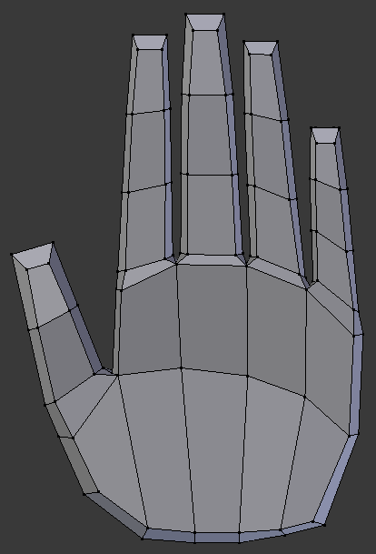
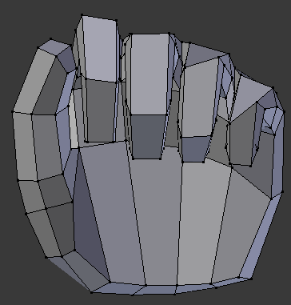
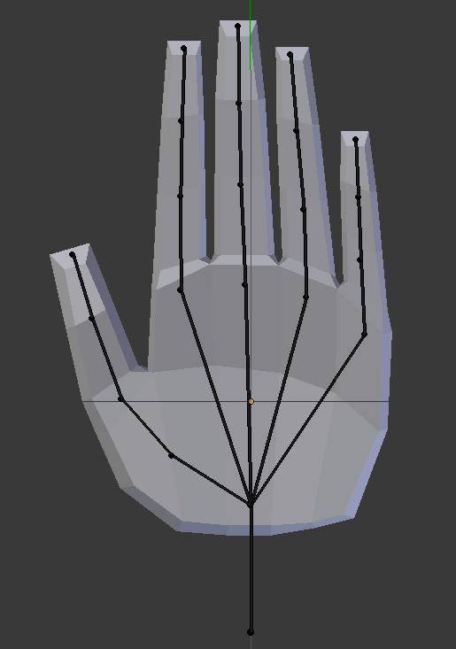
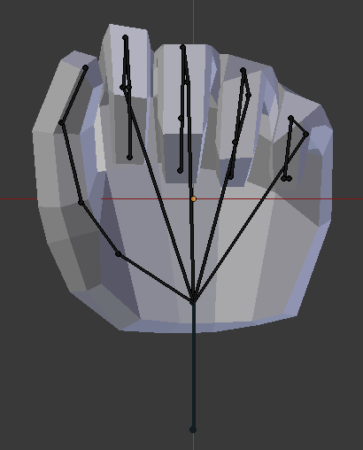
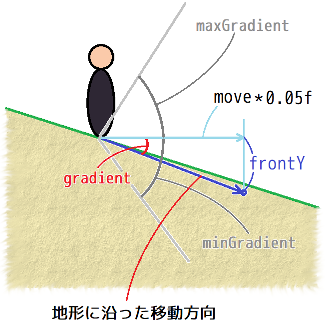

[OpenGL 3D 2019 第11回]

# メッシュに骨格を求めるのは間違っているだろうか？

<br>

## 1. スケルタル・アニメーション

### 1.1 スキンとスケルトン

「スケルタル・アニメーション」は、コンピューター・グラフィックスにおいてキャラクターのアニメーションを制御する方法のひとつで、1988年にナディア・マグネナット・タルマン、リチャード・ラペリエール、ダニエル・タルマンによって公開されました。「スケルタル・アニメーション」では、「スキン(皮膚)」と呼ばれるキャラクターの形状を表すメッシュと、「スケルトン(骨格)」と呼ばれる骨の階層構造という２つのデータによって、アニメーションを制御します。

>［補足］1988年の論文は`Joint-Dependent Local Deformations for Hand Animation and Object Grasping`で検索すれば見つけられるでしょう。

旧来のアニメーションでは、アニメーションのキーフレームごとにメッシュの全頂点の位置を記録する必要がありました。この方法の場合、アニメーターはすべての頂点の動きを注意深く設定していかなければなりません。また、メッシュに含まれる頂点が多くなるほどアニメーション・データも多くなってしまいます。

<div style="text-align: center;width: 100%;">


</div>
<div style="text-align: center;">［すべての頂点の位置を記録する］</div>

対して、スケルタル・アニメーションの場合、アニメーターはスケルトンの動きを設定するだけで済みます。データ量についても、メッシュの各頂点には影響を及ぼすボーンの番号とその影響力が追加されるだけで、これはアニメーションの長さに関わらず一定で、どれだけメッシュの頂点を追加しても、増えるデータはわずかにボーンの番号と影響力だけです。そして、アニメーション自体はスケルトンの動作として記録されるため、すべての頂点を記録する旧来の方法に比べるとはるかにデータ量が少なくります。

<div style="text-align: center;width: 100%;">


</div>
<div style="text-align: center;">［骨の回転だけを記録する。頂点は対応する骨に追従する］</div>

もちろん、スケルタル・アニメーションにも問題がないわけではありません。まずスケルトンのアニメーションを頂点に反映しなければならないため、頂点ごとに必要な計算量が増えます。さらに、スケルトンをアニメーションさせるプログラムは、旧来の手法と比べて複雑なものになってしまいます。

こういった理由から、初学者にとってスケルタル・アニメーションを自力で完成させることは非常に時間がかかるものにならざるを得ません。とはいえ、アニメーションのないゲームは味気ないものになりがちです。<br>そこで今回は、こちらでスケルタル・アニメーションを行うプログラムを用意して、みなさんにはそれを組み込んでもらうことにしました。

### 1.2 スケルタル・アニメーションを扱うファイルを追加する

それではスケルタル・アニメーションを扱うためのファイルを追加しましょう。以下のURLから「SkeketalMesh用追加プログラム.zip」というファイルをダウンロードして展開してください。

`https://github.com/tn-mai/OpenGL3D2019/tree/master/Doc`

展開したフォルダには、ResフォルダとSrcフォルダが含まれているはずです。この2つのフォルダの中にある全てのファイルを、みなさんのプロジェクトのResフォルダとSrcフォルダにコピーしてください。次に、コピーした全てのファイルをみなさんのプロジェクトに追加してください。

なお、この段階ではビルドしてもエラーが発生しますが、このあと解決していきますので今は気にしないでください。

### 1.3 main関数にスケルタル・アニメーションを利用可能にするプログラムを追加する

ここからは、追加したファイルを皆さんのプロジェクトで動くようにするためのプログラムを追加していきます。
main関数の書かれているファイルを開き、TitleScene.hインクルード文の下に次のプログラムを追加してください。

```diff
 #include <Windows.h>
 #include "Src/GLFWEW.h"
 #include "Src/TitleScene.h"
+#include "Src/SkeletalMesh.h"
 #include <iostream>
```

ファイルの置かれたフォルダによっては、`Src/`の部分は不要かもしれません。上記のプログラムを追加したとき、もし赤い波線が表示されるようなら`Src/`を消して`#include "SkeletalMesh.h"`と書いてみてください。

「SkeletalMesh.h(すけるたる・めっしゅ・どっと・えいち)」は、スケルタル・アニメーション用のクラスや関数が宣言されているヘッダーファイルです。

次に、スケルタル・アニメーション用のシステムを初期化するプログラムを追加します。<br>
main関数のGLFWEWを初期化するプログラムの下に、次のプログラムを追加してください。

```diff
 GLFWEW::Window& window = GLFWEW::Window::Instance();
 window.Init(1280, 720, u8"アクションゲーム");
+
+// スケルタル・アニメーションを利用可能にする.
+if (!Mesh::SkeletalAnimation::Initialize()) {
+  return 1;
+};

 SceneStack& sceneStack = SceneStack::Instance();
 sceneStack.Push(std::make_shared<TitleScene>());
```

続いて、毎フレーム必要な処理を追加します。

```diff
       if (MessageBox(nullptr, L"ゲームを終了しますか？", L"終了", MB_OKCANCEL) == IDOK) {
         break;
       }
     }
+
+    // スケルタル・アニメーション用データの作成準備.
+    Mesh::SkeletalAnimation::ResetUniformData();

      sceneStack.Update(deltaTime);
+
+    // スケルタル・アニメーション用データをGPUメモリに転送.
+    Mesh::SkeletalAnimation::UploadUniformData();

     //バックバッファを消去する
     glClearColor(0.8f, 0.2f, 0.1f, 1.0f);
     glClear(GL_COLOR_BUFFER_BIT | GL_DEPTH_BUFFER_BIT);
```

スケルタル・アニメーション用のデータは、シーンのUpdate関数内で作成されます。そのため、作成の準備をするResetUniformData(りせっと・ゆにふぉーむ・でーた)関数はシーンのUpdate関数が実行されるすぐ前に書き、作成したデータをGPUメモリに転送するUploadUniformData(あっぷろーど・ゆにふぉーむ・でーた)関数は、Update関数が実行したすぐ後に書いています。

最後に、スケルタル・アニメーションの利用を終了するプログラムを追加します。メインループの下に、次のプログラムを追加してください。

```diff
     sceneStack.Render();
     window.SwapBuffers();
   }
+
+  // スケルタル・アニメーションの利用を終了する.
+  Mesh::SkeletalAnimation::Finalize();
 }
```

これでmain関数へのプログラムの追加は完了です。

### 1.4 Shader::Program::Get関数を追加する

OpenGLで効率的にスケルタル・アニメーションを実行するには、シェーダー・プログラムとの連携が欠かせません。これを可能にするため、シェーダー・プログラムのIDを取得できるようにします。
Shader.hを開き、Programクラスの定義に次のプログラムを追加してください。

```diff
   void SetViewProjectionMatrix(const glm::mat4&);
   void SetModelMatrix(const glm::mat4&);
+
+  /// プログラムIDを取得する.
+  GLuint Get() const { return id; }

 private:
   GLuint id = 0;//プログラムID
```

こういった小さな機能のメンバ関数では、宣言と定義をhファイルとcppファイルに分けて書くほどでもない場合が多いです。そのような場合、上記のプログラムのように、クラス定義の中にメンバ関数の宣言と定義を同時に書くことができます。

### 1.5 Mesh.hにスケルタルメッシュ用の先行宣言を追加する

次はMesh::Bufferクラスに、スケルタル・アニメーション用の機能を追加していきます。<br>
Mesh.hを開き、次の先行宣言を追加してください。

```diff
 //先行宣言
 struct Mesh;
 using MeshPtr = std::shared_ptr<Mesh>;
 class MeshBuffer;
 using MeshBufferPtr = std::shared_ptr<Mesh>;
+
+// スケルタルメッシュ用の先行宣言.
+struct Node;
+struct ExtendedFile;
+using ExtendedFilePtr = std::shared_ptr<ExtendedFile>;
+class SkeletalMesh;
+using SkeletalMeshPtr = std::shared_ptr<SkeletalMesh>;

 /**
 * 頂点データ
 */
```

スケルタル・アニメーションに対応したメッシュは「ExtendedFile(えくすてんでっど・ふぁいる)」型の構造体として管理されます。そして、スケルタル・アニメーションを行う機能を追加したメッシュクラスには「SkeletalMesh(すけるたる・めっしゅ)」という名前を付けました。

### 1.6 Material構造体にスケルタルメッシュ用のシェーダー変数を追加する

スケルタル・アニメーションでは専用のシェーダー・プログラムが必要となります。手始めに、マテリアルが専用シェーダーを保持できるようにします。
Material構造体に次のプログラムを追加してください。

```diff
 struct Material
 {
   glm::vec4 baseColor = glm::vec4(1);
   Texture::Image2DPtr texture;
   Shader::ProgramPtr program;
+  // スケルタルメッシュ用のシェーダー.
+  Shader::ProgramPtr progSkeletalMesh;
 };
```

### 1.7 Mesh::Bufferクラスにスケルタルメッシュ用のメンバを追加する

スケルタル・アニメーションに対応したメッシュを読み込めるように、Mesh::Bufferクラスを拡張します。Mesh::Bufferクラスに次のプログラムを追加してください。

```diff
   void AddCude(const char* name);
+
+  // スケルタル・アニメーションに対応したメッシュの読み込みと取得.
+  bool LoadSkeletalMesh(const char* path);
+  SkeletalMeshPtr GetSkeletalMesh(const char* meshName) const;

 private:
   BufferObject vbo;
   BufferObject ibo;
   GLintptr vboEnd = 0;
   GLintptr iboEnd = 0;
   std::unordered_map<std::string, FilePtr> files;
   Shader::ProgramPtr progStaticMesh;
+
+  // スケルタル・アニメーションに対応したメッシュを保持するメンバ変数.
+  Shader::ProgramPtr progSkeletalMesh;
+  struct MeshIndex {
+    ExtendedFilePtr file;
+    const Node* node = nullptr;
+  };
+  std::unordered_map<std::string, MeshIndex> meshes;
+  std::unordered_map<std::string, ExtendedFilePtr> extendedFiles;
 };
```

上記のプログラムでは、２つのメンバ関数を追加していますが、実はこれらの関数はSkeletalMesh.cppに定義済みです。そのため、宣言さえ行えば使えるようになります。

### 1.8 スケルタル・アニメーション用のシェーダーを読み込む

スケルタル・アニメーションには専用のシェーダーが必要なので、Mesh::Bufferクラスを初期化するときにそれを読み込むプログラムを追加しなければなりません。しかし、そのまえにヘッダーファイルのインクルードを行いましょう。Mesh.cppを開き、Mesh.hのインクルード文の下に次のプログラムを追加してください

```diff
 #include "Mesh.h"
+#include "SkeletalMesh.h"
 #include "json11/json11.hpp"
 #include <glm/gtc/quaternion.hpp>
 #include <glm/gtc/matrix_transform.hpp>
 #include <glm/gtc/constants.hpp>
 #include <fstream>
 #include <algorithm>
 #include <iostream>
```

それでは、シェーダーを読み込みましょう。Buffer::Init関数に、次のプログラムを追加してください。

```diff
   progStaticMesh = Shader::Program::Create("Res/staticMesh.vert", "Res/StaticMesh.frag");
   if (progStaticMesh->IsNull()) {
     return false;
   }
+
+  // スケルタルメッシュ用のシェーダーを読み込む.
+  progSkeletalMesh = Shader::Program::Create(
+    "Res/SkeletalMesh.vert", "Res/SkeletalMesh.frag");
+  if (progSkeletalMesh->IsNull()) {
+    return false;
+  }
+  SkeletalAnimation::BindUniformBlock(progSkeletalMesh);

   vboEnd = 0;
   iboEnd = 0;
   files.reserve(100);
```

上記のプログラムでは、スケルタル・アニメーション用のシェーダーを読み込んだあとで、「BindUniformBlock(ばいんど・ゆにふぉーむ・ぶろっく)」という関数を実行しています。この関数は、スケルタル・アニメーション用に確保したGPUメモリをシェーダーから利用できるように設定します。

### 1.9 マテリアルにスケルタル・アニメーション用のシェーダーを設定する

続いて、読み込んだスケルタル・アニメーション用のシェーダーをマテリアルに設定します。Buffer::CreateMaterial関数に次のプログラムを追加してください。

```diff
 Material Buffer::CreateMaterial(
   const glm::vec4& color, Texture::Image2DPtr texture) const
 {
   Material m;
   m.baseColor = color;
   m.texture = texture;
   m.program = progStaticMesh;
+  m.progSkeletalMesh = progSkeletalMesh;
   return m;
 }
```

### 1.11 スケルタル・アニメーション用のシェーダーにビュープロジェクション行列を設定する

通常のメッシュと同様に、スケルタル・アニメーション用のシェーダーもビュープロジェクション行列を設定する必要があります。この処理はBuffer::SetViewProjectionMatrix関数でやってしまうのがよいでしょう。Buffer::SetViewProjectionMatrix関数に、次のプログラムを追加してください。

```diff
 void Buffer::SetViewProjectionMatrix(const glm::mat4& matVP) const
 {
   progStaticMesh->Use();
   progStaticMesh->SetViewProjectionMatrix(matVP);
+  progSkeletalMesh->Use();
+  progSkeletalMesh->SetViewProjectionMatrix(matVP);
   glUseProgram(0);
 }
```

これでスケルタル・アニメーションを使う準備が完了しました。

<div style="page-break-after: always"></div>

## 2. スケルタル・アニメーションを使う

### 2.1 スケルタル・アニメーションに対応したメッシュを読み込む

それでは、スケルタル・アニメーションを使ってみましょう。手始めに敵キャラクターをアニメーションさせてみます。まずはヘッダーファイルをインクルードしなければなりません。MainGameScene.cppを開き、Mesh.hのインクルード分の下に、次のプログラムを追加してください。

```diff
 #include "GLFWEW.h"
 #include "MainGameScene.h"
 #include "StatusScene.h"
 #include "GameOverscene.h"
+#include "SkeletalMeshActor.h"
 #include <glm/gtc/matrix_transform.hpp>
 #include <glm/gtc/constants.hpp>
 #include <random>
```

スケルタル・アニメーションするメッシュを扱う場合、StaticMeshActorクラスではなく、SkeletalMeshActorクラスを使います。

次に、敵キャラクターのメッシュをスケルタル・アニメーション対応版に切り替えましょう。敵のメッシュは「oni_small.glTF」ですが、実はこのファイルには既にスケルタル・アニメーションのデータが含まれています。ですから、必要なのは読み込む際に使う関数を変更することだけです。ということで、MainGameScene::Initialize関数を、次のように変更してください。

```diff
   meshBuffer.LoadMesh("Res/red_pine_tree.gltf");
   meshBuffer.LoadMesh("Res/bikuni.gltf");
-  meshBuffer.LoadMesh("Res/oni_small.gltf");
+  meshBuffer.LoadSkeletalMesh("Res/oni_small.gltf");
   meshBuffer.LoadMesh("Res/wall_stone.gltf");

   //ハイトマップを作成
   if (!heightMap.LoadFromFile("Res/Terrain.tga", 20.0f, 0.5f))
```

LoadSkeletalMesh(ろーど・すけるたる・めっしゅ)関数は、メッシュに加えてスケルタル・アニメーションに必要なデータも読み込む関数です。LoadMesh関数の代わりにこの関数を使うことで、スケルタル・アニメーションのデータが読み込まれます。

>［補足］LoadSkeletalMesh関数はスケルタル・アニメーションのデータを含まないglTFファイルも読み込めます。もちろん、そのようなメッシュをアニメーションさせることはできません。

### 2.2 SkeletalMeshActorクラスを使う

続いて、敵キャラクターのアクタークラスを、StaticMeshActorからSkeletalMeshActorに変更しましょう。MainGameScene::Initialize関数内の敵を配置するプログラムを、次のように変更してください。

```diff
 const size_t oniCount = 100;
 enemies.Reserve(oniCount);
-const Mesh::FilePtr mesh = meshBuffer.GetFile("Res/oni_small.gltf");
 for (size_t i = 0; i < oniCount; i++)
 {
   //敵の位置を(50,50)-(150,150)の範囲からランダムに選択
   glm::vec3 position(0);
   position.x = std::uniform_real_distribution<float>(50, 150)(rand);
   position.z = std::uniform_real_distribution<float>(50, 150)(rand);
   position.y = heightMap.Height(position);

   //敵の向きをランダムに選択
   glm::vec3 rotation(0);
   rotation.y = std::uniform_real_distribution<float>(0, 6.3f)(rand);
-  StaticMeshActorPtr p = std::make_shared<StaticMeshActor>(
-    mesh, "Kooni", 13, position, rotation);
+  const Mesh::SkeletalMeshPtr mesh = meshBuffer.GetSkeletalMesh("oni_small");
+  SkeletalMeshActorPtr p = std::make_shared<SkeletalMeshActor>(
+    mesh, "Kooni", 13, position, rotation);
+  p->GetMesh()->Play("Run");

   p->colLocal = Collision::Sphere{ glm::vec3(0),1.0f };
   enemies.Add(p);
```

Mesh::Buffer::GetSkeletalMesh関数はMesh::Buffer::GetFile関数と似ていますが、引数が「ファイル名」ではなく「メッシュ名」になっている点に注意してください。これは、glTF形式ではひとつのファイルに複数のメッシュを格納することができるからです。GetFile関数では、簡単さを優先して最初の１つが自動的に選択されるようになっていますが、GetSkeletalMesh関数では、メッシュ名を指定することで、特定のメッシュを選べるように改良しています。

アニメーションを実行するにはSkeletalMesh::Play(すけるたる・めっしゅ・ぷれい)関数を使います。また、SkeltalMeshActorからメッシュを取得するにはSkeletalMeshActor::GetMesh(すけるたる・めっｓｙ・あくたー・げっと・めっしゅ)関数を使います。

SkeletalMesh::Play関数には１～２つの引数を渡すことができます。最初の引数は「再生するアニメーションの名前」です。２つめの引数は「ループ再生の有無」です。この引数にはデフォルト値が設定されているので省略できます。省略するとtrueを指定したのと同じ扱いになります(ループ再生が有効になります)。もし一度だけ再生させたい場合は２つめの引数にfalseを指定します。

プログラムが書けたら、**ビルドして実行してください。**<br>敵キャラクターが歩行アニメーションをしていれば成功です。

>［補足］スケルタル・アニメーションは重い処理なので、Debugビルドではコマ送りのようになってしまうかもしれません。その場合、Releaseビルドで実行するか、敵の数を減らしてください。

<div style="border:solid 1px; background:#f0e4cd; margin: 1rem; padding: 1rem; border-radius: 10px">
<strong>［課題01］</strong><br>
敵キャラクターのアニメーションを変更してください。oni_small.glTFファイルに定義されているアニメーションの名前は「Wait」「Run」「Attack」「Hit」「Down」です。
</div>

<div style="page-break-after: always"></div>

## 3. 入力によるアニメーションの制御

### 3.1 PlayerActorクラスの定義にアニメーション用の機能を追加する

敵だけでなく、プレイヤーのアクターもアニメーションさせましょう。プレイヤーのアクターはキー入力に応じて停止したり、移動したり、ジャンプしたりします。このようにアクターの状態が変化したとき、その状態に応じてアニメーションを切り替えると、見た目の違和感が少なくなります。これらの処理はPlayerActorkクラスに追加していくのがよいでしょう。

まずは必要なヘッダーファイルをインクルードします。PlayerActor.hを開き、次のプログラムを追加してください。

```diff
 #ifndef PLAYERACTOR_H_INCLUDED
 #define PLAYERACTOR_H_INCLUDED
-#include "Actor.h"
+#include "GLFWEW.h"
+#include "SkeletalMeshActor.h"
 #include "Terrain.h"
 #include "memory"
```

次に、スケルタル・アニメーションを行えるようにPlayerActorクラスの定義に変更を加えます。PlayerActorクラスの定義を次のように変更してください。

```diff
 /**
 * プレイヤーアクター.
 */
-class PlayerActor : public StaticMeshActor
+class PlayerActor : public SkeletalMeshActor
 {
 public:
-  PlayerActor(const Mesh::FilePtr& mesh,
-    const glm::vec3& pos, const glm::vec3& rot, const Terrain::HeightMap* hm);
+  PlayerActor(const Terrain::HeightMap* hm, const Mesh::Buffer& buffer,
+    const glm::vec3& pos, const glm::vec3& rot = glm::vec3(0));
   virtual ~PlayerActor() = default;

   virtual void Update(float) override;
   void Jump();
+  void ProcessInput();
+  void SetBoardingActor(ActorPtr);

 private:
+  void CheckRun(const GamePad& gamepad);
+  void CheckJump(const GamePad& gamepad);
+
+  /// アニメーション状態.
+  enum class State {
+    idle, ///< 停止.
+    run,  ///< 移動.
+    jump, ///< ジャンプ.
+  };
+  State state = State::idle; ///< 現在のアニメーション状態.
+  bool isInAir = false;      ///< 空中判定フラグ.
+  ActorPtr boardingActor;   ///< 乗っているアクター.
+  float moveSpeed = 5.0f;    ///< 移動速度.
+
   const Terrain::HeightMap* heightMap = nullptr; ///< 参照する高さマップ.
 };
 using PlayerActorPtr = std::shared_ptr<PlayerActor>;
```

### 3.2 PlayerActorコンストラクタを変更する

続いてコンストラクタを変更します。しかし、その前に必要なヘッダーファイルのインクルードをします。PlayerActor.cppを開き、次のプログラムを追加してください。

```diff
 /**
 * @file PlayerActor.cpp
 */
 #include "PlayerActor.h"
+#include "SkeletalMesh.h"
+#include <glm/gtc/matrix_transform.hpp>

 /**
 * コンストラクタ.
```

続いて、コンストラクタを次のように変更してください。

```diff
 /**
 * コンストラクタ.
+*
+* @param hm    プレイヤーの着地判定に使用する高さマップ.
+* @param buffer プレイヤーのメッシュデータを持つメッシュバッファ.
+* @param pos    プレイヤーの初期座標.
+* @param rot    プレイヤーの初期方向.
 */
-PlayerActor::PlayerActor(const Mesh::FilePtr& mesh,
-  const glm::vec3& pos, const glm::vec3& rot, const Terrain::HeightMap* hm)
- : StaticMeshActor(mesh, "Player", 20, pos, rot), heightMap(hm)
+PlayerActor::PlayerActor(const Terrain::HeightMap* hm, const Mesh::Buffer& buffer,
+  const glm::vec3& pos, const glm::vec3& rot)
+  : SkeletalMeshActor(buffer.GetSkeletalMesh("Bikuni"), "Player", 13, pos, rot),
+  heightMap(hm)
 {
   colLocal = Collision::CreateSphere(glm::vec3(0, 0.7f, 0), 0.7f);
+  GetMesh()->Play("Idle");
+  state = State::idle;
 }
```

以前のコンストラクタではメッシュを引数で受け取っていましたが、今回はメッシュバッファを受け取って、コンストラクタ側で必要なメッシュを取得する形に変更してみました。bikuni.gltfに含まれるメッシュは「Bikuni(びくに)」だけなので、GetSkeletalMesh関数の引数にはこの名前を指定しています。その他の追加点として、関数内で最初のアニメーションとして「Idle(あいどる)」を再生するようになっています。

### 3.3 PlayerActor::Update関数を変更する

次に、プレイヤーの状態を更新し、その状態に応じてアニメーションを切り替える機能を追加します。この機能は以下の処理から構成されます。

1. 座標の更新.
2. 接地判定.
3. 乗っているオブジェクトの判定.
4. 落下判定.
5. 重力.
6. アニメーションの更新.

最初の処理は「座標の更新」ですが、これは既にStaticMeshActor::Update関数の呼び出しとして書いてあります。しかし、基底クラスをStaticMeshActorからSkeletalMeshActorに変更したので、クラス名を書き換える必要があります。なお、ここで座標の更新を行うActorクラスではなく、直接の継承元であるStaticMeshActorやSkeletalMeshActorを指定しているのには理由があります。なぜなら、継承したクラスがなにか重要な追加の処理を行っている(あるいは将来追加される)可能性があるからです。

```diff
 * @param deltaTime 前回の更新からの経過時間.
 */
 void PlayerActor::Update(float deltaTime)
 {
   // 座標の更新.
-  StaticMeshActor::Update(deltaTime);
+  SkeletalMeshActor::Update(deltaTime);

   // 接地判定.
   static const float gravity = 9.8f;
```

### 3.4 接地判定を変更する

続いて、接地判定に変更を加えます。接地判定に次のプログラムを追加してください。

```diff
   // 接地判定.
   static const float gravity = 9.8f;
   const float groundHeight = heightMap->Height(position);
   if (position.y <= groundHeight) {
     position.y = groundHeight;
     velocity.y = 0;
+    isInAir = false;
   } else if (position.y > groundHeight) {
     velocity.y -= gravity * deltaTime;
   }
 }
```

空中判定フラグ(isInAir)をfalseにして「地上判定」にする処理を追加しています。

### 3.5 乗っているオブジェクトの判定を追加する

衝突判定の結果、なにかの物体の上に乗っている状態になることがあります。ここではその物体から離れたかどうかを調べます。空中判定フラグを地上判定に切り替えるプログラムの下に、次のプログラムを追加してください。

```diff
     position.y = groundHeight;
     velocity.y = 0;
     isInAir = false;
   } else if (position.y > groundHeight) {
+    // 乗っている物体から離れたら空中判定にする.
+    if (boardingActor) {
+      Collision::Shape col = colWorld;
+      col.s.r += 0.1f; // 衝突判定を少し大きくする.
+      glm::vec3 pa, pb;
+      if (!Collision::TestShapeShape(col, boardingActor->colWorld, &pa, &pb)) {
+        boardingActor.reset();
+      }
+    }
     velocity.y -= gravity * deltaTime;
   }
 }
```

このプログラムでは、シェイプを少し大きくしてから判定しています。DetectCollision関数による衝突判定の結果、乗っている物体よりわずかに浮いてしまうことがあるため、こうしておかないと浮いたり着地したりを繰り返す状態になってしまいます。

### 3.6 落下判定を追加する

次に追加するのは落下判定です。物体から離れたかどうかを判定するプログラムの下に、次のプログラムを追加してください。

```diff
         boardingActor.reset();
       }
     }
+
+    // 落下判定.
+    const bool isFloating = position.y > groundHeight + 0.1f; // 地面から浮いているか.
+    if (!isInAir && isFloating && !boardingActor ) {
+      isInAir = true;
+    }
     velocity.y -= gravity * deltaTime;
   }
 }
```

落下判定は３つの条件から構成され、それぞれ「地上判定」、「浮遊判定」、「乗っている物体判定」となっています。落下判定自体は最初の２つの判定で十分に機能しますが、それだけだと他のコリジョンの上に乗っている場合に、常に地面から浮いていると判定されてしまいます。そこで、物体に乗っているかどうかも調べるようにしています。

### 3.7 重力の処理を修正する

「重力」の処理自体は既に書いてありますが、空中判定のときだけ重力を加えるように変更しましょう。重力を加えるプログラムの前後に、次のプログラムを追加してください。

```diff
     if (!isInAir && isFloating && isGoingDown) {
       isInAir = true;
     }

+    // 重力を加える.
+    if (isInAir) {
       velocity.y -= gravity * deltaTime;
+    }
   }
 }
```

### 3.8 適切なアニメーションを再生する

最後に、プレイヤーの状態に応じて適切なアニメーションを再生します。重力を加えるプログラムの下に、次のプログラムを追加してください。

```diff
     if (isInAir) {
       velocity.y -= gravity * deltaTime;
     }
   }
+
+  // アニメーションの更新.
+  switch (state) {
+  case State::run:
+    if (isInAir) {
+      GetMesh()->Play("Jump");
+      state = State::jump;
+    } else {
+      const float horizontalSpeed = velocity.x * velocity.x + velocity.z * velocity.z;
+      if (horizontalSpeed == 0) {
+        GetMesh()->Play("Idle");
+        state = State::idle;
+      }
+    }
+    break;
+
+  case State::idle:
+    if (isInAir) {
+      GetMesh()->Play("Jump");
+      state = State::jump;
+    } else {
+      const float horizontalSpeed = velocity.x * velocity.x + velocity.z * velocity.z;
+      if (horizontalSpeed != 0) {
+        GetMesh()->Play("Run");
+        state = State::run;
+      }
+    }
+    break;
+
+  case State::jump:
+    if (!isInAir) {
+      GetMesh()->Play("Idle");
+      state = State::idle;
+    }
+    break;
+  }
 }
```

現在の状態はstate(すてーと)変数に格納されていますので、switch文を使って状態に応じて処理を分けています。各状態における処理は次のとおりです。

* run(らん)やidle(あいどる)状態のとき、空中判定になっていればjump(じゃんぷ)状態に切り替えます。
* run状態のとき、horizontalSpeed(ほりぞんたる・すぴーど、水平速度)が0ならidle状態に切り替えます。
* idle状態のとき、horizontalSpeedが0以外ならrun状態に切り替えます。
* jump状態の時、地上判定になっていたらidle状態に切り替えます。

これでPlayerActor::Update関数は完成です。

### 3.9 PlayerActor::ProcessInput関数を定義する

次に、キー入力を扱う関数を定義しましょう。PlayerActor::Jump関数の定義の下に、次のプログラムを追加してください。

```diff
void PlayerActor::Jump()
{
  velocity.y = 5.0f;
}
+
+/**
+* 入力を処理する.
+*/
+void PlayerActor::ProcessInput()
+{
+  const GamePad gamepad = GLFWEW::Window::Instance().GetGamePad();
+  CheckRun(gamepad);
+  CheckJump(gamepad);
+}
```

ProcessInput関数では、移動とジャンプの判定を行いますが、これらはそれぞれ関数として別に定義することにしました。関数にすることで、処理に名前を付けることになるため、結果として何をするプログラムなのかが分かりやすくなります。

### 3.10 PlayerActor::CheckRun関数を定義する

移動の判定プログラムを追加します。ProcessInput関数の定義の下に、次のプログラムを追加してください。なお、この節で書くプログラムはMainGameScene::ProcessInputに書いてある移動処理とほとんど同じですので、そこからコピーしてもいいでしょう。

```diff
   CheckRun(gamepad);
   CheckJump(gamepad);
 }
+
+/**
+* 移動操作を処理する.
+*
+* @param gamepad ゲームパッド入力.
+*/
+void PlayerActor::CheckRun(const GamePad& gamepad)
+{
+}
```

最初に空中判定かどうかを調べます。なぜなら、空中にいるときは移動できないからです。CheckRun関数に次のプログラムを追加してください。

```diff
 void PlayerActor::CheckRun(const GamePad& gamepad)
 {
+  // 空中にいるときは移動できない.
+  if (isInAir) {
+    return;
+  }
 }
```

次に、方向キーの入力を調べて移動方向を計算します。空中判定の下に、次のプログラムを追加してください。

```diff
   if (isInAir) {
     return;
   }
+
+  // 方向キーから移動方向を計算.
+  const glm::vec3 front(0, 0, -1);
+  const glm::vec3 left(-1, 0, 0);
+  glm::vec3 move(0);
+  if (gamepad.buttons & GamePad::DPAD_UP) {
+    move += front;
+  } else if (gamepad.buttons & GamePad::DPAD_DOWN) {
+    move -= front;
+  }
+  if (gamepad.buttons & GamePad::DPAD_LEFT) {
+    move += left;
+  } else if (gamepad.buttons & GamePad::DPAD_RIGHT) {
+    move -= left;
+  }
 }
```

このプログラムでは方向キーの入力に応じて、move変数に前ベクトル(front)や左ベクトル(left)を加減算することで、移動方向を計算しています。

続いて、移動方向に向かう速度を設定するプログラムを書きましょう。移動方向を計算するプログラムの下に、次のプログラムを追加してください。

```diff
   } else if (gamepad.buttons & GamePad::DPAD_RIGHT) {
     move -= left;
   }
+
+  // 移動が行われていたら、移動方向に応じて向きと速度を更新.
+  if (glm::dot(move, move)) {
+    // 向きを更新.
+    move = glm::normalize(move);
+    rotation.y = std::atan2(-move.z, move.x) + glm::radians(90.0f);
+
+    // 物体に乗っていないときは地形の勾配を考慮して移動方向を調整する.
+    if (!boardingActor) {
+      // 移動方向の地形の勾配(gradient)を計算.
+      const float minGradient = glm::radians(-60.0f); // 沿うことのできる勾配の最小値.
+      const float maxGradient = glm::radians(60.0f); // 沿うことのできる勾配の最大値.
+      const float frontY =
+        heightMap->Height(position + move * 0.05f) - position.y - 0.01f;
+      const float gradient =
+        glm::clamp(std::atan2(frontY, 0.05f), minGradient, maxGradient);
+
+      // 地形に沿うように移動速度を設定.
+      const glm::vec3 axis = glm::normalize(glm::cross(move, glm::vec3(0, 1, 0)));
+      move = glm::rotate(glm::mat4(1), gradient, axis) * glm::vec4(move, 1.0f);
+    }
+    velocity = move * moveSpeed;
+  } else {
+    // 移動していないので速度を0にする.
+    velocity = glm::vec3(0);
+  }
 }
```

単に水平方向に移動してから地形の高さを適用するという方法では、勾配によって実際の移動速度が変化してしまいます。そこで、下図に示すようにプレイヤーの高さと移動先の高さの差から地形の<ruby>勾配<rt>こうばい</rt></ruby>を求め、その角度から実際の移動方向を計算しなおします。

<div style="text-align: center;width: 100%;">

</div>

### 3.11 PlayerActor::CheckJump関数を定義する

移動の次は、ジャンプ判定のプログラムを追加します。CheckRun関数の定義の下に、次のプログラムを追加してください。

```diff
     velocity = glm::vec3(0);
   }
 }
+
+/**
+* ジャンプ操作を処理する.
+*
+* @param gamepad ゲームパッド入力.
+*/
+void PlayerActor::CheckJump(const GamePad& gamepad)
+{
+  if (isInAir) {
+    return;
+  }
+  if (gamepad.buttonDown & GamePad::B) {
+    Jump();
+  }
+}
```

### 3.12 PlayerActor::Jump関数を変更する

ジャンプするときにいくつかの処理を追加します。Jump関数に次のプログラムを追加してください。

```diff
 void PlayerActor::Jump()
 {
   velocity.y = 5.0f;
+  boardingActor.reset();
+  isInAir = true;
 }
```

### 3.13 PlayerActor::SetBoardingActor関数を定義する

最後に、乗っている物体を設定するSetBoardingActor(せっと・ぼーでぃんぐ・あくたー)関数を定義します。PlayerActor::ProcessInput関数の定義の下に、次のプログラムを追加してください。

```diff
  CheckRun(gamepad);
  CheckJump(gamepad);
 }
+
+/**
+* プレイヤーが乗っている物体を設定する.
+*
+* @param p 乗っている物体.
+*/
+void PlayerActor::SetBoardingActor(ActorPtr p)
+{
+  boardingActor = p;
+  if (p) {
+    isInAir = false;
+  }
+}

 /**
 * 移動操作を処理する.
```

これでPlayerActorクラスの変更は完了です。

### 3.14 PlayerActorクラスを使う

スケルタル・アニメーションに対応したPlayerActorクラスに対応するために、MainGameSceneクラスに変更を加えます。MainGameScene.cppを開き、MainGameScene::Initialize関数を、次のように変更してください。

```diff
   meshBuffer.LoadMesh("Res/red_pine_tree.gltf");
-  meshBuffer.LoadMesh("Res/bikuni.gltf");
+  meshBuffer.LoadSkeletalMesh("Res/bikuni.gltf");
   meshBuffer.LoadSkeletalMesh("Res/oni_small.gltf");
   meshBuffer.LoadMesh("Res/wall_stone.gltf");

   //ハイトマップを作成
   if (!heightMap.LoadFromFile("Res/Terrain.tga", 20.0f, 0.5f)) {
     return false;
   }
   if (!heightMap.CreateMesh(meshBuffer, "Terrain")) {
     return false;
   }

   glm::vec3 startPos(100, 0, 100);
   startPos.y = heightMap.Height(startPos);
-  player = std::make_shared<PlayerActor>(
-    meshBuffer.GetFile("Res/bikuni.gltf"), startPos, glm::vec3(0), &heightMap);
-  player->colLocal = Collision::CreateSphere(glm::vec3(0, 0.7f, 0), 0.7f);
+  player = std::make_shared<PlayerActor>(&heightMap, meshBuffer, startPos);

   std::mt19937 rand;
```

### 3.15 プレイヤーの移動処理を変更する

プレイヤーの移動処理はPlayerActor::ProcessInput関数にまとめましたので、MainGameScene::ProcessInputにある移動処理をPlayerActor::ProcessInput関数で置き換えます。MainGameScene::ProcessInput関数を次のように変更してください。

```diff
   // プレイヤー操作.
-  const GamePad gamepad = window.GetGamePad();
-  glm::vec3 velocity(0);
-  if (gamepad.buttons & GamePad::DPAD_LEFT) {
-    velocity.x = -1;
-  } else if (gamepad.buttons & GamePad::DPAD_RIGHT) {
-    velocity.x = 1;
-  }
-  if (gamepad.buttons & GamePad::DPAD_DOWN) {
-    velocity.z = 1;
-  } else if (gamepad.buttons & GamePad::DPAD_UP) {
-    velocity.z = -1;
-  }
-  if (velocity.x || velocity.z) {
-    velocity = normalize(velocity);
-    player->rotation.y = std::atan2(-velocity.z, velocity.x) + glm::radians(90.0f);
-    velocity *= 6.0f;
-  }
-  player->velocity.x = velocity.x;
-  player->velocity.z = velocity.z;
-
-  // ジャンプ.
-  if (gamepad.buttonDown & GamePad::B) {
-    player->Jump();
-  }
+  player->ProcessInput();

   if (window.GetGamePad().buttonDown & GamePad::A) {
```

これでプレイヤーの操作は全てPlayerActor::ProcessInput関数で行うようになりました。

プログラムが書けたら**ビルドして実行してください。**<br>プレイヤーを移動させたりジャンプさせたとき、対応するアニメーションが再生されたら成功です。

<div style="page-break-after: always"></div>

## 4. Actorクラスに衝突処理関数を追加する

### 4.1 Actor::OnHit関数を定義する

現在のプログラムでは、プレイヤーが物体の上に乗ったときに停止しないようになっています。なぜなら、「物体の上に乗っている」という状態がPlayerActorに伝わっていないからです。「物体の上に乗っている」という状態を伝えるためには、衝突ハンドラの中でSetBoardingActor関数を呼び出せばいいのですが、ここに問題が潜んでいます。というのは、衝突ハンドラの引数はActorPtr型なので、直接この関数を呼び出すことができないのです。もちろん、キャストを使えば可能ですが、将来「この衝突ハンドラを別のアクターにも使いたい」となった場合に問題が生じる可能性があります。

そこで、Actorクラスに衝突ハンドラの機能を追加することにします。Actorの衝突ハンドラを仮想関数にすることで、派生クラスで自由に機能を付け加えることが可能となり、また誤った型をキャストしてしまうリスクも避けられます。

それでは追加していきましょう。Actor.hを開き、次のように先行宣言を追加してください。

```diff
 #include <memory>
 #include <functional>
+
+class Actor;
+using ActorPtr = std::shared_ptr<Actor>;

/**
* シーンに配置するオブジェクト
```

続いて、Actorクラスの定義に次のプログラムを追加してください。

```diff
   virtual void Update(float);
   virtual void UpdateDrawData(float);
   virtual void Draw();
+  virtual void OnHit(const ActorPtr&, const glm::vec3&) {}

 public:
   std::string name; ///< アクターの名前.
```

さきほど先行宣言を追加したのは、OnHit関数の定義においてActorPtr型を使えるようにするためです。

>［補足］ある処理から間接的に呼び出されるような関数を「ハンドラ(handle + er)」といいますが、ハンドラの名前は「On(おん) + 取り扱う事象の名前」という形が一般的です。ここでの「on」は「when」に近い用法で、「なんらかの事象が発生した」ことを表します。別に「when」でも構わないのですが、微妙なニュアンスの違いがあること、短い単語のほうが書く手間が減ることから「on」が好まれるようです。

### 4.2 DetectCollision関数からOnHit関数を呼び出す

次に、DetectCollision関数からOnHit関数を呼び出すようにするのですが、これまでどおり衝突ハンドラを指定したいこともあるかもしれません。そこで、衝突ハンドラのデフォルト引数にnullptrを設定することにします。そして、DetectCollision関数は衝突ハンドラ引数がnullptrの場合にOnHitを呼び出すようにします。

まずはデフォルト引数を設定しましょう。３つのDetectCollision関数の宣言の末尾のプログラムを次のように変更してください。

```diff
 using CollisionHandlerType =
   std::function<void(const ActorPtr&, const ActorPtr&, const glm::vec3&)>;
-void DetectCollision(const ActorPtr& a, const ActorPtr& b, CollisionHandlerType handler);
-void DetectCollision(const ActorPtr& a, ActorList& b, CollisionHandlerType handler);
-void DetectCollision(ActorList& a, ActorList& b, CollisionHandlerType handler);
+void DetectCollision(const ActorPtr& a, const ActorPtr& b,
+  CollisionHandlerType handler = nullptr);
+void DetectCollision(const ActorPtr& a, ActorList& b,
+  CollisionHandlerType handler = nullptr);
+void DetectCollision(ActorList& a, ActorList& b,
+  CollisionHandlerType handler = nullptr);

 #endif // ACTOR_H_INCLUDED
```

handler引数にデフォルト値を追加したことで紙面の横幅を超えてしまったため、途中で改行を入れていますが、この改行まで真似する必要はありません。

続いてActor.cppを開き、DetectCollision関数(３種類ありますが引数で判断してください)を次のように変更してください。

```diff
 void DetectCollision(const ActorPtr& a, const ActorPtr& b, CollisionHandlerType handler)
 {
   if (a->health <= 0 || b->health <= 0) {
     return;
   }
   glm::vec3 pa, pb;
   if (Collision::TestShapeShape(a->colWorld, b->colWorld, &pa, &pb)) {
+    if (handler) {
       handler(a, b, pb);
+    } else {
+      a->OnHit(b, pb);
+      b->OnHit(a, pa);
+    }
   }
 }
```

<div style="border:solid 1px; background:#f0e4cd; margin: 1rem; padding: 1rem; border-radius: 10px">
<strong>［課題02］</strong><br>
残りの２つのDetectCollision関数について、上記のプログラムと同様にhandlerがnullptrではないときだけhandlerを実行し、nullptrのときはOnHitを実行するように変更してください。
</div>

### 4.3 PlayerActor::OnHit関数を定義する

それでは、PlayerActorクラスにOnHit関数を追加しましょう。PlayerActor.hを開き、PlayerActorクラスの定義に次のプログラムを追加してください。

```diff
   virtual void Update(float) override;
+  virtual void OnHit(const ActorPtr&, const glm::vec3&);
   void Jump();
   void ProcessInput();
   void SetBoardingActor(ActorPtr);
```

続いてPlayerActor.cppを開き、PlayerActor::Update関数の定義の下に、次のプログラムを追加してください。なお、このOnHit関数はMainGameScene.cppにあるPlayerCollisionHandler関数とほとんど同じです。そちらからコピーして修正してもいいでしょう。

```diff
       state = State::idle;
     }
     break;
   }
 }
+
+/**
+* 衝突ハンドラ.
+*
+* @param b 衝突相手のアクター.
+* @param p 衝突が発生した座標.
+*/
+void PlayerActor::OnHit(const ActorPtr& b, const glm::vec3& p)
+{
+  const glm::vec3 v = colWorld.s.center - p;
+  // 衝突位置との距離が近すぎないか調べる.
+  if (dot(v, v) > FLT_EPSILON) {
+    // thisをbに重ならない位置まで移動.
+    const glm::vec3 vn = normalize(v);
+    float radiusSum = colWorld.s.r;
+    switch (b->colWorld.type) {
+    case Collision::Shape::Type::sphere: radiusSum += b->colWorld.s.r; break;
+    case Collision::Shape::Type::capsule: radiusSum += b->colWorld.c.r; break;
+    }
+    const float distance = radiusSum - glm::length(v) + 0.01f;
+    position += vn * distance;
+    colWorld.s.center += vn * distance;
+  } else {
+    // 移動を取り消す(距離が近すぎる場合の例外処理).
+    const float deltaTime = static_cast<float>(GLFWEW::Window::Instance().DeltaTime());
+    const glm::vec3 deltaVelocity = velocity * deltaTime;
+    position -= deltaVelocity;
+    colWorld.s.center -= deltaVelocity;
+  }
+  SetBoardingActor(b);
+}

 /**
 * ジャンプさせる.
```

### 4.4 MainGameScene::Update関数を変更する

最後に、OnHit関数が使われるようにDetectCollision関数の引数を変更しましょう。MainGameScene.cppを開き、MainGameScenn::Update関数を次のように変更してください。

```diff
   trees.Update(deltaTime);
   objects.Update(deltaTime);

-  DetectCollision(player, enemies, PlayerCollisionHandler);
-  DetectCollision(player, trees, PlayerCollisionHandler);
-  DetectCollision(player, objects, PlayerCollisionHandler);
+  DetectCollision(player, enemies);
+  DetectCollision(player, trees);
+  DetectCollision(player, objects);

   player->UpdateDrawData(deltaTime);
   enemies.UpdateDrawData(deltaTime);
```

プログラムが書けたら**ビルドして実行してください。**<br>石壁や敵の上に乗ったときにプレイヤーが停止でき、停止アニメーションが再生され、その場でジャンプが可能になっていたら成功です。

<div style="border:solid 1px; background:#f0e4cd; margin: 1rem; padding: 1rem; border-radius: 10px">
<strong>［課題03］</strong><br>
StaticMeshActorまたはSkeletalMeshActorの派生クラスを作成してOnHit関数をオーバーライドし、プレイヤーに触れられたらアクターの向きを変化させてください。<br>なお、以下のURLにあるglTFファイルは自由に利用してもらって構いません。
https://github.com/tn-mai/OpenGL3D2019/tree/master/Res
</div>
